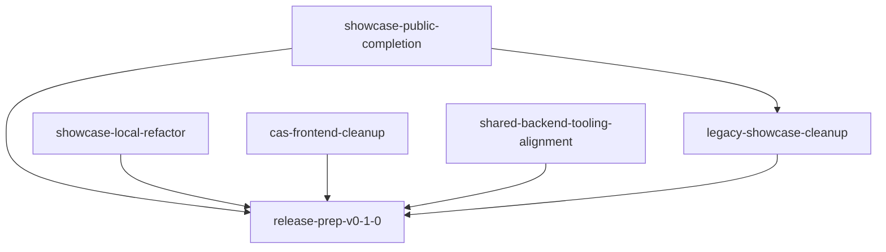

# Framework Completion Plan — First Release

**Last updated:** 2026-05-17  
**Status:** Planning (pre-implementation)  
**Target:** `v0.1.0` public release of the cfxdevkit framework  
**Purpose:** This document and all phase files serve as source material for OpenSpec change instructions.

---

## Context and Goals

The monorepo has a mature Tier 0 + Tier 1 framework (all packages functional) but the application layer — the showcase apps that demonstrate and validate the framework — needs consolidation before a release can happen.

Two showcase apps are the **keepers**: `showcase-local` and `showcase-public`.  
Five legacy apps are **scheduled for deletion**: `showcase`, `showcase-browser`, `showcase-stack`, `showcase-gateway`, and `showcase-backend`.

Before deletion, all unique, non-superseded demo content in the legacy apps must be either:
- **Ported** to a keeper app, or
- **Documented** as superseded by the `devnode-server` + `ConfluxDevkitClient` architecture

The main pain points that need surgical attention:
1. **showcase-local** — the dashboard architecture is sound and mostly working, but accumulated dead code (a server-action layer that was never the right approach) and a deprecated guide/tutorial concept have made it hard for agents and humans to understand the real structure and extend it correctly
2. **showcase-public** — the chapter-style app is already in place (`/core`, `/wallet`, `/keys`, `/siwe`, `/defi`, `/ui-kit`), but the hardware wallet demo is not ported and a few legacy wallet/RPC capabilities still need consolidation before the old apps can be deleted
3. **CAS** — appears mostly complete but has a `create/` route remnant from an old spec era that creates confusion
4. **Shared tooling alignment** — the `mcp-server` and VS Code extension both describe `@cfxdevkit/devnode-server` + `@cfxdevkit/client` as the canonical integration model, but the current implementations still lean on direct `@cfxdevkit/devnode` usage; before release they need to be wired to the shared backend contract and the required HTTP surface must be verified end-to-end

---

## Monorepo Layout Reference

**Workspace root:** `/workspaces/root`  
**Build system:** Moon (config in `/workspaces/root/.moon/`); per-package task definitions in each package's `moon.yml`  
**Package manager:** pnpm workspaces (root config: `/workspaces/root/pnpm-workspace.yaml`)  
**Code quality:** `pnpm -w typecheck` (TypeScript), `pnpm -w lint` (Biome), `pnpm -w test` (Vitest), `pnpm check:unused` (knip) — all run from workspace root

### Package → Source Directory

| Package | Source path (relative to workspace root) |
|---------|------------------------------------------|
| `@cfxdevkit/cdk` | `repos/cfx-core/packages/cdk/` |
| `@cfxdevkit/protocol` | `repos/cfx-core/packages/protocol/` |
| `@cfxdevkit/executor` | `repos/cfx-core/packages/executor/` |
| `@cfxdevkit/devnode` | `repos/cfx-core/packages/devnode/` |
| `@cfxdevkit/testing` | `repos/cfx-core/packages/testing/` |
| `@cfxdevkit/services` | `repos/cfx-keys/packages/services/` |
| `@cfxdevkit/wallet` | `repos/cfx-keys/packages/wallet/` |
| `@cfxdevkit/abis` | `repos/cfx-meta/packages/abis/` |
| `@cfxdevkit/contracts` | `repos/cfx-solidity/packages/contracts/` |
| `@cfxdevkit/compiler` | `repos/cfx-solidity/packages/compiler/` |
| `@cfxdevkit/ui` | `repos/cfx-ui/packages/ui/` |
| `@cfxdevkit/react` | `repos/cfx-ui/packages/react/` |
| `@cfxdevkit/wallet-connect` | `repos/cfx-ui/packages/wallet-connect/` |
| `@cfxdevkit/theme` | `repos/cfx-ui/packages/theme/` |
| `@cfxdevkit/create` | `repos/cfx-tools/packages/scaffold-cli/` |
| `@cfxdevkit/mcp-server` | `repos/cfx-tools/packages/mcp-server/` |
| `@cfxdevkit/cli` | `repos/cfx-tools/packages/cli/` |
| `@cfxdevkit/devnode-server` | `repos/cfx-tools/packages/devnode-server/` |
| `@cfxdevkit/client` | `repos/cfx-tools/packages/client/` |
| `cfxdevkit-vscode-extension` | `repos/cfx-tools/packages/vscode-extension/` |
| `@cfxdevkit/llm-agents` | `repos/cfx-llm/packages/llm-agents/` |
| `@cfxdevkit/llm-client` | `repos/cfx-llm/packages/llm-client/` |
| `@cfxdevkit/hardware-bridge` ❌ stub | `repos/cfx-domain/packages/hardware-bridge/` |
| `@cfxdevkit/example-showcase-ui` | `projects/examples/packages/showcase-ui/` |

### Application Paths

| App | Path | Port | Role |
|-----|------|------|------|
| **showcase-local** | `projects/examples/apps/showcase-local/` | 3011 | Keeper — self-contained local dev workspace (embeds devnode-server in-process) |
| **showcase-public** | `projects/examples/apps/showcase-public/` | 3010 | Keeper — fully browser-side public SDK demos (no backend) |
| showcase-backend *(delete)* | `projects/examples/apps/showcase-backend/` | — | Legacy Express server for old showcase apps; predates @cfxdevkit/devnode-server |
| showcase *(delete)* | `projects/examples/apps/showcase/` | 5181 | Legacy backend demo |
| showcase-browser *(delete)* | `projects/examples/apps/showcase-browser/` | 5183 | Legacy browser wallet demo |
| showcase-stack *(delete)* | `projects/examples/apps/showcase-stack/` | 5182 | Legacy full-stack demo |
| showcase-gateway *(delete)* | `projects/examples/apps/showcase-gateway/` | — | Legacy reverse proxy |
| hardware-wallet-showcase *(dissolve)* | `projects/examples/apps/hardware-wallet-showcase/` | — | Ledger/hardware demo; port to showcase-public then delete |
| CAS frontend | `projects/cas/apps/frontend/` | — | DeFi automation UI |
| CAS backend | `projects/cas/apps/backend/` | — | Keeper engine + REST API |

**Key architecture points:**
- `showcase-local` has `@cfxdevkit/devnode-server` as a direct dependency. `lib/local-runtime.ts` calls `createDevnodeServerApp()` inline. The Next.js API routes in `app/api/` are thin proxy handlers that call the embedded Hono server via `requestRuntime()`. `ConfluxDevkitClient` is configured with `baseUrl: '/api'` — it calls the Next.js app itself. No external process needed.
- `showcase-public` has no `@cfxdevkit/client` or `@cfxdevkit/devnode-server` dependency. All logic runs in the browser.
- `showcase-backend` is an old Express server and is **not used by either keeper**. Delete it with the other legacy apps.

### Tier Definitions

- **Tier 0** — Core framework packages (no app dependencies; pure SDK) — `repos/cfx-core/`, `repos/cfx-keys/`, `repos/cfx-meta/`, `repos/cfx-solidity/`, `repos/cfx-ui/`
- **Tier 1** — Platform/DX tools that depend on Tier 0 — `repos/cfx-tools/`
- **Tier 2** — Cross-cutting domain packages — `repos/cfx-domain/`
- **Tier 3** — Application projects — `projects/`

---

## Phase Index

| Phase | File | Scope | Priority |
|-------|------|-------|----------|
| **0** | [phase-0-legacy-audit.md](./phase-0-legacy-audit.md) | Audit legacy showcases; decide what to port vs delete | P0 — do first |
| **1** | [phase-1-showcase-local.md](./phase-1-showcase-local.md) | Clean up showcase-local dead code; document architecture; extend panels | P0 — critical |
| **2** | [phase-2-showcase-public.md](./phase-2-showcase-public.md) | Port hardware wallet + browser wallet features to showcase-public | P1 |
| **3** | [phase-3-cas.md](./phase-3-cas.md) | Analyze and close CAS WIP; delete old spec remnants | P1 |
| **4** | [phase-4-release-prep.md](./phase-4-release-prep.md) | Final cleanup, shared-backend alignment, deprecation, packaging, release checklist | P2 — after P0–P3 |

---

## Execution Order

```
Phase 0 (legacy audit)
  ↓
Phase 1 (showcase-local)  ←→  Phase 2 (showcase-public)   [can run in parallel]
  ↓                              ↓
Phase 3 (CAS)
  ↓
Phase 4 (release prep)
  ↓
v0.1.0 tag
```

Phases 1 and 2 are independent and can be assigned to separate agents or sprints simultaneously.  
Phase 3 (CAS) is lower risk and can proceed after Phase 0 without waiting for 1+2.

## OpenSpec Change Graph

The active OpenSpec set should track implementation units, not just topic slices. Phase 2 is one `showcase-public` completion stream, so its wallet, core, and hardware work is best implemented as a single merged change rather than three separate changes competing for the same app surface and validation loop.



### Dependency Notes

- `showcase-public-completion` gates deletion of `hardware-wallet-showcase` and should finish before the destructive part of `legacy-showcase-cleanup` closes.
- `legacy-showcase-cleanup` can start audit and reference cleanup earlier, but final example-app deletion should follow keeper-app parity decisions.
- `showcase-local-refactor`, `cas-frontend-cleanup`, and `shared-backend-tooling-alignment` are largely independent implementation tracks that only converge at release prep.
- `release-prep-v0-1-0` remains the final umbrella gate and should not absorb mid-stream feature work.

## Implementation Bundles

Use these as the actual implementation units:

1. `showcase-local-refactor`
2. `showcase-public-completion` (collapsed from `showcase-public-wallet-features`, `showcase-public-core-lookups`, and `showcase-public-hardware-wallet`)
3. `shared-backend-tooling-alignment`
4. `cas-frontend-cleanup`
5. `legacy-showcase-cleanup`
6. `release-prep-v0-1-0`

Recommended sequencing:

- Start bundles 1, 2, 3, and 4 in parallel.
- Start bundle 5 once bundle 2 has resolved keeper parity for the hardware-wallet legacy app and Phase 0 audit decisions are locked.
- Start bundle 6 only after bundles 1 through 5 are complete.

---

## Framework Tier Status (as of plan date)

All Tier 0 packages have real implementations. No stubs remain in Tier 0.

| Tier | Package | Status |
|------|---------|--------|
| 0 | `@cfxdevkit/cdk` | ✅ Complete |
| 0 | `@cfxdevkit/protocol` | ✅ Complete |
| 0 | `@cfxdevkit/executor` | ✅ Complete |
| 0 | `@cfxdevkit/devnode` | ✅ Complete |
| 0 | `@cfxdevkit/testing` | ✅ Complete |
| 0 | `@cfxdevkit/services` | ✅ Complete |
| 0 | `@cfxdevkit/wallet` | ✅ Complete (hardware: Ledger, OneKey, Satochip) |
| 0 | `@cfxdevkit/abis` | ✅ Complete |
| 0 | `@cfxdevkit/contracts` | ✅ Complete |
| 0 | `@cfxdevkit/compiler` | ✅ Complete |
| 0 | `@cfxdevkit/ui` | ✅ Complete |
| 0 | `@cfxdevkit/react` | ✅ Complete |
| 0 | `@cfxdevkit/wallet-connect` | ✅ Complete |
| 0 | `@cfxdevkit/theme` | ✅ Complete |
| 1 | `@cfxdevkit/create` | ✅ Complete |
| 1 | `@cfxdevkit/mcp-server` | ⚠️ Tool registry and docs are in place; runtime alignment to `@cfxdevkit/devnode-server` + `@cfxdevkit/client` remains release work |
| 1 | `@cfxdevkit/cli` | ✅ Complete |
| 1 | `@cfxdevkit/devnode-server` | ✅ Complete |
| 1 | `@cfxdevkit/client` | ✅ Complete |
| 1 | `@cfxdevkit/llm-agents` | ✅ Complete |
| 1 | `@cfxdevkit/llm-client` | ✅ Complete |
| 1 | `cfxdevkit-vscode-extension` | ⚠️ Functional, but still needs shared-backend alignment to `@cfxdevkit/devnode-server` via `@cfxdevkit/client` |
| 2 | `@cfxdevkit/hardware-bridge` | ❌ Placeholder package with only smoke-marker export — see Phase 0 |

---

## Quality Gates for v0.1.0

All must pass before tagging:

- [ ] `pnpm -w typecheck` — zero errors
- [ ] `pnpm -w lint` — zero errors (warnings allowed)
- [ ] `pnpm -w test` — zero failures
- [ ] `pnpm check:unused` — zero unused files, zero unused deps
- [ ] Legacy showcases deleted (showcase, showcase-browser, showcase-stack, showcase-gateway, showcase-backend)
- [ ] showcase-local: all panels functional end-to-end, no dead code
- [ ] showcase-public: hardware wallet page complete, browser wallet demo complete
- [ ] hardware-wallet-showcase: dissolved into showcase-public
- [ ] CAS: no dead `create/` route, WIP helpers deleted or completed
- [ ] VS Code extension and MCP are wired to `@cfxdevkit/devnode-server` through `@cfxdevkit/client`, with no tool-owned fork of the local runtime contract
- [ ] `@cfxdevkit/devnode-server` exposes every HTTP surface the extension and MCP need for network, deploy, contracts, keystore, accounts, and node control
- [ ] `@cfxdevkit/hardware-bridge` stub deleted or replaced
- [ ] README updated to reference only keeper apps
