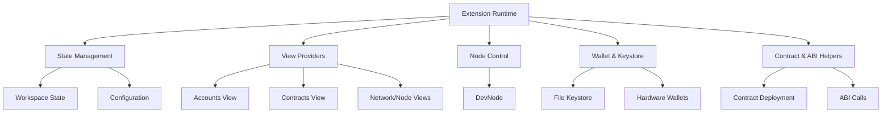

# CLI & Developer Tools

# CLI & Developer Tools Module

The **CLI & Developer Tools** module provides a lightweight, dependency-minimal command-line interface and a rich VS Code extension for interacting with the Conflux network — supporting account management, contract deployment, node control, and cross-chain development workflows.

It consists of two primary packages:

- `@cfxdevkit/cli`: A minimal CLI (`cfx`) for scripting and automation.
- `@cfxdevkit/scaffold-cli`: A project scaffolding tool for rapid template-based setup.
- `@cfxdevkit/vscode-extension`: A full-featured VS Code extension for interactive development.

All components share a common philosophy: **small surface area, zero external CLI dependencies**, and **deep integration with `@cfxdevkit/core` and related libraries**.

---

## Core Principles

| Principle | Rationale |
|---------|-----------|
| **No external CLI parser** | Hand-rolled `parseArgs` avoids `commander`/`yargs` bloat and keeps install footprint minimal. |
| **Command-agnostic output** | All commands support `--json` for machine-readable output and human-friendly formatting. |
| **Stateless CLI, stateful extension** | CLI is ephemeral; VS Code extension persists network, keystore, and deployment state. |
| **Dual-chain first** | All tooling supports both **Core Space** (base32 addresses) and **eSpace** (EVM-compatible `0x` addresses). |

---

## CLI (`@cfxdevkit/cli`)

### Purpose

A minimal CLI for scripting, CI/CD, and developer automation. It exposes three core commands:

- `cfx status` — Ping chains and measure RPC latency.
- `cfx derive` — Derive accounts from a mnemonic (or generate one).
- `cfx generate` — Generate a fresh BIP-39 mnemonic.

### Command Structure

```bash
cfx <command> [options]
```

#### Global Flags

| Flag | Type | Description |
|------|------|-------------|
| `--json` | boolean | Emit JSON output (machine-readable). |
| `--help` | boolean | Show help. |

#### `status` Command

| Flag | Type | Description |
|------|------|-------------|
| `--chain <id\|name>` | string | Ping a specific chain (e.g., `core-testnet`, `espace-mainnet`). |
| `--rpc <url>` | string | Override the RPC endpoint. |
| `--timeout-ms <ms>` | number | HTTP timeout (default: 30s). |

**Output (non-JSON)**:
```
OK  core-testnet       id=    1 head=epoch=1234567   120ms  http://...
ERR espace-mainnet    id=1030 head=block=9876543   210ms  http://...  (timeout)
```

#### `derive` Command

| Flag | Type | Description |
|------|------|-------------|
| `--mnemonic "<phrase>"` | string | Use existing mnemonic. |
| `--generate` | boolean | Generate a new mnemonic. |
| `--count <N>` | number | Derive `N` accounts (default: `1`). |
| `--start <I>` | number | Starting derivation index (default: `0`). |
| `--type standard\|mining` | string | Account segment (default: `standard`). |
| `--core-network-id <id>` | number | `1029` (main), `1` (test), `2029` (local). |
| `--passphrase "<pass>"` | string | BIP-39 passphrase. |
| `--strength 128\|256` | number | Mnemonic strength (12 or 24 words). |
| `--show-private-keys` | boolean | Include private keys in output. |
| `--show-mnemonic` | boolean | Include mnemonic (even without `--generate`). |

**Output (non-JSON)**:
```
mnemonic: ... (only if --generate or --show-mnemonic)
accountType: standard   coreNetworkId: 1

  [0]
    evm  : 0x...   (path m/44'/60'/0'/0/0)
    core : cfxtest:...   (path m/44'/60'/0'/0/0)
    pk   : 0x... (only if --show-private-keys)
```

#### `generate` Command

| Flag | Type | Description |
|------|------|-------------|
| `--strength 128\|256` | number | Mnemonic strength (default: `128` → 12 words). |

**Output**: Plain mnemonic (or JSON with `--json`).

---

### Argument Parsing (`args.ts`)

A hand-rolled parser supporting:

- `--flag` → `flags.flag = true`
- `--key value` or `--key=value` → `flags.key = "value"`
- First non-flag token → `command`
- Remaining tokens → `positionals`

```ts
interface ParsedArgs {
  command: string | undefined;
  positionals: string[];
  flags: Record<string, string | boolean>;
}
```

Helper functions extract typed values:

```ts
getString(flags, 'mnemonic'); // string | undefined
getNumber(flags, 'count');    // number | undefined
getBool(flags, 'show-keys');  // boolean
```

> ✅ **No external dependencies** — critical for CLI install speed and reproducibility.

---

## Scaffold CLI (`@cfxdevkit/scaffold-cli`)

### Purpose

Bootstrap new projects using templates (e.g., `basic`, `react`, `solidity`). Designed for rapid prototyping and workshop use.

### Usage

```bash
cfx-scaffold <project-name> [--template <name>] [--force]
```

### Key Functions

| Function | Description |
|---------|-------------|
| `scaffoldProject(projectDir, templateName, options)` | Renders template files with `{{variable}}` substitution. |
| `validateName(name)` | Enforces npm-compatible project names (no spaces, no leading digits, etc.). |
| `renderFile(content, values)` | Replaces `{{key}}` placeholders with values. |

**Example**:
```bash
cfx-scaffold my-dapp --template solidity --force
# → Creates `my-dapp/`, renders `package.json` with `{{name}}` → `"my-dapp"`
```

---

## VS Code Extension (`@cfxdevkit/vscode-extension`)

### Purpose

A full-featured development environment inside VS Code, integrating:

- Local node control (`devnode`)
- Keystore management (file, OneKey, Satochip)
- Contract deployment & ABI interaction
- Network & chain selection (Core/eSpace)
- Deployment tracking & history

### Architecture Overview



### Key Components

#### 1. Runtime (`ExtensionRuntime`)

Central class managing:

- Node lifecycle (`startNode`, `stopNode`, `mineBlocks`)
- Keystore state (`unlockKeystore`, `rotateKeystorePassphrase`)
- Network & chain selection (`selectNetwork`, `setSelectedSpace`)
- View refresh (`refreshAll`, `buildSnapshot`)

#### 2. State Management (`extension-state-helpers.ts`)

Persistent state stored in `vscode.workspaceState` and config:

| State Key | Type | Description |
|-----------|------|-------------|
| `STATE_NETWORK` | `NetworkSelection` | `local`, `testnet`, `mainnet` |
| `STATE_SPACE` | `ChainTarget` | `espace`, `core` |
| `STATE_KEYSTORE_BACKEND` | `KeystoreBackend` | `file`, `onekey`, `satoshi` |
| `STATE_ACTIVE_FILE_REF` | `SecretRef` | Active mnemonic wallet |
| `STATE_ACTIVE_ACCOUNT_INDEX` | `number` | Active derived account index |

#### 3. View Providers (`views-*.ts`)

Tree views for:

- **Networks** — quick network switching
- **Node** — start/stop/restart/mine
- **Accounts** — derived accounts with balances
- **Contracts** — deployed contracts with ABI actions

Each view uses `StaticTreeProvider` for efficient rendering.

#### 4. Keystore & Wallet (`extension-wallet-helpers.ts`, `extension-wallet-lock-helpers.ts`)

Supports:

- **File backend**: Encrypted keystore (`keystore.json`) with BIP-39 mnemonics.
- **Hardware backends**: OneKey (SDK), Satochip (bridge).
- Mnemonic generation/import, passphrase rotation, account derivation.

#### 5. Node Control (`extension-node-helpers.ts`)

Uses `@cfxdevkit/devnode` to manage a local Conflux node:

- `startNode()` — starts node with mnemonic-derived accounts.
- `mineBlocks(n)` — mines `n` empty blocks.
- `wipeNode()` — clears node data.

#### 6. Contract Helpers (`extension-contract-command-helpers.ts`, `extension-contract-import-helpers.ts`)

- `deployContractCommand()` — deploy from template/workspace Solidity.
- `importContractCommand()` — import existing contracts (manual or env var).
- `showContractsQuickPick()` — copy deployed contract addresses.

#### 7. ABI Interaction (`extension-abi-helpers.ts`)

- `abiCallRead()` — call view functions, parse JSON args.
- `abiCallWrite()` — send transactions, prompt payable value.
- `promptAbiArgs()` — JSON array input with validation.
- `placeholderForSolidityType()` — generates example args (e.g., `"0x..."`, `true`, `[]`).

---

## Integration with Core Libraries

All CLI and extension commands delegate to `@cfxdevkit/core` and related packages:

| CLI/Extension Function | Core Library Used |
|------------------------|-------------------|
| `deriveDualAccounts` | `@cfxdevkit/core/wallet` |
| `generateMnemonic`, `validateMnemonic` | `@cfxdevkit/core/wallet` |
| `getChain`, `listChains` | `@cfxdevkit/core/chains` |
| `createClient`, `http`, `readContract`, `sendWrite` | `@cfxdevkit/core/client`, `@cfxdevkit/contracts` |
| `createDevNode`, `DevNode` | `@cfxdevkit/devnode` |
| `createFileKeystore`, `rotateLocalPassphrase` | `@cfxdevkit/services/keystore-file` |
| `signerFromOneKey`, `signerFromSatochip` | `@cfxdevkit/wallet/hardware` |

---

## Error Handling & Cross-Module Flows

The module integrates with shared error types:

| Flow | Error Type | Trigger |
|------|-----------|---------|
| `DeriveFromFlags → ValidateMnemonic` | `CryptoError` | Invalid BIP-39
