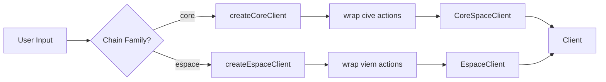
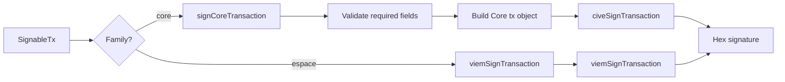

# Core Protocol & Chain

# Core Protocol & Chain Module

The **Core Protocol & Chain** module (`@cfxdevkit/core`) provides the foundational abstractions for interacting with Conflux’s dual-chain architecture: **Core Space** (Conflux-native, non-EVM) and **eSpace** (EVM-compatible). It unifies RPC client creation, chain configuration, address encoding, wallet operations, and error handling under a consistent, type-safe API.

This module is the **central nervous system** of the framework: it defines *what chains exist*, *how to talk to them*, *how to derive and sign transactions*, and *how to report failures*.

---

## Architecture Overview

```mermaid
flowchart TD
    subgraph "Configuration"
        Chains["chains/index.ts"]
        ChainConfig["ChainConfig"]
    end

    subgraph "Clients"
        Client["client/index.ts"]
        CoreClient["client/core.ts"]
        EspaceClient["client/espace.ts"]
    end

    subgraph "Transport"
        Transport["client/transport.ts"]
        HTTP["http()"]
        WS["ws()"]
        Fallback["fallback()"]
    end

    subgraph "Wallet"
        Wallet["wallet/index.ts"]
        Derivation["wallet/derivation.ts"]
        Signing["wallet/signing.ts"]
    end

    subgraph "Utilities"
        Units["units/index.ts"]
        Address["address/index.ts"]
        Errors["errors/index.ts"]
        Types["types/index.ts"]
    end

    Chains -->|config| Client
    Transport -->|_viem/_cive| CoreClient
    Transport -->|_viem/_cive| EspaceClient
    Client --> CoreClient
    Client --> EspaceClient
    Derivation -->|mnemonic, paths| Wallet
    Signing -->|signCoreTransaction| Wallet
    Units -->|CFX/drip math| Types
    Address -->|base32/hex| Types
    Errors -->|CfxError hierarchy| All

    style Chains fill:#e6f7ff,stroke:#1890ff
    style Client fill:#f6ffed,stroke:#52c41a
    style Wallet fill:#fff7e6,stroke:#faad14
```

---

## Core Concepts

### 1. Chain Configuration (`chains/index.ts`)

A **chain** is a static configuration describing a Conflux network (mainnet, testnet, local, etc.) and its RPC endpoints, token metadata, and explorer.

#### Key Types

| Type | Description |
|------|-------------|
| `ChainFamily` | `'core'` (Conflux-native) or `'espace'` (EVM-compatible) |
| `Network` | `'mainnet'`, `'testnet'`, `'devnet'`, `'local'` |
| `ChainConfig` | Immutable config object with `id`, `name`, `rpc`, `nativeToken`, etc. |

#### Predefined Chains

| Chain | `id` | `family` | `network` | Default RPC |
|-------|------|----------|-----------|-------------|
| `coreSpaceMainnet` | 1029 | `core` | `mainnet` | `https://main.confluxrpc.com` |
| `coreSpaceTestnet` | 1 | `core` | `testnet` | `https://test.confluxrpc.com` |
| `coreSpaceLocal` | 2029 | `core` | `local` | `http://127.0.0.1:12537` |
| `espaceMainnet` | 1030 | `espace` | `mainnet` | `https://evm.confluxrpc.com` |
| `espaceTestnet` | 71 | `espace` | `testnet` | `https://evmtestnet.confluxrpc.com` |
| `espaceLocal` | 2030 | `espace` | `local` | `http://127.0.0.1:8545` |

#### API

```ts
// Look up a chain by ID or name (throws on unknown)
getChain(idOrName: ChainId | string): ChainConfig

// List chains, optionally filtered
listChains(filter?: { family?: ChainFamily; network?: Network }): readonly ChainConfig[]

// Validate & normalize user-provided chain configs
defineChain(input: ChainConfig): ChainConfig
```

> ✅ **Design Note**: Chains are *pure data* — no I/O, no side effects. This enables safe serialization, testing, and configuration-driven client creation.

---

### 2. Client Abstraction (`client/index.ts`)

Clients are **family-aware RPC clients** that abstract over `viem` (for eSpace) and `cive` (for Core Space). They expose a unified interface while preserving chain-specific semantics.

#### Client Interface

```ts
interface ClientBase {
  readonly chain: ChainConfig;
  readonly transport: Transport;
  request<T = unknown>(req: RpcRequest, opts?: CallOptions): Promise<T>;
}

interface EspaceClient extends ClientBase {
  readonly family: 'espace';
  getBlockNumber(): Promise<bigint>;
  getBlock(tag: BlockTag): Promise<Block>;
  getBalance(address, opts?): Promise<Wei>;
  getTransactionReceipt(hash): Promise<TxReceipt | null>;
  estimateGas(input): Promise<bigint>;
}

interface CoreSpaceClient extends ClientBase {
  readonly family: 'core';
  getEpochNumber(opts?): Promise<bigint>;
  getStatus(): Promise<NodeStatus>;
  getBalance(address, opts?): Promise<Wei>;
  getTransactionReceipt(hash): Promise<TxReceipt | null>;
  getTransaction(hash): Promise<unknown | null>;
  getLogs(filter): Promise<CoreLog[]>;
  getSponsorInfo(address, opts?): Promise<SponsorInfo>;
  getAdmin(address, opts?): Promise<string | null>;
}
```

#### Client Creation

```ts
const client = createClient({
  chain: getChain('core-mainnet'),
  transport: http({ url: 'https://main.confluxrpc.com' }),
});
```

> ✅ **Design Note**: `createClient()` is the *only* public entry point for client instantiation. It dispatches to `createCoreClient()` or `createEspaceClient()` based on `chain.family`.

---

### 3. Transport Layer (`client/transport.ts`)

A `Transport` wraps both `viem` and `cive` transports, enabling dual-family clients to share the same underlying connection.

#### Transport Types

| Kind | Constructor | Notes |
|------|-------------|-------|
| `http` | `http(opts)` | Supports `url`, `headers`, `timeoutMs`, `retries` |
| `ws` | `ws(opts)` | Supports `url`, `reconnect`, `timeoutMs` |
| `fallback` | `fallback(transports)` | Round-robin failover across transports |

#### Example

```ts
const transport = fallback([
  http({ url: 'https://main.confluxrpc.com', timeoutMs: 5000 }),
  http({ url: 'https://backup.confluxrpc.com' }),
]);
```

> ✅ **Design Note**: `Transport` is *family-agnostic* — it doesn’t know about Core/eSpace, only about RPC connectivity.

---

### 4. Address Encoding (`address/index.ts`)

Conflux uses **base32 addresses** (e.g., `cfx:aaj9c9g9g9g9g9g9g9g9g9g9g9g9g9g9g9g9g9g9g9`) instead of hex. This module provides bidirectional conversion between hex and base32.

#### Key Functions

| Function | Signature | Description |
|----------|-----------|-------------|
| `hexToBase32` | `(hex: Hex, networkId: number) => string` | Convert hex → base32 (e.g., `0x...` → `cfx:...`) |
| `base32ToHex` | `(base32: string) => HexAddress` | Convert base32 → hex (strict by default) |
| `isBase32Address` | `(addr: string) => boolean` | Validate base32 format |
| `getCoreAddress` | `(addr: string) => string` | Canonicalise (fix prefix + casing) |

> ✅ **Design Note**: Uses `cive` under the hood — ensures compatibility with Conflux’s official tooling.

---

### 5. Wallet & Signing (`wallet/index.ts`, `wallet/derivation.ts`, `wallet/signing.ts`)

The wallet module handles **key derivation**, **address generation**, and **transaction signing** for both Core and eSpace.

#### Mnemonic & Derivation

| Function | Description |
|----------|-------------|
| `generateMnemonic(strength = 128)` | Generate a BIP-39 mnemonic |
| `validateMnemonic(mnemonic)` | Validate BIP-39 compliance |
| `deriveAccount(input)` | Derive a single account (EVM or Core) |
| `deriveDualAccount(input)` | Derive *both* EVM and Core addresses from one mnemonic |
| `deriveDualAccounts(input)` | Derive a list of dual-address accounts |

#### Default Derivation Paths

| Family | Path | Purpose |
|--------|------|---------|
| Core Space | `m/44'/503'/0'/0/0` | Conflux-native (BIP-44 coin type `503'`) |
| eSpace | `m/44'/60'/0'/0/0` | EVM-compatible (coin type `60'`) |

#### Dual-Address Accounts

```ts
interface DualAddressAccount {
  index: number;
  evmAddress: Address;      // eSpace: 0x...
  coreAddress: string;      // Core: cfx:...
  publicKey: Hex;
  privateKey: Hex;
  paths: { evm: string; core: string };
}
```

#### Signing

| Function | Description |
|----------|-------------|
| `signerFromPrivateKey(privateKey, coreNetworkId?)` | Create a `Signer` from a private key |
| `signTransaction(tx, opts?)` | Sign a transaction (Core or eSpace) |
| `signMessage(message, opts?)` | Sign a message (EIP-191) |
| `signTypedData(typedData, opts?)` | Sign EIP-712 typed data |

> ✅ **Design Note**: Core Space transactions require additional fields (`epochHeight`, `storageLimit`, `gas`, `nonce`) and support `legacy`, `cip2930`, and `cip1559` types.

---

### 6. Units & Math (`units/index.ts`)

Conflux uses **drip** (1 CFX = 10¹⁸ drip) as the base unit. Gas prices are quoted in **Gdrip** (1 Gdrip = 10⁹ drip).

#### Key Functions

| Function | Description |
|----------|-------------|
| `parseCFX(value: string)` | Parse decimal CFX → `Wei` (drip) |
| `formatCFX(value: Wei)` | Format drip → decimal CFX string |
| `parseGDrip(value: string)` | Parse Gdrip → drip |
| `formatGDrip(value: Wei)` | Format drip → Gdrip string |
| `stringifyBigInt(value, space?)` | JSON.stringify with `bigint` → string |

> ✅ **Design Note**: All math is `bigint`-only — no floating-point arithmetic.

---

### 7. Types (`types/index.ts`)

Shared primitive types across the framework:

| Type | Description |
|------|-------------|
| `Address`, `Hash`, `Hex`, `Wei`, `ChainId` | Re-exported from `viem` |
| `BlockTag` | `latest`, `earliest`, `pending`, `safe`, `finalized`, or `bigint` |
| `EpochTag` | Core-specific: `latest_state`, `latest_mined`, `latest_finalized`, `latest_checkpoint`, `earliest` |
| `NodeStatus` | Core Space node state (`epochNumber`, `bestHash`, `chainId`, etc.) |
| `CoreLog`, `CoreLogFilter` | Core Space log types (supports epoch/block ranges) |
| `SponsorInfo` | Contract sponsor pool state (`sponsorBalanceForGas`, `usedStoragePoints`, etc.) |

> ✅ **Design Note**: Types are *wire-level* — they match RPC payloads exactly.

---

### 8. Error Handling (`errors/index.ts`)

A typed error hierarchy for framework-specific failures.

#### Error Classes

| Class | Use Case |
|-------|----------|
| `CfxError` | Base class (all errors extend this) |
| `RpcError` | Network, timeout, rate-limit, server 5xx |
| `ContractError` | Reverts, decode failures, gas estimation |
| `WalletError` | Mnemonic, derivation, signing, user rejection |
| `KeystoreError` | Vault locked, missing secret, backend unavailable |

#### Error Structure

```ts
interface CfxErrorInit {
  code: string;         // e.g., 'core/rpc/timeout', 'core/wallet/sign-rejected'
  message: string;
  cause?: unknown;
  meta?: Record<string, unknown>;
}
```

> ✅ **Design Note**: Errors are *JSON-serializable* (`toJSON()`) and include structured context (`meta`) for debugging.

---

## Integration Points

### Client Creation Flow



### Signing Flow



---

## Usage Examples

### 1. Create a Core Space Client

```ts
import { getChain, http, createClient } from '@cfxdevkit/core';

const client = createClient({
  chain: getChain('core-mainnet'),
  transport: http({ url: 'https://main.confluxrpc.com' }),
});

const epoch = await client.getEpochNumber({ epochTag: 'latest_state' });
console.log(epoch); // 1234567n
```

### 2. Derive a Dual-Address Account

```ts
import { deriveDualAccount } from '@cfxdevkit/core';

const account = deriveDualAccount({
  mnemonic: 'abandon ...',
  index: 0,
  coreNetworkId: 1029,
});

console.log(account
