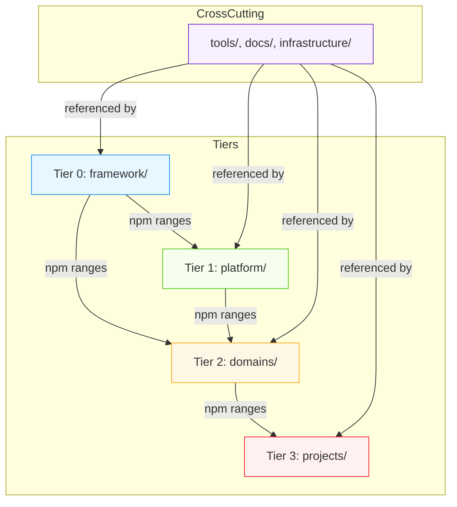

# Documentation & Architecture

# Documentation & Architecture Module

This module defines the architectural and documentation foundation for the GitNexus-indexed modular monorepo workspace. It establishes the **five-tier dependency model**, **boundary contracts**, **build stack decisions**, and **security posture** that govern how code is organized, built, and maintained across the repository.

> **Key insight**: This module is *not* a runtime component — it is a *design-time contract* enforced through documentation, CI, and tooling. It tells agents and contributors *where* to place new code, *how* to build it, and *what* rules it must obey.

---

## Purpose

The Documentation & Architecture module serves three core purposes:

1. **Spatial organization** — defines where code belongs (`repos/cfx-*`, `projects/*`, `infrastructure/*`, etc.)
2. **Dependency governance** — enforces a one-way dependency graph across tiers
3. **Operational clarity** — documents build tools, security boundaries, and migration strategy

It answers questions like:
- *"Should I put this in `framework/` or `platform/`?"*
- *"Can `domains/game-engine` depend on `framework/react`?"*
- *"What build tools are allowed, and why?"*
- *"How do I safely refactor a `framework/` package?"*

---

## The Five-Tier Architecture

The repository is logically partitioned into five **architectural tiers**, each with distinct responsibilities, dependency rules, and release semantics.

### Tier Model



### Tier Responsibilities

| Tier | Current Path | Target Path | Role | Published? | Dependency Rule |
|------|--------------|-------------|------|------------|-----------------|
| **0** | `repos/cfx-{core,keys,ui,solidity}` | `framework/` | Chain SDK, contracts, React primitives | ✅ npm (`@cfxdevkit/*`) | **No deps on other tiers** |
| **1** | `repos/cfx-tools` | `platform/` | Devcontainer, AI agent tools, scaffolding | ⚠️ Some (CLI, MCP) | May depend on `framework/` via npm |
| **2** | `repos/cfx-domain` | `domains/` | Game engine, automation, hardware bridges | ⚠️ Optional | May depend on `framework/` only |
| **3** | `projects/*` | `projects/` | End-user applications | ❌ Internal/deployed | May depend on any lower tier |
| — | `tools/`, `docs/`, `infrastructure/` | — | Cross-cutting support | ❌ | May be referenced by any tier |

> **Critical rule**: **Lower tiers may never import from higher tiers.** This is enforced by CI and tooling.

---

## Boundary Contracts

Each tier has explicit **boundary contracts** — rules that define what is allowed, forbidden, and expected.

### Tier 0 (`framework/`) — Published SDK

- **Tree-shakeable & side-effect free** where possible
- **Targets Node 20+ and modern browsers** — no Node-only APIs in browser packages
- **Semver-compliant** — uses Changesets, publishes typed entrypoints + sourcemaps + LICENSE
- **No internal imports** — `internal/` folders are package-local only
- **Stability annotations** — `@stable`, `@beta`, `@experimental`, `@internal`
- **Current location**: `repos/cfx-core`, `repos/cfx-keys`, `repos/cfx-ui`, `repos/cfx-solidity`

### Tier 1 (`platform/`) — Developer Platform

- **May depend on `framework/` via npm range** — never via `workspace:*`
- **Never a runtime dependency** — no deployed app imports from `platform/`
- **Owns developer experience**: containers, AI agent tooling, scaffolding, IDE integration
- **Current location**: `repos/cfx-tools`

### Tier 2 (`domains/`) — Reusable Verticals

- **Encapsulates one vertical concern** (game state, automation strategy, hardware protocol)
- **Imports `framework/` only** — no platform or project imports
- **Each domain documents its public API** in its own README
- **Promotion criterion**: used by ≥ 2 projects, or explicitly designated as a future product
- **Current location**: `repos/cfx-domain`

### Tier 3 (`projects/`) — Applications

- **Free to be opinionated** — may use any framework/domain/platform package
- **Each project has its own deploy lifecycle** (`infrastructure/<project>`)
- **Project-internal `packages/` allowed** for genuinely project-specific code
- **Current location**: `projects/*`

### Cross-Cutting Areas

| Area | Role | Dependency Rule |
|------|------|-----------------|
| `tools/` | Shared configs (`tsconfig`, `biome`, `eslint`, codegen, release) | Consumed by every workspace package |
| `docs/` | Long-form docs (architecture, ADRs, guides, generated API) | Referenced by any tier |
| `infrastructure/` | Dockerfiles, compose, K8s, Terraform, CI workflows, dashboards | Referenced by any tier |

---

## Build Stack & Tooling

The workspace uses a **vendor-neutral, offline-first toolchain**. All decisions are recorded in [ADR-0001](docs/adr/0001-build-stack.md).

| Concern | Tool | Why |
|---------|------|-----|
| Package manager | **pnpm 10+ workspaces** | Single root lockfile, `workspace:*` protocol |
| Bundler | **Vite 8 (Rolldown)** | Libraries: `vite build --lib` + `vite-plugin-dts`; Apps: static output (S3/Cloudflare/Netlify) |
| Task runner | **moonrepo** (Rust) | Deterministic hashing, parallel task graph, S3-compatible remote cache, no Vercel lock-in |
| Linter / formatter | **Biome** | Unified across repos |
| Tests | **Vitest** (unit/integration), **Playwright** (e2e), **Hardhat** (contracts) | |
| Type-checking | **TS project references** driven by moon | |
| Releases | **Changesets** (`framework/`), tags + GitOps (`projects/`) | |

### Why Not Turborepo / Nx / Bazel?

- **Turborepo**: Tightening Vercel coupling (Remote Cache, telemetry)
- **Nx**: Heavy, pushes Nx Cloud
- **Bazel**: Overkill for JS/TS-first stack with one C++ corner

> **Moon is chosen** because it gives deterministic hashing, parallel task graph, integrated toolchain, and remote-cache-as-a-bucket — all without a vendor account.

---

## Security Boundaries

The architecture enforces **explicit security boundaries** per tier. Full details in [SECURITY.md](SECURITY.md).

| Concern | Location | Notes |
|--------|----------|-------|
| Private keys / keystores | Never committed | env + `infrastructure/secrets/` references only |
| Smart-contract source | `projects/<p>/contracts/` | Each project owns deployments |
| Generated ABIs | `framework/contracts/` (shared) or per-project | Published, versioned |
| Network endpoints | `framework/core` config or per-project env | No hard-coded mainnet keys |
| MCP / AI tool surface | `platform/mcp-server/` | Explicit tool allowlist |

### Key Security Invariants

- **Session keys** are the default for automated signers — short-lived, capability-scoped, derived in memory
- **Raw private keys** may only be loaded by interactive user action
- **Hardware wallets** (Ledger) are recommended for mainnet write
- **Keystore backends** are pluggable: `keystore-kms`, `keystore-os`, `keystore-file`, `keystore-forward`, `keystore-memory`
- **Audit logging** is append-only and hash-chained

See [ADR-0002](docs/adr/0002-keystore.md) for full keystore strategy.

---

## Migration Strategy

The current workspace is a **stepping stone** toward the final tier-shaped topology. The migration plan ([MIGRATION.md](MIGRATION.md)) is **non-destructive**:

1. **Move, don’t rewrite** — use `git mv` to preserve history
2. **Compat shims first** — old import paths re-export from new locations
3. **One project at a time** — never migrate two consumers in parallel
4. **Green CI gate** — no migration step merges without passing existing tests

### Migration Sequence (Summary)

| Step | What | Risk |
|------|------|------|
| 1 | Lift `devkit/packages/*` → `framework/*` | Low |
| 2 | Lift `devkit/devtools/*` → `platform/devtools/*` | Low |
| 3 | Lift devkit-workspace MCP/scaffold/vscode-ext/templates → `platform/*` | Medium |
| 4–6 | Move `Electro/`, `conflux-phaser/`, `chainbrawler/` → `projects/*` | Low |
| 7 | Move `cas/` → `projects/cas/`; identify `domains/automation/` candidates | High (live mainnet) |
| 8–9 | Extract reusable bits into `domains/*`; replace duplicated code with `framework/*` deps | Medium |
| 10 | Decommission old top-level folders | Low (after green window) |

Each step is a **single squash-mergeable PR** — reverting fully restores prior state.

---

## Documentation Structure

The `docs/` folder hosts **long-form documentation** that spans multiple packages or tiers.

### Current Structure

```
docs/
├── architecture/       Cross-cutting design notes
├── adr/                Architectural Decision Records
├── guides/             How-tos (planned)
├── api/                Generated API reference (TypeDoc)
├── projects/           Per-project entry points (planned)
├── security/           Threat models, audit history (planned)
├── keystore-docker.md  Operational guide
└── llm-fine-tuning-plan.md  LLM automation planning
```

### ADRs (Architectural Decision Records)

| ID | Title | Status |
|----|-------|--------|
| 0001 | Build & Workspace Stack | ✅ Accepted |
| 0002 | Keystore Strategy | ✅ Accepted |
| 0003 | Multi-Repo Split by Technical Surface | 🟡 Proposed |

> ADRs are **append-only** — superseded ADRs link forward to their replacement.

---

## GitNexus Integration

The repository is indexed by **GitNexus** as **root** (6177 symbols, 10166 relationships, 300 execution flows). This enables:

- **Impact analysis** before edits: `gitnexus_impact({target: "symbolName", direction: "upstream"})`
- **Blast radius reporting**: direct callers, affected processes, risk level
- **Safe renaming**: `gitnexus_rename` understands the call graph
- **Execution flow tracing**: `gitnexus_query({query: "concept"})` returns process-grouped results

> **MUST run** `gitnexus_impact` before editing any symbol. **MUST run** `gitnexus_detect_changes()` before committing.

See `.claude/skills/gitnexus/` for CLI reference.

---

## Framework Design Principles

Every package under `framework/` (and ideally `domains/`/`projects/`) follows these principles:

1. **Linear flow, no hidden state** — pure functions by default; side effects named
2. **One responsibility per module** — one feature per `src/<feature>/` folder
3. **Component-size budget** — ≤ 250 LOC/file, ≤ 30 LOC/function, ≤ 5 public exports
4. **Prefer functions over classes** — use classes only for identity (long-lived connections)
5. **Plain data in, plain data out** — inputs/outputs are JSON-serializable
6. **Explicit dependency injection** — network, fs, clock, rand passed in, not imported
7. **Structured error model** — `CfxError` with `code`, `cause`, `meta`
8. **Async model** — `Promise<T>`, `AbortSignal` for cancellation
9. **Naming conventions** — `create*`, `make*`, `read*`, `write*`, `parse*`, `format*`, `is*`, `assert*`
10. **Public surface** — named exports only; `exports` map matches `API.md`

See [docs/architecture/framework-design-principles.md](docs/architecture/framework-design-principles.md) for full list.

---

## Call Graph & Execution Flow Summary

This module itself has **no runtime code** — it is a documentation and design artifact. However, it governs the execution flows of the entire workspace.

### Key Execution Flows

| Flow | Tier(s) Involved | Description |
|------|------------------|-------------|
| `pnpm run lint` | All tiers | Biome linting across workspace |
| `pnpm run typecheck` | All tiers | TypeScript project references |
| `pnpm exec moon run :test` | All tiers | Vitest + Hardhat tests |
| `pnpm run build` | All tiers | Vite build (libs + apps) |
| `pnpm run security:check` | All tiers | Secret leaks, dependency audit |
| `pnpm run llm:all` | `repos/cfx-llm` | Deterministic LLM upkeep agents |

### GitNexus Context

- **Index freshness**: Check via `gitnexus://repo/root/context`
- **Clusters**: `gitnexus://repo/root/clusters`
- **Processes**: `gitnexus://repo/root/processes`
- **Step-by-step trace**: `gitnexus://repo/root/process/{name}`

> **If index is stale, run `npx gitnexus analyze` first.**

---

## Conclusion

The Documentation & Architecture module is the **single source of truth** for how this repository is structured, built, and secured. It is enforced through:

- **Documentation** (this file, ADRs, READMEs)
- **Tooling** (moon, Biome, Vite, GitNexus)
- **CI gates** (lint, typecheck, tests, security checks)
- **Human process** (impact analysis, one-way dependency rule)

When in doubt, **consult this module first** — it tells you where to put code, how to build it, and what rules to obey.
