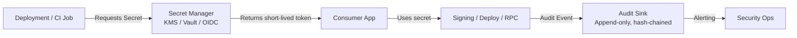

# Infrastructure & Security

# Infrastructure & Security Module

## Overview

The **Infrastructure & Security** module is a cross-cutting operational framework that defines *how* secrets, deployments, and observability are governed across the system — not *what* the system does. It enforces security best practices, standardizes secret management, and establishes audit and access controls for production-critical operations.

Crucially, this module is **one-way**: infrastructure code may reference application projects, but application code must *never* import from `infrastructure/`. This ensures operational concerns remain decoupled from business logic and prevents accidental tight coupling between security policy and runtime behavior.

> **Design Principle**: *Policy lives in infrastructure; execution lives in application.*  
> This module codifies *rules*, not *implementations*.

---

## Core Purpose

This module serves three primary functions:

1. **Secret Governance**  
   Enforces secure handling of cryptographic material (signing keys, tokens, mnemonics) through policies, templates, and integration with external secret stores (KMS, Vault, GitHub OIDC).

2. **Operational Continuity**  
   Defines backup, recovery, and rotation procedures to ensure resilience and incident response readiness.

3. **Audit & Compliance**  
   Mandates tamper-evident, append-only logging of secret access and signing events, with defined retention and alerting.

It does *not* contain secrets, deploy scripts, or CI logic — those live elsewhere (e.g., `.github/workflows/`, secret manager, deployment tooling). Instead, it provides the *rules* those systems must follow.

---

## Structure

```
infrastructure/
├── README.md                 # High-level overview & rules
├── STRUCTURE.md              # Detailed layout & policy references
└── secrets/                  # Policy & template layer only
    ├── README.md             # Secrets operations guidance
    ├── env.template          # Environment variable template (no secrets)
    └── policies/
        ├── access.md         # Least-privilege access model & reviews
        ├── audit-retention.md# Log retention, format, and alerting
        ├── backup-recovery.md# Recovery procedures & quorum rules
        └── rotation.md       # Cadence & emergency rotation steps
```

### Key Constraints

- ✅ Allowed: templates, references, encrypted files (e.g., SOPS + KMS), policy documents  
- ❌ Forbidden: plaintext secrets, decrypted keys, mnemonics, private keys, API tokens  
- 🔐 All production secrets must be sourced from a managed backend (AWS/GCP KMS, HashiCorp Vault, GitHub OIDC)

---

## How It Works

### Secret Lifecycle Management

Secrets are *never* stored in this module. Instead, the module defines *how* secrets are managed across their lifecycle:

| Phase | Policy Source | Enforcement |
|-------|---------------|-------------|
| **Creation** | `rotation.md` (cadence), `env.template` (backend config) | Secret manager enforces key type, length, and origin |
| **Access** | `access.md` (least privilege, OIDC), `env.template` (KMS/Vault config) | IAM roles, OIDC federation, and workload identity binding |
| **Rotation** | `rotation.md` (procedure), `backup-recovery.md` (fallback) | CI/CD pipelines trigger rotation via backend APIs |
| **Audit** | `audit-retention.md` (log format, retention, alerts) | Audit sink (e.g., CloudWatch, Stackdriver, custom sink) |
| **Recovery** | `backup-recovery.md` (quorum, dry-run, incident workflow) | Manual or automated restore via backend-native tools |

#### Secret Access Flow (Simplified)



> All secrets flow through a managed backend — *never* via repository secrets or plaintext files.

---

### Policy Enforcement

Policies are *declarative* and *reference-driven*. They do not auto-enforce — instead, they serve as:

- **Checklist for CI/CD pipelines** (e.g., verify rotation date before deploy)
- **Audit criteria** (e.g., monthly access review records must exist)
- **Incident response playbook** (e.g., follow `backup-recovery.md` steps)

Example: A CI job deploying a signing service must:
1. Confirm the signing key’s last rotation date is within `rotation.md` cadence  
2. Verify the access review record for that key is ≤30 days old  
3. Route signing events to the audit sink per `audit-retention.md` format  
4. Fail if any check is missing

---

## Key Components

### 1. `secrets/env.template`

A *non-secret* environment variable template used to configure secret backend integration:

```bash
CFXDEVKIT_ENV=development
CFXDEVKIT_AUDIT_SINK=file://.cfxdevkit/audit.log
CFXDEVKIT_KMS_PROVIDER=
CFXDEVKIT_KMS_KEY_ID=
CFXDEVKIT_VAULT_ADDR=
CFXDEVKIT_VAULT_MOUNT=
```

- Used by developers and CI to configure secret resolution  
- Must be copied to `secrets/.env` (ignored by `.gitignore`) and populated with *non-sensitive* backend config  
- Never contains actual credentials

### 2. `secrets/policies/`

A set of human-readable policy documents that define *operational guardrails*:

| Policy | Scope | Key Requirements |
|--------|-------|------------------|
| `access.md` | Who can access what, and when | Least privilege, OIDC, named identities, scheduled reviews |
| `audit-retention.md` | Logging & compliance | Append-only, tamper-evident, ≥1-year retention, alerting triggers |
| `backup-recovery.md` | Resilience & incident response | Quorum-based recovery, no plaintext export, dry-run testing |
| `rotation.md` | Key freshness & compromise response | Cadence by secret type, 5-step procedure, emergency override |

> These are *living documents* — updated as threats evolve or tooling changes.

---

## Integration with the Rest of the Codebase

This module is *consumed* by:

- **CI/CD pipelines** (`.github/workflows/`)  
  → Enforces policy checks before deploy (e.g., rotation date, access review)

- **Secret resolution libraries** (in application repos)  
  → Uses `env.template` to configure KMS/Vault/OIDC clients

- **Audit sinks** (e.g., `cfxdevkit-audit-sink`)  
  → Implements `audit-retention.md` format and retention rules

- **Deployment tooling** (e.g., Terraform, Helm, custom scripts)  
  → Integrates with secret manager APIs per `rotation.md` and `backup-recovery.md`

- **Security operations**  
  → Uses `access.md` and `audit-retention.md` for compliance audits and incident triage

### No Reverse Dependencies

Application code **must not**:
- Import from `infrastructure/`
- Reference policy files at runtime
- Parse or execute policy documents

This ensures security policy remains *external* to the system’s runtime behavior — reducing attack surface and preventing policy leakage into binaries.

---

## Security Posture

This module enforces:

- ✅ **Zero plaintext secrets in source control**  
- ✅ **Short-lived credentials** (OIDC, KMS short-lived tokens)  
- ✅ **Tamper-evident audit trails**  
- ✅ **Least-privilege access** with scheduled reviews  
- ✅ **Recovery quorum** to prevent single-point-of-failure  
- ✅ **Rotation cadence** aligned with threat model

It does *not* replace:
- Secret scanning tools (e.g., GitLeaks)  
- Runtime secret redaction (e.g., in logs)  
- Penetration testing or vulnerability scanning

Instead, it provides the *operational foundation* those tools rely on.

---

## Developer Guidance

### For Developers

- Use `secrets/env.template` to configure local secret resolution  
- Store personal keystores *outside* the repo (e.g., `~/.cfxdevkit/keystore`)  
- Never commit decrypted SOPS files or plaintext secrets  
- Follow `rotation.md` when rotating local dev keys  
- Report access review findings via the runbook (not in PRs)

### For CI/CD Maintainers

- Enforce policy checks in workflows (e.g., `rotation.md` cadence)  
- Route signing events to the audit sink per `audit-retention.md`  
- Fail deployments if access review records are missing or expired  
- Use OIDC where possible — avoid long-lived repository secrets

### For Security Ops

- Review `access.md` and `audit-retention.md` for compliance audits  
- Monitor audit sink alerts (e.g., failed signing, off-hours access)  
- Run quarterly recovery dry-runs using non-production keys  
- Update policies as threats evolve

---

## Future Considerations

- **Automated policy validation**: Tools to lint CI workflows against `access.md`/`rotation.md`  
- **Audit sink abstraction**: Unified interface for diverse sinks (CloudWatch, Splunk, custom)  
- **Policy versioning**: Track policy changes alongside infrastructure code  
- **Secret health dashboard**: Visualize rotation status, access reviews, and audit gaps

---

> **Remember**: This module is *policy*, not *code*. Its success is measured by the absence of incidents — not by lines of code.
