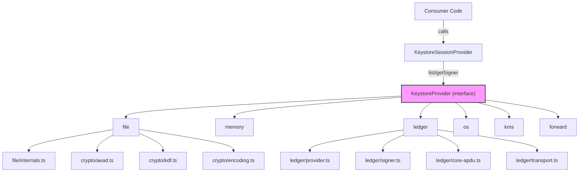
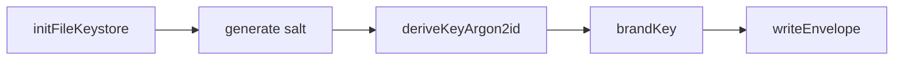
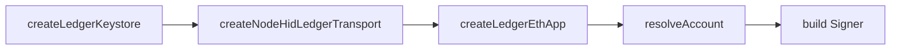

# Keystore & Wallet Services

# Keystore & Wallet Services Module

The **Keystore & Wallet Services** module (`@cfxdevkit/services`) provides a unified, pluggable interface for managing cryptographic secrets (private keys, mnemonics) and producing `Signer` instances for signing transactions and messages across multiple chains (Conflux Core, eSpace Ethereum). It abstracts away backend-specific details while enforcing security best practices: encryption, audit logging, capability enforcement, and hardware wallet integration.

---

## Overview

This module implements a **provider-based architecture** where different keystore backends (file, memory, OS keyring, Ledger hardware wallet, cloud KMS) conform to a shared `KeystoreProvider` interface. All secret material remains encrypted or hardware-bound — never exposed in plaintext across the API boundary.

### Key Goals

- **Security-first**: AES-256-GCM encryption, Argon2id key derivation, hardware-backed signing.
- **Pluggability**: Uniform interface for diverse backends (file, memory, Ledger, etc.).
- **Auditability**: Optional append-only audit logging for all keystore operations.
- **Capability enforcement**: Fine-grained transaction constraints (chains, contracts, selectors, value limits).
- **Cross-chain support**: Conflux Core (via Ledger Core app) and eSpace Ethereum (via Ledger Ethereum app).

---

## Architecture



### Core Layers

| Layer | Purpose | Key Files |
|-------|---------|-----------|
| **Crypto** | Low-level primitives: encryption, KDF, encoding | `crypto/` |
| **Keystore Provider** | Unified interface for all backends | `keystore/index.ts` |
| **Backend Implementations** | Concrete keystore implementations | `keystore/{file,ledger,memory,...}/` |
| **Audit** | Append-only operation logging | `keystore/audit.ts` |

---

## Crypto Primitives (`src/crypto/`)

### AES-256-GCM Encryption (`aead.ts`)

Secure encryption of secrets using AES-256-GCM with **separate tag handling** (not appended to ciphertext). Supports optional AAD (Authenticated Additional Data) to bind ciphertext to a context (e.g., `service:account`).

```ts
// Encrypt
const { ciphertext, iv, tag } = await encryptAesGcm({ key, plaintext, aad });

// Decrypt
const plaintext = await decryptAesGcm({ key, ciphertext, iv, tag, aad });
```

- **IV**: 12 bytes (RFC 5288), auto-generated if omitted.
- **Tag**: 16 bytes, verified during decryption.
- **AAD**: Contextual metadata (e.g., `cfx-v1:cfxdevkit:deployer`), not encrypted but bound to the tag.

### Key Derivation (`kdf.ts`)

- **Argon2id**: Primary KDF for passphrase-based encryption (64 MiB memory, 3 iterations, 1 lane).
  ```ts
  const kek = await deriveKeyArgon2id({ passphrase, salt });
  ```
- **HKDF-SHA256**: Derive subkeys from a master secret (e.g., for key rotation).

### Key Types (`keys.ts`)

- **`AesGcmKey`**: Branded `Uint8Array & { __brand: 'AesGcmKey' }` (32 bytes).
  - Generated via `generateAesGcmKey()` (CSPRNG) or derived via `deriveKeyArgon2id()`/`deriveKeyHkdf()`.
  - Type branding prevents accidental misuse (e.g., passing a 16-byte key).

### Encoding (`encoding.ts`)

- **`toHex`/`fromHex`**: 0x-prefixed hex (e.g., `0x1234...`).
- **`toBase64Url`/`fromBase64Url`**: URL-safe base64 (RFC 4648, no padding) — used for IV/tag/ciphertext in keystore files.

### Randomness (`random.ts`)

- **`randomBytes(n)`**: Cryptographically secure randomness via `@noble/hashes/utils`.

---

## Keystore Provider Interface (`keystore/index.ts`)

All backends implement `KeystoreProvider`, which defines:

```ts
interface KeystoreProvider {
  readonly id: string; // e.g., "file", "ledger"
  readonly capabilities: { write: boolean; list: boolean; rotate: boolean };

  list(opts?: KeystoreListOptions): Promise<StoredSecret[]>;
  has(ref: SecretRef, opts?: KeystoreCallOptions): Promise<boolean>;
  getSigner(
    ref: SecretRef,
    capability?: Capability,
    opts?: KeystoreCallOptions
  ): Promise<Signer>;

  // Optional (write-capable backends only)
  put?(input: KeystorePutInput, opts?: KeystoreCallOptions): Promise<void>;
  remove?(ref: SecretRef, opts?: KeystoreCallOptions): Promise<void>;
  updateMeta?(ref: SecretRef, meta: Record<string, string>, opts?: KeystoreCallOptions): Promise<void>;
}
```

### Key Types

| Type | Description |
|------|-------------|
| `SecretRef` | `{ service: string; account: string }` — e.g., `{ service: 'cfxdevkit', account: 'deployer' }` |
| `StoredSecret` | Public metadata: `ref`, `kind` (`'private-key'`/`'mnemonic'`/`'opaque'`), `createdAt`, `meta` |
| `Capability` | Transaction constraints: `chains`, `contracts`, `selectors`, `maxValuePerTx`, `notAfter` |

### Audit Logging

- **`AuditLogger`**: `record(entry: AuditEntry)` — non-blocking, fire-and-forget.
- **`createAppendOnlyAuditLogger`**: Appends JSON lines to a file with SHA-256 chaining (sequence + previous hash).
- **Default**: `noopAuditLogger` (drops all entries) — used in non-production contexts.

---

## Backend Implementations

### File Keystore (`keystore/file/`)

Encrypted local storage using a master passphrase.

#### File Format (`Envelope`)

```json
{
  "version": "cfx-v1",
  "kdf": {
    "name": "argon2id",
    "salt": "base64url(...)",
    "memKiB": 65536,
    "iterations": 3,
    "parallelism": 1
  },
  "secrets": {
    "cfxdevkit\0deployer": {
      "kind": "private-key",
      "createdAt": 1717020000000,
      "iv": "base64url(...)",
      "ct": "base64url(...)",
      "tag": "base64url(...)"
    }
  }
}
```

- **Encryption**: Each secret encrypted with `AES-GCM` using a KEK derived from the master passphrase.
- **AAD**: Contextual binding (`cfx-v1:${service}:${account}`).
- **Atomic Writes**: Uses temp file + rename to prevent corruption.

#### Key Operations

| Operation | Flow |
|----------|------|
| **`initFileKeystore`** | Generate salt → derive KEK → write empty envelope |
| **`unlockAndProbe`** | Derive KEK → decrypt first secret → validate passphrase |
| **`changeFilePassphrase`** | Decrypt all secrets with old KEK → re-encrypt with new KEK |

### Memory Keystore (`keystore/memory/`)

In-memory store for **tests only** (refuses to load in production).

- Stores secrets as plaintext in RAM.
- Supports `private-key` and `mnemonic` kinds.
- Derives `Signer` via `signerFromPrivateKey` or `deriveAccount` (BIP-44).

### Ledger Hardware Wallet (`keystore/ledger/`)

Supports **Conflux Core** (via Ledger Core app) and **eSpace Ethereum** (via Ledger Ethereum app).

#### Transport & APDU

- **`LedgerTransportLike`**: Abstracts HID/USB communication.
- **APDU Commands**:
  - `INS_GET_PUBLIC_KEY` (0x02): Get address.
  - `INS_SIGN_TX` (0x03): Sign transaction (chunked for large payloads).
  - `INS_SIGN_PERSONAL` (0x04): Sign message (Core app ≥ v2.3.0).

#### Account Configuration

```ts
interface LedgerAccountConfig {
  ref: SecretRef;
  family?: 'espace' | 'core';
  path?: string; // e.g., "m/44'/60'/0'/0/0"
  chainId?: number;
  coreNetworkId?: number; // e.g., 1029 for Conflux Core
  expectedAddress?: Address;
  showAddressOnDevice?: boolean;
}
```

#### Signer Creation

- **eSpace**: Uses `@ledgerhq/hw-app-eth` for EIP-1559 signing.
- **Core**: Direct APDU calls via `@ledgerhq/hw-transport-node-hid`.
- **Capability Enforcement**: Applied via `applyCapability()` wrapper.

---

## Capability Enforcement (`keystore/memory/capability.ts`)

Wraps a base `Signer` to enforce transaction constraints:

```ts
const signer = applyCapability(baseSigner, {
  chains: [1029], // Conflux Core only
  contracts: ['0x...'],
  selectors: ['0xa9059cbb'], // transfer(address,uint256)
  maxValuePerTx: 1000n,
  notAfter: Date.now() + 86400000 // 24h
});
```

- **Enforced**: `signTransaction` only.
- **Delegated**: `signMessage`/`signTypedData` (no capability model for messages).

---

## Integration Points

### `KeystoreSessionProvider`

The primary consumer of this module. Manages keystore sessions (file unlock, Ledger connection) and exposes `getSigner()`/`list()` to the app.

### Initialization Flows

#### File Keystore Initialization



#### Ledger Connection



---

## Error Handling

All crypto/keystore errors use `CryptoError` or `KeystoreError` (subclasses of `CfxError`):

| Code | Description |
|------|-------------|
| `services/crypto/bad-key` | Invalid key length, malformed hex/base64 |
| `services/crypto/decrypt-failed` | GCM tag mismatch, corrupt input |
| `services/keystore/not-found` | Secret not found |
| `services/keystore/bad-passphrase` | Incorrect passphrase |
| `services/keystore/ledger/app-unavailable` | Missing Ledger app/transport |
| `services/keystore/ledger/device-error` | Device communication failure |

---

## Security Considerations

- **No plaintext secrets**: All secrets encrypted at rest (file) or hardware-bound (Ledger).
- **Key derivation**: Argon2id with recommended parameters (64 MiB, 3 iterations).
- **AAD binding**: Prevents ciphertext substitution across contexts.
- **Audit logging**: Tracks access patterns (optional, production-recommended).
- **Capability enforcement**: Limits signer misuse (e.g., prevent high-value transfers).

---

## Testing & Development

- **Memory keystore**: Used in unit tests (`keystore/memory/index.test.ts`).
- **Crypto tests**: `src/crypto/index.test.ts` covers encryption, KDF, encoding.
- **Ledger tests**: Mock APDU responses (`core-framing.test.ts`).

---

## Summary

The **Keystore & Wallet Services** module provides a secure, extensible foundation for managing cryptographic secrets across Conflux and Ethereum ecosystems. By abstracting backend complexity behind a unified interface, it enables:

- Local encrypted storage (`file`)
- Hardware wallet signing (`ledger`)
- Test-friendly in-memory storage (`memory`)
- Audit trails and capability enforcement

All while enforcing cryptographic best practices and preventing secret leakage.
