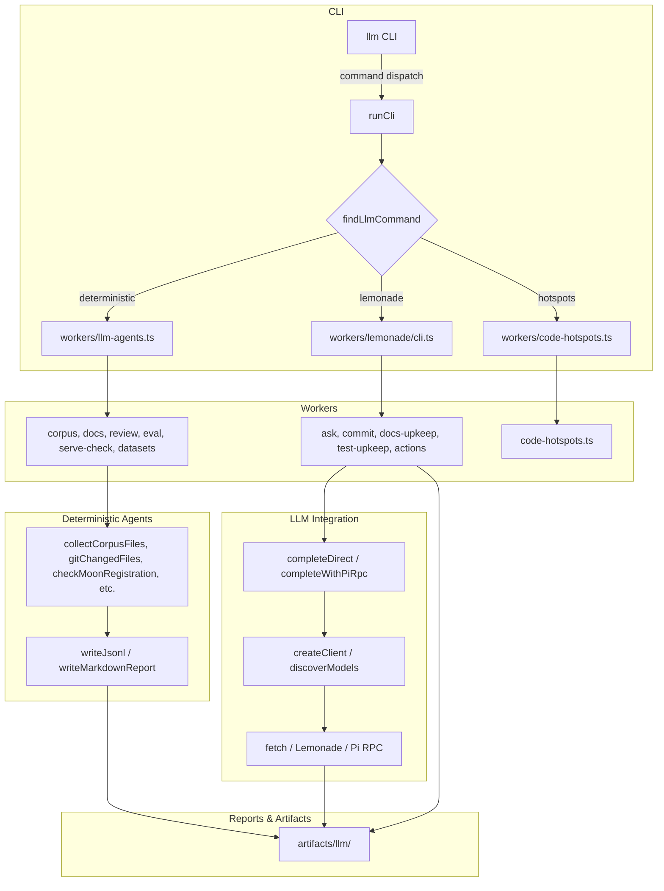
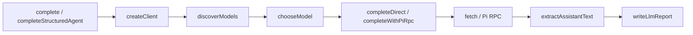

# LLM Automation & Tooling

# LLM Automation & Tooling Module

The **LLM Automation & Tooling** module (`@cfxdevkit/llm-tools`) is a monorepo-local automation framework that enables deterministic and LLM-assisted repository upkeep. It provides a unified CLI interface for running code review, documentation alignment, test coverage analysis, commit preparation, and agent orchestration pipelines — all grounded in local repository context and powered by local LLMs (e.g., via Lemonade server or Pi RPC).

This module is not a general-purpose LLM SDK; it is a *domain-specific automation harness* for the Conflux DevKit monorepo, with strong opinions about structure, quality gates, and reproducibility.

---

## Core Purpose

The module enables developers and CI pipelines to:

- **Run deterministic agents** (corpus indexing, docs alignment, review, eval, hotspots, datasets)
- **Interact with local LLMs** for repo-aware tasks (commit message generation, changelog drafting, docs upkeep, test suggestions, architecture Q&A)
- **Orchestrate multi-step workflows** (e.g., `llm:commit`, `llm:docs-upkeep`, `llm:test-upkeep`)
- **Generate and validate structured outputs** (JSON, Markdown reports, changelogs, test files)
- **Integrate with existing tooling** (Moon, Biome, Vitest, Git, `gitnexus`)

All operations are *context-aware*, *reproducible*, and *report-driven*, with artifacts written to `artifacts/llm/`.

---

## Architecture Overview



### Worker Types

| Worker | Script | Responsibility |
|--------|--------|----------------|
| `lemonade` | `workers/lemonade/cli.ts` | LLM-driven tasks: commit, docs-upkeep, test-upkeep, ask, actions |
| `deterministic` | `workers/llm-agents.ts` | Static analysis: corpus, docs, review, eval, datasets, serve-check |
| `hotspots` | `workers/code-hotspots.ts` | File size & churn analysis against policy budgets |

---

## Command Interface

The module exposes a unified CLI via `pnpm --filter @cfxdevkit/llm-tools llm -- <command> [args]`.

### Command Categories

#### LLM-Driven (`worker: lemonade`)
| Command | Description |
|---------|-------------|
| `models` | List auto-discovered Lemonade models |
| `config` | Show/update Lemonade config (`base-url`, `default-model`, `action`) |
| `ask` | Ask a repo-aware question |
| `commit` | Run hardened commit pipeline (scope detection → changelog → commit message → validation → commit) |
| `action` | Run a named delegated action (e.g., `test-audit`, `repo-health`, `plan`) |
| `actions` | List available actions |
| `docs-upkeep` | Run docs checks + delegate recommendations to LLM |
| `test-upkeep` | Analyze test coverage, identify hotspots, optionally generate tests |
| `test-audit`, `health`, `validation`, `plan`, `architecture` | Delegated LLM tasks (via `run` subcommand) |

#### Deterministic (`worker: deterministic`)
| Command | Description |
|---------|-------------|
| `all` | Run all deterministic agents |
| `corpus` | Build local corpus metadata (files, chunks, docs index) |
| `datasets` | Build deterministic eval seed data (no training) |
| `docs` | Run docs alignment checks (broken refs, drift, exports) |
| `eval` | Summarize agent gates (docs, datasets, serve-check) |
| `review` | Changed-file review + validation suggestions |
| `hotspots` | Scan file sizes & churn against policy |
| `serve-check` | Check Lemonade server reachability |

#### Hotspots (`worker: hotspots`)
| Command | Description |
|---------|-------------|
| `hotspots` | Scan source files for size & churn violations |

---

## Key Components

### 1. Command Registry (`index.ts`)

```ts
export interface LlmCommandDefinition {
  readonly name: string;
  readonly description: string;
  readonly worker: LlmWorker;
  readonly workerArgs: readonly string[];
}
```

- Central registry of all commands (`llmCommands`)
- Maps CLI command → worker script + arguments
- Enables `findLlmCommand(name)` and type-safe `LlmCommandName`

### 2. CLI Runner (`run.ts`)

- Parses args (`--`, `-h`, `help`)
- Resolves repo root via `pnpm-workspace.yaml` + `scripts/`
- Spawns worker via `pnpm exec tsx <script> <workerArgs> [args]`
- Handles exit codes and error reporting

### 3. LLM Client & Completion (`workers/lemonade/completion/`)

#### Core Flow



- **`createClient()`**: Builds base URLs from config/env, discovers models
- **`discoverModels()`**: Tries multiple endpoints (`/api/v1/models`, `/v1/models`, `/models`)
- **`complete()`**: Sends chat completion with context + prompt
- **`completeStructuredAgent()`**: Same, but expects strict JSON (used for docs-upkeep, test-upkeep, commit)
- **`completeWithPiRpc()`**: Delegates to `pi` coding agent via RPC (optional)

#### JSON Repair & Validation

- `parseJsonObject()` handles:
  - Markdown fences
  - Trailing commas
  - Raw newlines in strings
  - Balanced brace extraction
- Used by `validateChangelogJson`, `validateCommitJson`, `validateDocsUpkeepJson`, etc.

### 4. Commit Pipeline (`workers/lemonade/commit/`)

#### Stages

1. **Scope Detection** (`scope.ts`)
   - Detects changed files (staged, unstaged, untracked)
   - Groups by package (`repos/cfx-*/`, `tools/`, `projects/`, `root`)
   - Resolves changelog paths per scope

2. **Changelog Generation** (`changelog.ts`)
   - LLM generates Keep-a-Changelog style entry per scope
   - Validates JSON → fallback if malformed
   - Appends to `CHANGELOG.md`

3. **Commit Message Generation** (`message.ts`)
   - LLM generates conventional commit subject + body
   - Validates JSON → fallback if malformed
   - Writes report to `artifacts/llm/reports/lemonade-commit.md`

4. **Quality Gates** (`gates.ts`)
   - Runs `code-hotspots`, lint, typecheck, build, test (configurable)
   - Fails pipeline on hard violations

5. **Execution** (`message.ts`)
   - Confirms with user (unless `--yes`)
   - Stages files, commits, returns short SHA

### 5. Deterministic Agents (`workers/agents/`)

#### Agent Types

| Agent | Key Functions | Output |
|-------|---------------|--------|
| `corpus` | `collectCorpusFiles`, `chunkFile`, `extractDocIndex` | `corpus/files.jsonl`, `chunks.jsonl`, `docs-index.jsonl` |
| `docs` | `findBrokenPathRefs`, `checkMoonRegistration`, `checkPackageExports` | `reports/docs-alignment.{json,md}` |
| `review` | `gitChangedFiles`, `codeHotspotReport`, `suggestValidationCommands` | `reports/review.{json,md}` |
| `eval` | Aggregates docs/dataset/serve-check status | `reports/eval.{json,md}` |
| `serve-check` | Pings Lemonade endpoints | `reports/serve-check.{json,md}` |
| `datasets` | Builds eval seed data (50 source, 50 doc, 2 policy examples) | `datasets/agent-eval.jsonl` |

#### Runtime Helpers (`agents/runtime/`)

- `writeJsonl`, `writeJsonReport`, `writeMarkdownReport` → `artifacts/llm/`
- `readJsonIfExists`, `readJsonlIfExists`
- `printSummary`, `renderFindings`, `renderReview`, `renderEval`, `renderServeCheck`, `renderAgentRun`
- Path utilities: `toRel`, `packageOwner`, `tierForPath`, `languageForPath`, `sha256`
- Git helpers: `gitChangedFiles`, `suggestValidationCommands`
- Repo checks: `checkMoonRegistration`, `checkPackageExports`, `findBrokenPathRefs`

### 6. Docs Upkeep (`workers/lemonade/docs/`)

- **Scopes**: Groups markdown files by directory (leaf-to-root)
- **Context Flow**: Child summaries shared only within parent folder; root receives compact summaries
- **Modes**:
  - `--write`: Apply exact replacements
  - `--quick`: Limit tokens & files
- **Fallback**: If LLM returns malformed JSON, generates deterministic fallback artifact

### 7. Test Upkeep (`workers/lemonade/tests/`)

- **Inventory**: Scans `vitest.config.*`, collects source/test/untested files
- **Baseline Suggestions**: Adds deterministic runtime smoke tests for untested exports
- **Context**: Includes test run output, untested files, existing tests
- **Write Mode**: Generates complete Vitest test files

---

## Configuration & State

### Config (`artifacts/llm/config/lemonade.json`)

```json
{
  "baseUrl": null,
  "defaultModel": null,
  "actions": {
    "commit": "qwen2.5-coder:14b",
    "test-audit": "qwen2.5-coder:14b"
  }
}
```

- Set via `pnpm run llm:config -- set <key> <value>`
- `baseUrl`: Lemonade server URL (or env `LEMONADE_URL`)
- `defaultModel`: Default model for non-action tasks
- `actions`: Per-action model overrides

### Artifacts (`artifacts/llm/`)

| Path | Purpose |
|------|---------|
| `corpus/files.jsonl`, `chunks.jsonl`, `docs-index.jsonl` | Corpus metadata |
| `corpus/manifest.json` | Corpus summary |
| `datasets/agent-eval.jsonl`, `datasets/manifest.json` | Eval seed data |
| `reports/docs-alignment.{json,md}` | Docs alignment findings |
| `reports/review.{json,md}` | Changed-file review |
| `reports/
