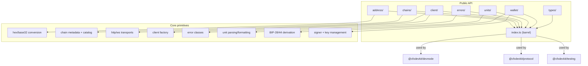

# Other — cfx-core

# `@cfxdevkit/core` — Tier 0a Chain Primitives

`@cfxdevkit/core` is the foundational library for interacting with Conflux networks. It provides **type-safe, low-level primitives** for addresses, units, RPC clients, wallet operations, and chain metadata — all without opinionated abstractions. As the Tier 0a module per ADR-0003, it is designed to be **reusable across higher-level tooling**, including contracts, protocol extensions, and testing utilities.

---

## Overview

This module delivers:

- ✅ **Dual-space support**: Core Space (Conflux native) and eSpace (EVM-compatible)
- ✅ **Strict address encoding**: Base32 ↔ hex conversion with correct network prefixes (`cfx:`, `cfxtest:`, `net2029:`, etc.)
- ✅ **Client abstraction**: Extensible RPC client with transport pluggability (`http`, `ws`, `fallback`)
- ✅ **Wallet primitives**: BIP-39/44 derivation, signing, and dual-address account generation
- ✅ **Unit helpers**: `CFX`/`drip`, `GDrip`, and generic token formatting with `bigint` safety
- ✅ **Error taxonomy**: Rich, serializable error types (`CfxError`, `RpcError`, `WalletError`, `ContractError`)
- ✅ **Chain catalog**: Predefined mainnet/testnet/local chains for both spaces

It is intentionally **stateless and transport-agnostic**, making it suitable for browser, Node.js, and test environments alike.

---

## Architecture



All submodules are exported via **subpath exports** (e.g., `@cfxdevkit/core/client`) to enable granular bundling and tree-shaking.

---

## Key Components

### 1. Address Handling (`address/`)

Conflux uses **base32-encoded addresses** with network-specific prefixes. This module implements:

- `hexToBase32(hex: HexAddress, networkId: number): string`  
  Converts a 20-byte hex address to a Conflux base32 address (e.g., `cfx:aarc9...`).
- `base32ToHex(base32: string): HexAddress`  
  Decodes base32 back to hex, validating checksums.
- `isBase32Address(addr: string): boolean`  
  Validates base32 format and prefix.
- `getCoreAddress(addr: string): string`  
  Normalizes verbose uppercase format (`CFX:TYPE.USER:...`) for `cive` compatibility.

> ✅ **Tested against known mainnet vector** (`0x1a2f...aa55` → `cfx:aarc9...`).

### 2. Chain Catalog (`chains/`)

Predefined chains for both spaces:

| Chain ID | Name             | Network | Family | RPC (HTTP)                     |
|----------|------------------|---------|--------|--------------------------------|
| `1`      | `core-testnet`   | testnet | core   | `https://test.confluxrpc.com` |
| `71`     | `espace-testnet` | testnet | espace | `https://evmtestnet.confluxrpc.com` |
| `1029`   | `core-mainnet`   | mainnet | core   | `https://main.confluxrpc.com` |
| `1030`   | `espace-mainnet` | mainnet | espace | `https://evm.confluxrpc.com` |
| `2029`   | `core-local`     | local   | core   | `http://127.0.0.1:12537`      |
| `2030`   | `espace-local`   | local   | espace | `http://127.0.0.1:8545`       |

- `listChains(filter?: { family?: 'core' \| 'espace'; network?: 'mainnet' \| 'testnet' \| 'local' })`
- `getChain(idOrSlug: number \| string)`
- `defineChain(chain: ChainConfig): Chain`  
  Validates `id > 0`, `rpc.http.length > 0`, and `displayName`.

> ✅ `getChain(1030)` returns `espaceMainnet`; `getChain('espace-mainnet')` is equivalent.

### 3. RPC Client (`client/`)

A minimal, transport-agnostic client supporting **both Core Space and eSpace RPC methods**.

#### Transports
- `http(url?: string)` → `{ kind: 'http' }`
- `ws(url: string)` → `{ kind: 'ws' }`
- `fallback(transports: Transport[])` → `{ kind: 'fallback' }`

#### Client Creation
```ts
import { createClient, http } from '@cfxdevkit/core/client';
import { espaceTestnet } from '@cfxdevkit/core/chains';

const client = createClient({
  chain: espaceTestnet,
  transport: http(),
});
```

#### Methods
- **eSpace (EVM)**: `getBlockNumber`, `getBalance`, `getTransactionReceipt`, `sendRawTransaction`, etc.
- **Core Space**: `getEpochNumber`, `getStatus`, `getSponsorInfo`, `getAdmin`, `getLogs`, etc.

> ✅ **Network tests** (`RUN_NETWORK_TESTS=1 vitest`) verify against real testnet endpoints.

#### Error Wrapping
- `wrapRpc(promise, code, meta?)` → Catches non-`CfxError` exceptions and rethrows as `RpcError`.
- `nullWhenNotFound(promise, notFoundName)` → Converts `NotFoundError` to `null`.

### 4. Wallet & Keys (`wallet/`)

#### Mnemonics
- `generateMnemonic(strength = 128): string`  
  12-word (128-bit) or 24-word (256-bit) BIP-39 mnemonic.
- `validateMnemonic(mnemonic: string): boolean`

#### Derivation
- `deriveAccount({ mnemonic, path = "m/44'/60'/0'/0/0", passphrase? })`  
  Returns `{ privateKey, account: { address, publicKey } }`.
- `deriveAccounts({ mnemonic, basePath, count })`  
  Sequential derivation (e.g., for test fixtures).
- `DEFAULT_ESPACE_PATH = "m/44'/60'/0'/0/0"`
- `DEFAULT_CORE_PATH = "m/44'/503'/0'/0/0"`

#### Dual-Space Accounts
- `deriveDualAccount({ mnemonic, index, accountType = 'user', coreNetworkId })`  
  Derives **same private key** for both EVM and Core addresses (critical for genesis funding).
- `deriveDualAccounts({ mnemonic, count, startIndex })`

#### Signers
- `signerFromPrivateKey(privateKey: HexAddress)`  
  Returns `{ account, signMessage, signTransaction, signTypedData }`.

#### Core Address Encoding
- `coreAddressFromPrivateKey(privateKey, networkId)`  
  Encodes Core Space address with correct prefix (`cfx:`, `cfxtest:`, `net2029:`).

> ✅ **Deterministic test vectors** (e.g., `test test test ... junk`) validate derivation paths.

### 5. Units (`units/`)

All helpers use `bigint` to avoid floating-point errors.

| Function             | Description                                  |
|----------------------|----------------------------------------------|
| `parseUnits(value, decimals)` | `"1.5"` → `1_500_000_000_000_000_000n` |
| `formatUnits(value, decimals)` | `1_500_000_000_000_000_000n` → `"1.5"` |
| `parseCFX(value)` / `formatCFX(value)` | 18-decimal helpers for `CFX`/`drip` |
| `parseDrip(value)` / `formatDrip(value)` | Alias for `parseCFX`/`formatCFX` |
| `parseGDrip(value)` / `formatGDrip(value)` | 9-decimal gas-price unit (`1 GDrip = 1e9 drip`) |
| `formatToken(value, { decimals, symbol })` | `"2 USDC"` |
| `stringifyBigInt(value, indent?)` | JSON-safe serialization of `bigint` |

> ✅ Round-trip tests confirm precision and correctness.

### 6. Errors (`errors/`)

A unified error hierarchy:

```ts
class CfxError extends Error {
  code: string; // e.g., 'core/chains/unknown'
  message: string;
  cause?: Error;
  meta?: Record<string, unknown>;
  toJSON(): { name, code, message, meta? };
}

class RpcError extends CfxError { ... }
class WalletError extends CfxError { ... }
class ContractError extends CfxError { ... }

function isCfxError(err: unknown): err is CfxError;
```

> ✅ `toJSON` omits `meta` when absent for clean serialization.

---

## Package Structure

```
packages/core/
├── src/
│   ├── address/          # Base32/hex conversion
│   ├── chains/           # Chain catalog + definitions
│   ├── client/           # RPC client + transports
│   │   └── errors.ts     # Error wrappers
│   ├── errors/           # Error classes
│   ├── types/            # Shared TypeScript types
│   ├── units/            # Unit formatting
│   ├── wallet/           # Key management + derivation
│   └── index.ts          # Barrel re-export
├── dist/                 # ESM build (Vite + dts)
├── *.test.ts             # Unit tests (Vitest)
└── vitest.config.ts
```

- **Build**: `vite build` → ESM output (`dist/index.js`, `dist/index.d.ts`)
- **Test**: `vitest run` / `RUN_NETWORK_TESTS=1 vitest run`
- **Typecheck**: `tsc --noEmit`

---

## Integration with Other Modules

`@cfxdevkit/core` is the **base dependency** for:

| Module                 | Usage of `@cfxdevkit/core`                                  |
|------------------------|-------------------------------------------------------------|
| `@cfxdevkit/devnode`   | Uses `chains`, `wallet`, `address` to generate genesis accounts |
| `@cfxdevkit/protocol`  | Depends on `client` and `types` for sponsor/staking methods |
| `@cfxdevkit/testing`   | Uses `devnode`, `core`, and `contracts` for test fixtures   |

---

## Usage Examples

### 1. Create an eSpace Client
```ts
import { createClient, http } from '@cfxdevkit/core/client';
import { espaceMainnet } from '@cfxdevkit/core/chains';

const client = createClient({
  chain: espaceMainnet,
  transport: http(),
});

const block = await client.getBlock('latest');
console.log(block.number); // 1234567890n
```

### 2. Derive a Dual-Space Account
```ts
import { deriveDualAccount } from '@cfxdevkit/core/wallet';

const { evmAddress, coreAddress, privateKey } = deriveDualAccount({
  mnemonic: 'test test test ... junk',
  index: 0,
  coreNetworkId: 2029,
});

console.log(evmAddress); // 0xf39fd6e51aad88f6f4ce6ab8827279cfffb92266
console.log(coreAddress); // net2029:arc9abycue0hhzgyrr53m6cxedgccrmmyybjgh4xg
```

### 3. Format Gas Price in GDrip
```ts
import { formatGDrip } from '@cfxdevkit/core/units';

const gasPrice = 20_000_000_000n; // 20 GDrip
console.log(formatGDrip(gasPrice)); // "20"
```

---

## Design Principles

- **No side effects**: Pure functions, no global state.
- **Explicit over implicit**: Network IDs required for address encoding.
- **Type safety first**: All APIs use precise types (HexAddress, `bigint`, etc.).
- **Test-driven**: Every public function has unit tests; network tests are opt-in.
- **Extensibility**: `defineChain` and transport pluggability support custom networks.

---

## Future Work

- `types/`: Expand type definitions for RPC responses (currently minimal).
- `client/`: Add request batching and retry policies.
- `wallet/`: Support hardware wallets (Trezor, Ledger) via `viem` integrations.

---

## License

MIT — see root `LICENSE`.
