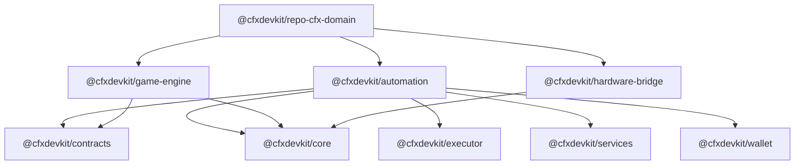

# Other — cfx-domain

# `@cfxdevkit/repo-cfx-domain` — Tier 2 Verticals Module

> **Package**: `@cfxdevkit/repo-cfx-domain`  
> **Version**: `0.0.0`  
> **Target**: Carve-out per [ADR-0003](#)  
> **Layer**: Tier 2 — *verticals* (game-engine, automation, hardware-bridge)

---

## Overview

The `cfx-domain` module is a **workspace-root package** that organizes and coordinates *domain-specific verticals* within the CFX DevKit architecture. It does not contain executable logic itself, but serves as a structural container for three independent, reusable TypeScript libraries:

| Package | Purpose |
|--------|---------|
| `@cfxdevkit/automation` | On-chain automation strategies (e.g., DCA, stop-loss, scheduled execution) |
| `@cfxdevkit/game-engine` | Reusable on-chain game state engine |
| `@cfxdevkit/hardware-bridge` | Bidirectional bridge between physical hardware and the chain (e.g., sensors, actuators) |

Each vertical is implemented as a **workspace package** (`packages/*`) with its own build, test, and type-checking pipeline. All follow a consistent monorepo pattern and are designed to be consumed by higher-tier modules (e.g., `@cfxdevkit/app`, `@cfxdevkit/services`).

---

## Architecture



### Key Structural Principles

- **No internal dependencies** between verticals — they are *orthogonal* concerns.
- **No runtime logic** in the root package (`cfx-domain`); it only defines the workspace.
- All packages are **ESM-only**, targeting `es2023`, with type declarations emitted via `vite-plugin-dts`.
- Each package is versioned independently (currently `0.0.0`), and intended for future stabilization.

---

## Package Details

### `@cfxdevkit/automation`

- **Purpose**: Encapsulate reusable *execution strategies* for on-chain interactions.
- **Dependencies**:
  - `@cfxdevkit/contracts`, `@cfxdevkit/core`, `@cfxdevkit/executor`, `@cfxdevkit/services`, `@cfxdevkit/wallet`
- **Current surface**: Minimal — only exposes `__packageName`.
- **Planned exports**: Strategy interfaces (e.g., `LimitStrategy`, `StopLossStrategy`, `ScheduledExecutor`), configuration schemas, and execution runners.

### `@cfxdevkit/game-engine`

- **Purpose**: Provide a generic engine for modeling and updating *on-chain game state* (e.g., turn-based, deterministic, stateful contracts).
- **Dependencies**:
  - `@cfxdevkit/contracts`, `@cfxdevkit/core`
- **Current surface**: Minimal — only exposes `__packageName`.
- **Planned exports**: State machine types, transition validators, event loggers, and engine runners.

### `@cfxdevkit/hardware-bridge`

- **Purpose**: Enable *physical-world integration* via standardized sensor/actuator protocols (e.g., WebSocket-based telemetry, MQTT, BLE).
- **Dependencies**:
  - `@cfxdevkit/core`
- **Current surface**: Minimal — only exposes `__packageName`.
- **Planned exports**: Protocol adapters, sensor type definitions, event streams, and bridge lifecycle managers.

---

## Development & Build

All packages share a common toolchain:

| Tool | Role |
|------|------|
| `pnpm@10.6.0+` | Workspace manager |
| `Node.js >=22` | Runtime |
| `Vite` | Build system (library mode) |
| `vitest` | Unit testing |
| `biome` | Linting & formatting |
| `tsc` | Type checking |

### Build Pipeline

1. Source files in `src/` are compiled to ESM (`dist/index.js`) and type declarations (`dist/index.d.ts`).
2. `vite-plugin-dts` extracts types from source (excluding tests).
3. All dependencies are externalized (no bundling of `node_modules`).
4. Source maps are emitted for debugging.

### Commands (per package)

```bash
# Build
pnpm build

# Test
pnpm test
pnpm test:watch

# Type-check
pnpm typecheck

# Lint
pnpm lint

# Clean
pnpm clean
```

---

## Integration with the DevKit

This module resides at **Tier 2**, directly above the foundational `@cfxdevkit/core` and `@cfxdevkit/contracts` layers, and below application-facing layers (e.g., `@cfxdevkit/app`, `@cfxdevkit/cli`).

- **Consumers**: Higher-tier packages (e.g., `@cfxdevkit/app`) import verticals as needed.
- **Extensibility**: New verticals can be added as sibling packages under `packages/`, following the same `moon.yml`, `vite.config.ts`, and `tsconfig.json` conventions.
- **ADR Alignment**: This structure reflects the carve-out strategy defined in [ADR-0003](#), separating domain concerns from infrastructure.

---

## Future Work

- Implement concrete strategies in `@cfxdevkit/automation`.
- Define game state schema and engine interfaces in `@cfxdevkit/game-engine`.
- Add hardware protocol adapters (e.g., WebSocket, serial) in `@cfxdevkit/hardware-bridge`.
- Publish API documentation (`API.md`) and structural docs (`STRUCTURE.md`) for each package.
- Stabilize versions and release to npm.

---

## References

- [ADR-0003 — Module Carve-Out Strategy](#)
- [MoonRepo Project Schema](https://moonrepo.dev/schemas/project.json)
- [Vite Library Mode](https://vitejs.dev/guide/build.html#library-mode)
- [Biome](https://biomejs.dev/) — Unified toolchain for linting/formatting
