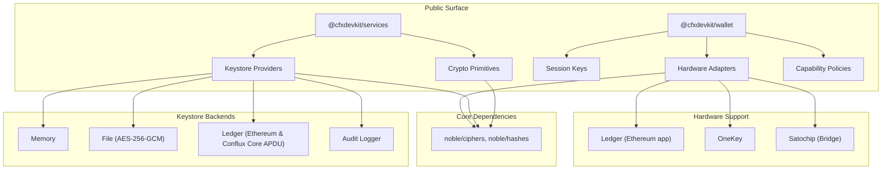
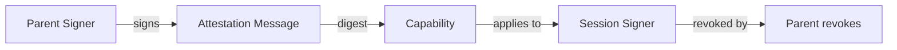

# Other — cfx-keys

# `@cfxdevkit/repo-cfx-keys` — Tier 0b Trust Boundary: Keystore + Wallet

> **Audience**: Platform engineers, security auditors, and wallet integration developers working with Conflux eSpace and Core Space.

---

## Overview

The `cfx-keys` module implements **Tier 0b** of the security model: the *audit-grade trust boundary* for cryptographic key management and signing operations. It provides:

- **Keystores**: Pluggable backends for storing and retrieving private keys (file, memory, Ledger hardware, audit-logged).
- **Crypto primitives**: AES-256-GCM encryption, Argon2id/HKDF key derivation, secure encoding.
- **Wallet tooling**: Session keys, capability policies, hardware wallet adapters (Ledger, OneKey, Satochip), and local wallet initialization.

Per [ADR-0003](https://github.com/cfxdevkit/adr), this module is a *carve-out target* — its code must be reviewed for cryptographic correctness, side-channel resilience, and auditability.

### Key Design Principles

| Principle | Rationale |
|---------|-----------|
| **Zero key material exposure** | Secrets are never logged, serialized, or returned in `list()` results. |
| **Capability-based signing** | All signers can be wrapped with fine-grained policies (chains, contracts, selectors, value limits, expiry). |
| **Hardware-first** | Ledger and other hardware wallets are first-class citizens; software keystores are fallbacks. |
| **Append-only audit trail** | All keystore operations are logged in a hash-chained, sequenced audit log. |

---

## Architecture



### Package Structure

| Package | Purpose |
|--------|---------|
| `@cfxdevkit/services` | Core keystore + crypto primitives. |
| `@cfxdevkit/wallet` | Session keys, hardware adapters, capability policies, local wallet init. |

---

## `@cfxdevkit/services`: Core Keystore & Crypto

### Crypto Module (`src/crypto/`)

A minimal, auditable crypto layer built on [`@noble/ciphers`](https://github.com/paulmillr/noble-ciphers) and [`@noble/hashes`](https://github.com/paulmillr/noble-hashes).

#### Key Functions

| Function | Description |
|---------|-------------|
| `generateAesGcmKey()` | Generates a 32-byte AES-256 key. |
| `encryptAesGcm({ key, plaintext, aad? })` | Encrypts with AES-256-GCM; returns `{ ciphertext, iv, tag }`. |
| `decryptAesGcm({ key, ciphertext, iv, tag, aad? })` | Decrypts; throws on tag mismatch or AAD tampering. |
| `deriveKeyArgon2id({ passphrase, salt, memKiB, iterations })` | Memory-hard key derivation (recommended for master passphrase). |
| `deriveKeyHkdf({ ikm, info, length })` | Deterministic key expansion (e.g., for hierarchical derivation). |
| `randomBytes(n)` | Cryptographically secure random bytes. |
| `toHex`, `fromHex`, `toBase64Url`, `fromBase64Url` | Standardized encoding (no `+`, `/`, `=` in base64url). |

#### Security Notes

- **IV length**: 12 bytes (NIST-recommended for GCM).
- **Tag length**: 16 bytes (full 128-bit authentication tag).
- **Argon2id**: Enforces `salt.length ≥ 16` bytes; rejects short salts.
- **AAD support**: Tampering with associated data breaks decryption (e.g., context binding).

### Keystore Module (`src/keystore/`)

A unified interface for key storage and retrieval:

```ts
interface Keystore {
  list(): Promise<KeystoreItem[]>
  has(ref: KeystoreRef): Promise<boolean>
  getSigner(ref: KeystoreRef, capability?: Capability): Promise<Signer>
  put?(item: KeystoreItem): Promise<void> // optional write capability
  remove?(ref: KeystoreRef): Promise<void> // optional write capability
}
```

#### Supported Backends

| Backend | Path | Features |
|--------|------|----------|
| `memory` | `@cfxdevkit/services/keystore-memory` | In-memory, seeded at construction. |
| `file` | `@cfxdevkit/services/keystore-file` | AES-256-GCM encrypted JSON file. |
| `ledger` | `@cfxdevkit/services/keystore-ledger` | Hardware-backed via Ledger HID. |
| `audit` | `@cfxdevkit/services/keystore-audit` | Wraps any keystore with append-only logging. |

#### Audit Logging (`src/keystore/audit.ts`)

All keystore operations are logged in a **hash-chained** format:

```json
{
  "sequence": 1,
  "previousHash": "0000...0000",
  "entryHash": "sha256(1 || prevHash || JSON(entry))"
}
```

- **Entry fields**: `at`, `provider`, `action`, `ok`, `ref`, `kind`.
- **Tamper-evident**: Any modification breaks the chain.
- **Append-only**: New entries are appended; no in-place updates.

```ts
const logger = createAppendOnlyAuditLogger({ path: '/var/log/keystore.log' });
logger.record({ at: Date.now(), provider: 'file', action: 'getSigner', ok: true, ref: { service: 's', account: 'a' } });
```

---

## `@cfxdevkit/wallet`: Session Keys & Hardware

### Session Keys (`src/session-key/`)

A *session key* is a short-lived signer derived from a *parent* key, constrained by a *capability*.

#### Flow



#### Key Functions

| Function | Description |
|---------|-------------|
| `createSessionKey({ parent, capability, privateKey })` | Mints a session signer with attestation. |
| `canonicalAttestationMessage(parent, session, capability)` | Deterministic JSON message for signing. |
| `session.revoke()` | Marks session as revoked; all future sign calls fail. |

#### Capability Schema

```ts
interface Capability {
  chains?: number[]; // permitted chain IDs
  contracts?: Address[]; // permitted target addresses
  selectors?: Hex[]; // permitted function selectors (e.g., `0xa9059cbb`)
  maxValuePerTx?: bigint; // max ETH/token value per transaction
  notAfter?: number; // Unix timestamp (ms)
}
```

> **Note**: Empty capabilities are rejected — every session must be constrained.

### Hardware Wallets (`src/hardware/`)

Unified adapter contract for hardware devices:

```ts
interface HardwareWalletAdapter {
  kind: 'ledger' | 'onekey' | 'satochip';
  getSigner(path: string, expectedAddress?: Address): Promise<Signer>;
}
```

#### Supported Devices

| Device | Adapter | Transport |
|--------|---------|-----------|
| Ledger Nano X/S | `@cfxdevkit/wallet/hardware/ledger` | `@ledgerhq/hw-app-eth` + APDU framing |
| OneKey | `@cfxdevkit/wallet/hardware/onekey` | SDK over USB/BLE |
| Satochip | `@cfxdevkit/wallet/hardware/satochip` | HTTP bridge (`/health`, `/address`, `/sign-*`) |

#### Ledger APDU Framing (`src/keystore/ledger/core-framing.ts`)

Conflux Core Space uses a custom APDU protocol:

- **`INS=0x01`**: Get version.
- **`INS=0x02`**: Get public key (with chain ID display).
- **`INS=0x03`**: Sign transaction (`SIGN_TX`).
- **`INS=0x04`**: Sign message (`SIGN_PERSONAL`).

The module implements **chunked APDU exchange** to handle long messages (e.g., 1024+ bytes).

```ts
await exchangeChunks(transport, 0x04, encodePath("m/44'/503'/0'/0/0"), message);
```

- **Fallback**: If `transport.send()` fails (e.g., old LedgerJS), falls back to raw `exchange()`.

### Local Wallet Init (`src/init/`)

Convenience functions for bootstrapping a local keystore:

| Function | Description |
|---------|-------------|
| `initLocalWallet({ passphrase, path })` | Creates encrypted keystore, returns mnemonic + signer. |
| `openLocalWallet({ passphrase, path })` | Opens existing keystore. |
| `rotateLocalPassphrase({ oldPassphrase, newPassphrase, path })` | Re-encrypts keystore under new passphrase. |
| `defaultKeystorePath()` | Respects `CFXDEVKIT_KEYSTORE` env var. |

> **Security**: Passphrases must be ≥ 12 characters (enforced by `initFileKeystore`).

---

## Capability Enforcement (`src/policies/`)

All signers can be wrapped with `withCapability(signer, capability)` to enforce policies:

```ts
const capped = withCapability(signer, {
  chains: [1030],
  contracts: ['0x...'],
  maxValuePerTx: 1000n,
  notAfter: Date.now() + 3600_000,
});
```

### Policy Checks

| Constraint | Error Code | Message |
|-----------|------------|---------|
| `chainId` not in list | `wallet/policies/chain-denied` | `chainId X not permitted` |
| `to` not in allowlist | `wallet/policies/contract-denied` | `target 0x... not permitted` |
| Function selector not allowed | `wallet/policies/selector-denied` | `selector 0x... not permitted` |
| `value` exceeds cap | `wallet/policies/value-exceeded` | `tx value Y exceeds cap X` |
| Capability expired | `wallet/policies/expired` | `capability expired` |

> **Note**: `signMessage` and `signTypedData` are *not* constrained by chain/contract — only `signTransaction`.

---

## Integration Points

### Call Graph Highlights

| Flow | Description |
|------|-------------|
| `initLocalWallet` → `initFileKeystore` | Creates AES-256-GCM encrypted keystore. |
| `createSessionKey` → `signMessage` | Parent signs attestation message. |
| `ledger keystore` → `exchangeChunks` | APDU exchange for Core message signing. |
| `withCapability` → `checkCapability` | Validates transaction against policy. |

### Dependencies

| Dependency | Role |
|-----------|------|
| `viem` | Transaction serialization, address recovery. |
| `@ledgerhq/hw-app-eth` | Ledger Ethereum app integration. |
| `@ledgerhq/hw-transport-node-hid` | Node.js HID transport for Ledger. |
| `@noble/ciphers`, `@noble/hashes` | Cryptographic primitives (AES, Argon2, HKDF). |

---

## Security Considerations

### Audit Trail

- **All keystore operations** are logged via `audit.record(...)`.
- **Audit log is append-only** — tampering breaks the hash chain.
- **Sensitive fields** (`secret`, `privateKey`) are never logged.

### Key Rotation

- **File keystore**: `changeFilePassphrase` re-encrypts all entries.
- **Session keys**: Revoked via `session.revoke()`; parent retains authority.

### Hardware Wallets

- **Address verification**: `expectedAddress` mismatch throws `address-mismatch`.
- **Ledger app versioning**: Core message signing requires ≥ v2.2.3 (gracefully degrades to transaction signing only).

---

## Usage Examples

### 1. Initialize a Local Wallet

```ts
import { initLocalWallet } from '@cfxdevkit/wallet/init';

const wallet = await initLocalWallet({
  passphrase: 'correct horse battery staple',
  path: '/home/user/.cfxdevkit/keystore.json',
});

console.log(wallet.mnemonic); // 24-word BIP39 mnemonic
console.log(wallet.address); // 0x...
```

### 2. Create a Session Key

```ts
import { createSessionKey } from '@cfxdevkit/wallet/session-key';
import { signerFromPrivateKey } from '@cfxdevkit/core/wallet';

const parent = signerFromPrivateKey('0x...');
const session = await createSessionKey({
  parent,
  capability: {
    chains: [1030],
    contracts: ['0x10109fc8df283027b6285cc889f5aa624eac1f55'],
    maxValuePerTx: 1000n,
    notAfter: Date.now() + 3600_000,
  },
  privateKey: '0x2222...',
});

// Use session.signer — all txs are constrained.
const raw = await session.signer.signTransaction({
  chainId: 1030,
  to: '0x10109fc8df283027b6285cc889f5aa624eac1f55',
  value: 500n,
});
```

### 3. Ledger Hardware Signing (Core Space)

```ts
import { createLedgerKeystore, createNodeHidLedgerTransport } from '@cfxdevkit/services/keystore-ledger';

const transport = createNodeHidLedgerTransport();
const provider = createLedgerKeystore({
  eth: createLedgerEthApp(transport),
  accounts: [{ ref: { service: 'cfx', account: 'ledger-0' }, path
