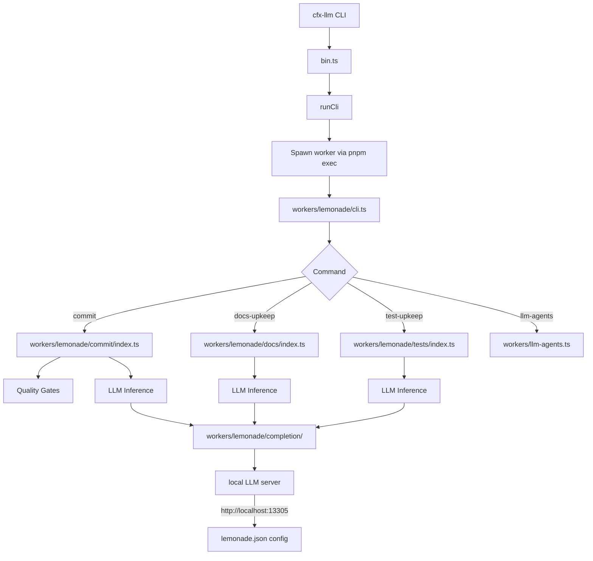

# Other — cfx-llm

# `@cfxdevkit/repo-cfx-llm` — Local LLM Automation Module

> **Tier 1 — local LLM and AI-assisted developer automation**  
> *Carve-out target per ADR-0003*

This module provides a suite of deterministic and AI-assisted developer workflows for repository upkeep, validation, and commit automation — all powered by a local LLM (e.g., via [Lemonade Server](https://github.com/cfxdevkit/llm-tools)). It is designed to run entirely offline, with no external API dependencies beyond a local model endpoint.

---

## Overview

The `cfx-llm` module implements the **Lemonade** family of CLI tools (`cfx-llm commit`, `cfx-llm docs-upkeep`, `cfx-llm test-upkeep`, etc.) that:

- Scan and analyze source code, tests, and documentation
- Detect hotspots, drift, and coverage gaps
- Generate changelogs, commit messages, and test suggestions
- Enforce quality gates (lint, typecheck, build, test)
- Integrate with [Pi Coding Agent](https://github.com/mariozechner/pi-coding-agent) for RPC-based LLM inference

It is built as a monorepo package (`pnpm` workspace) with a single application layer (`@cfxdevkit/llm-tools`) containing all worker logic.

### Key Design Principles

- **Deterministic first**: All scanning, indexing, and reporting is deterministic and reproducible.
- **Local-first**: No cloud APIs; all inference runs against a local LLM server.
- **Modular workers**: Each workflow (`commit`, `docs-upkeep`, `test-upkeep`, etc.) is isolated and composable.
- **Policy-driven**: Quality gates and file budgets are configurable and enforced via structured reports.

---

## Architecture



### Core Packages

| Package | Purpose |
|--------|---------|
| `@cfxdevkit/repo-cfx-llm` | Root workspace manifest (`pnpm-workspace.yaml`) |
| `@cfxdevkit/llm-tools` | Main application layer: CLI, workers, LLM glue |

---

## Key Components

### 1. CLI Entry Point (`src/bin.ts`, `src/run.ts`)

- `bin.ts`: Entry point for `cfx-llm` binary.
- `run.ts`: Spawns a worker via `pnpm exec tsx workers/lemonade/cli.ts <command> [args...]`.
  - Supports nested `--` separators (e.g., `cfx-llm -- commit -- --dry-run`).
  - Forwards flags and arguments transparently.

### 2. Worker CLI (`workers/lemonade/cli.ts`)

Routes to the appropriate worker:

```ts
export const commands = new Map([
  ['commit', runCommit],
  ['docs-upkeep', runDocsUpkeep],
  ['test-upkeep', runTestUpkeep],
  ['llm-agents', runAll],
  // ...
]);
```

### 3. LLM Integration Layer (`workers/lemonade/completion/`)

Provides a unified interface to local LLMs:

| Module | Purpose |
|--------|---------|
| `client.ts` | Model discovery, config (`lemonade.json`), client creation |
| `complete.ts` | `completeStructuredAgent`, `completeCommitAgent`, `completeDocsUpkeepArtifact` |
| `context.ts` | Build context blocks (e.g., `commitPreflightBlock`, `buildBaseContext`) |
| `runner.ts` | `commandBlock`, `git` helpers for deterministic subprocess execution |
| `pi.ts` | Pi provider registration (`writePiLemonadeProviderExtension`) |
| `json.ts` | Safe JSON parsing from LLM output |

#### Configuration (`artifacts/llm/config/lemonade.json`)

```json
{
  "baseUrl": "http://localhost:13305/",
  "defaultModel": "user.Qwen3.6-35B-A3B-GGUF",
  "actions": {
    "docs-upkeep": { "prompt": "...", "context": [...] },
    "commit": { "prompt": "...", "context": [...] }
  }
}
```

### 4. Quality Gate System (`workers/lemonade/shared/index.ts`)

Enforces validation rules before critical operations (e.g., commits):

```ts
export const QUALITY_GATES = [
  { id: 'lint', cmd: 'pnpm run lint', required: true },
  { id: 'typecheck', cmd: 'pnpm run typecheck', required: true },
  { id: 'build', cmd: 'moon run :build', required: false },
  { id: 'test', cmd: 'moon run :test', required: true },
];
```

- Used by `runCommit`, `runTestUpkeep`, and `runDocsUpkeep`.
- Can be bypassed with `--force`, but **hotspot gate cannot**.

### 5. Code Hotspots Scanner (`workers/code-hotspots.ts`)

Analyzes source files for size and churn:

- **Hotspot score** = `lines + (added + deleted) * 2 + commits * 25`
- Enforces file budgets:
  - Soft limit: 250 lines (warning)
  - Hard limit: 300 lines (error)
- Outputs:
  - `artifacts/llm/reports/code-hotspots.json`
  - `artifacts/llm/reports/code-hotspots.md`

> ⚠️ **Hard violations block commits** — no `--force` override.

### 6. Deterministic Agents (`workers/llm-agents.ts`)

Runs lightweight, non-LLM agents for repo upkeep:

| Agent | Purpose |
|-------|---------|
| `corpus` | Builds file/chunk/doc metadata under `artifacts/llm/corpus` |
| `docs` | Validates doc paths, exports, Moon registration |
| `eval` | Summarizes agent gates |
| `review` | Reviews git changes and suggests validations |
| `serve-check` | Checks Lemonade Server reachability |

---

## Workflows

### `cfx-llm commit`

1. **Quality gates** (lint, typecheck, build, test, hotspot)
2. **Preflight**: GitNexus registration, git status/diff/analysis
3. **Scope detection**: `detectChangedScopes()` → per-package scopes
4. **Changelog generation**: `generateChangelogEntry()` per scope (LLM)
5. **Commit message**: `generateCommitMessage()` (LLM)
6. **Approval**: `confirmPrompt()` unless `--yes`
7. **Post-checks**: Re-run quality gates (optional)
8. **Commit**: `git add`, `git commit`

> Supports `--dry-run`, `--force`, `--agent direct|pi-rpc`, `--model <id>`

### `cfx-llm docs-upkeep`

1. **Deterministic scan**: `pnpm run llm:docs` → `artifacts/llm/reports/docs-alignment.md`
2. **Discover scopes**: `discoverDocsUpkeepScopes()` → folder groups
3. **Generate artifacts**: `generateDocsUpkeepArtifact()` (LLM)
4. **Write updates**: `applyDocsUpkeepUpdates()` (if `--write`)
5. **Index**: `writeDocsUpkeepIndex()` → `artifacts/llm/reports/docs-upkeep.md`

### `cfx-llm test-upkeep`

1. **Discover packages**: `discoverTestUpkeepPackages()` (vitest.config)
2. **Build inventory**: `collectPackageTestInventory()` → source/test counts
3. **Run tests**: `runPackageTestsBlock()` (vitest)
4. **Generate suggestions**: `generateTestUpkeepArtifact()` (LLM)
5. **Write tests**: `writeTestUpkeepSuggestions()` (if `--write`)
6. **Re-run tests**: Validate new tests pass
7. **Index**: `writeTestUpkeepIndex()` → `artifacts/llm/reports/test-upkeep.md`

> Fails if any package still fails validation.

---

## File Structure

```
repos/cfx-llm/
├── package.json
├── pnpm-workspace.template.yaml
└── packages/
    └── llm-tools/
        ├── package.json
        ├── moon.yml
        ├── vite.config.ts
        ├── tsconfig.json
        ├── src/
        │   ├── bin.ts
        │   ├── run.ts
        │   └── run.test.ts
        └── workers/
            ├── lemonade/
            │   ├── cli.ts
            │   ├── commit/
            │   │   ├── index.ts
            │   │   ├── message.ts
            │   │   ├── changelog.ts
            │   │   ├── gates.ts
            │   │   └── scope.ts
            │   ├── docs/
            │   │   ├── index.ts
            │   │   ├── discover.ts
            │   │   ├── generate.ts
            │   │   └── write.ts
            │   ├── tests/
            │   │   ├── index.ts
            │   │   ├── discover.ts
            │   │   ├── generate.ts
            │   │   └── write.ts
            │   ├── completion/
            │   │   ├── index.ts
            │   │   ├── client.ts
            │   │   ├── complete.ts
            │   │   ├── context.ts
            │   │   ├── pi.ts
            │   │   ├── pi-rpc.ts
            │   │   ├── complete-utils.ts
            │   │   ├── json.ts
            │   │   └── runner.ts
            │   ├── shared/
            │   │   ├── index.ts
            │   │   └── logging.ts
            │   └── commands.ts
            ├── agents/
            │   ├── all.ts
            │   ├── corpus.ts
            │   ├── docs.ts
            │   ├── eval-serve.ts
            │   ├── review.ts
            │   └── runtime/
            │       ├── checks.ts
            │       ├── constants.ts
            │       ├── corpus.ts
            │       ├── docs.ts
            │       ├── models.ts
            │       ├── paths.ts
            │       └── reports.ts
            ├── code-hotspots.ts
            └── llm-agents.ts
```

---

## Configuration & Artifacts

### Config

- `artifacts/llm/config/lemonade.json`: LLM endpoint, model, actions
- `artifacts/llm/config/pi-lemonade-provider.mjs`: Pi provider extension (auto-generated)

### Reports

| Report | Purpose |
|--------|---------|
| `artifacts/llm/reports/code-hotspots.{md,json}` | File size & churn analysis |
| `artifacts/llm/reports/docs-alignment.md` | Doc drift warnings (deterministic) |
| `artifacts/llm/reports/docs-upkeep.md` | Docs upkeep results |
| `artifacts/llm/reports/test-upkeep.md` | Test upkeep results |
| `artifacts/llm/reports/lemonade-commit.md` | Commit analysis & approval |
| `artifacts/llm/reports/review.md` | Git diff review (preflight) |
| `artifacts/llm/reports/eval.md` | Agent gate summary |

---

## Testing & Quality

- **Unit tests**: `pnpm test` (Vitest)
- **Typecheck**: `pnpm typecheck`
- **Lint**: `pnpm lint` (Biome)
- **Build**: `pnpm build` (Vite → `dist/`)
- **Hotspot gate**: Enforced at commit time; hard violations block commit.

---

## Integration with Other Modules

- **`@cfxdevkit/repo-root`**: Uses `cfx-llm` via `pnpm exec cfx-llm commit`.
- **`@cfxdevkit/llm-server`**: Provides local LLM endpoint (`http://localhost:13305`).
- **`@cfxdevkit/pi-coding-agent`**: Optional RPC backend (`--agent pi-rpc`).
- **`@cfxdevkit/moon`**: Used for build/test commands in quality gates.

---

## Extending Lemonade

To add a new command:

1. Create `workers/lemonade/new-command/index.ts`
2. Export `runNewCommand` function
3. Register in `workers/lemonade/cli.ts`
4. Add tests in `workers/lemonade/new-command/index.test.ts`
5. Update `workers/llm-agents.ts` if it’s a deterministic agent

> Follow existing patterns: deterministic scanning → LLM inference → write/update → index.

---

## Troubleshooting

| Symptom | Fix |
|--------|-----|
| `No Lemonade model available` | Start Lemonade Server, verify `http://localhost:13305/v1/models` |
| `Hotspot gate failed` | Split oversized files (`workers/lemonade-complete.ts`, etc.) |
| `Commit aborted due to gate failures` | Run `pnpm lint`, `pnpm typecheck`, `pnpm exec moon run :test` |
| `Pi provider not found` | Run `pnpm exec cfx-llm llm-agents serve-check` |

---

## Future Work

- Support for incremental LLM inference (caching)
- Parallel scope processing (currently serial)
- Configurable hotspots thresholds per repo
- LLM model fallback chain (e.g., `Qwen3` → `Phi-3.5`)

---
