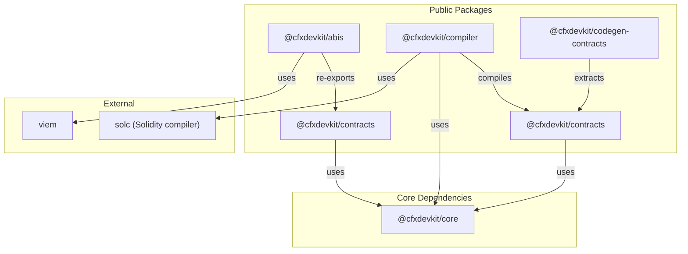

# Other — cfx-solidity

# `@cfxdevkit/repo-cfx-solidity` — Solidity Pipeline Module

The **Other — cfx-solidity** module (package name `@cfxdevkit/repo-cfx-solidity`) is a self-contained workspace that provides the full Solidity toolchain for Conflux development: ABI definitions, compiler integration, contract bindings, and deployment tooling. It is a *carve-out* from `cfx-core`, designed to be reusable across layers — including `@cfxdevkit/core` itself — without circular dependencies.

This module is **not a runtime dependency** of end users. Instead, it is a *monorepo* containing several internal packages that power higher-level tooling (e.g., `@cfxdevkit/contracts`, `@cfxdevkit/compiler`, `@cfxdevkit/codegen-contracts`). Developers interact with it indirectly via its public packages.

---

## High-Level Architecture



### Key Design Principles

- **Zero circular dependencies**: `@cfxdevkit/abis` has *no* `cfxdevkit` dependencies, enabling safe use in `@cfxdevkit/core`.
- **Modular exports**: Each package exposes granular sub-paths (`./solc`, `./resolver`, `./deploy`) for optimal tree-shaking.
- **Test-first**: All packages include integration tests (e.g., `integration.test.ts`) that compile → deploy → read contracts against a real `devnode`.
- **Conflux-aware**: Bridge helpers (`@cfxdevkit/contracts/bridge`) handle Core/eSpace address mapping and cross-space calls.

---

## Package Breakdown

### 1. `@cfxdevkit/abis` — Standard ABI Shapes

**Purpose**: Re-export canonical EVM ABIs (ERC-20/721/1155, Multicall3) from `viem` under stable aliases.

**Why separate?**  
ABI definitions are *pure data* — they don’t need compiler or runtime logic. Isolating them avoids pulling heavy dependencies into `@cfxdevkit/core`.

**Public Surface** (`src/index.ts`):
```ts
export const ERC20_ABI, ERC721_ABI, ERC1155_ABI, MULTICALL3_ABI;
export const MULTICALL3_ADDRESS = '0xcA11bde05977b3631167028862bE2a173976CA11';
```

**Key Properties**:
- Zero `cfxdevkit` dependencies.
- Type-safe re-exports (`export type ERC20_ABI = typeof ERC20_ABI`).
- Canonical Multicall3 address (verified per chain).

**Usage**:
```ts
import { ERC20_ABI, MULTICALL3_ADDRESS } from '@cfxdevkit/abis';
```

> 💡 **Prefer this over `@cfxdevkit/contracts/abis`** in new code — the latter is a back-compat re-export.

---

### 2. `@cfxdevkit/compiler` — Solidity Compilation Pipeline

**Purpose**: Compile Solidity sources to artifacts using `solc` standard JSON, plus import resolvers and template helpers.

**Core Components**:

| Module | Purpose |
|--------|---------|
| `./solc` | Low-level `solc` loader + `compile()` shim |
| `./resolver` | Import resolution strategies (`npmResolver`, `remappingResolver`, `compose`) |
| `./templates` | Pre-baked Solidity templates (e.g., `basicErc20`) |
| `./artifacts` | Artifact I/O helpers (`selectorsOf`, `readArtifact`, `writeArtifact`) |
| `./errors` | Typed compile errors (`CompileError`, `CompileErrorCode`) |

**Key Functions**:

- `compile(input: CompileInput): Promise<CompileOutput>`  
  Compiles sources with `solc`, caches binaries in `$XDG_CACHE_HOME/cfxdevkit/solc`, and returns artifacts + diagnostics.

- `npmResolver()` / `remappingResolver(mappings: string[])`  
  Resolves imports like `import "@openzeppelin/contracts/token/ERC20/ERC20.sol";` or `import "ds-test/test.sol";`.

- `compose(resolvers: ImportResolver[])`  
  Chain resolvers — returns the first non-null hit.

- `selectorsOf(abi: Abi)`  
  Extracts function selectors (e.g., `0xa9059cbb` for `transfer(address,uint256)`).

**Templates** (`src/templates/erc20/source.ts`):
- `basicErc20`: A minimal, self-contained `BasicErc20` contract (no external imports), ideal for devnode tests.

**Integration Test** (`src/integration.test.ts`):
- Compiles `basicErc20` → deploys to `devnode` → reads state via `@cfxdevkit/contracts`.
- Requires `RUN_SOLC_TESTS=1` and `RUN_DEVNODE_TESTS=1` to run.

---

### 3. `@cfxdevkit/contracts` — Contract Bindings & Operations

**Purpose**: High-level helpers for reading, writing, deploying, and interacting with contracts — with first-class support for **Core Space** and **eSpace**.

**Sub-Packages**:

| Path | Purpose |
|------|---------|
| `./abis` | Back-compat re-exports of `@cfxdevkit/abis` |
| `./read` | `readContract()` — type-safe `eth_call`/`cfx_call` |
| `./write` | `prepareWrite()` + `sendWrite()` — transaction signing & broadcasting |
| `./deploy` | `deployContract()` — deploy with nonce/gas estimation for both spaces |
| `./erc20` | Typed helpers (`erc20.balanceOf`, `erc20.transfer`, etc.) |
| `./bridge` | Cross-space helpers (`transferToEspace`, `callEspace`, `withdrawFromMapped`) |

**Core Helpers**:

- `readContract({ client, address, abi, functionName, args, blockTag/epochTag })`  
  - Uses `eth_call` for eSpace, `cfx_call` for Core Space.
  - Validates address format (`0x` for eSpace, base32 for Core).

- `prepareWrite({ address, abi, functionName, args, chainId })`  
  Returns a `SignableTx` with encoded calldata.

- `sendWrite({ client, signer, ...tx })`  
  Fills nonce/gas/fees, signs, broadcasts, and optionally waits for receipt.

- `deployContract({ client, signer, abi, bytecode, args })`  
  - For **eSpace**: uses `eth_sendRawTransaction`.
  - For **Core**: uses `cfx_sendRawTransaction` with `cip2930`-style gas estimation (`gasLimit`, `storageLimit`, `epochHeight`).

**Bridge Helpers** (`src/bridge/index.ts`):
- `mappedEspaceAddress(coreHex: HexAddress)`  
  Derives eSpace address via `keccak256(coreHex)[12:32]`.
- `transferToEspace({ client, signer, to, value })`  
  Encodes `transferEVM(bytes20)` and sends to `CrossSpaceCall` (`0x0888...0006`).
- `callEspace({ client, signer, to, data, value })`  
  Encodes `callEVM(bytes20, bytes)` for cross-space calls.
- `getMappedBalance({ client, coreHexAddress })`  
  Reads balance via `cfx_call` against `CrossSpaceCall`.

---

### 4. `@cfxdevkit/codegen-contracts` — Contract Extraction Tool

**Purpose**: Extract ABI + bytecode from Hardhat artifacts and generate TypeScript modules for `@cfxdevkit/contracts`.

**Current State**:  
- Empty CLI scaffold (`src/index.ts`).
- Real implementation deferred to `extract.ts`/`render.ts` per `tools/STRUCTURE.md`.

**Intended Workflow**:
```bash
cfxdevkit-extract-contracts \
  --artifacts ./artifacts \
  --output ./src/contracts/generated
```

---

## Package Dependencies & Tree-Shaking

### Dependency Graph (Simplified)

```
@cfxdevkit/abis
  └── viem

@cfxdevkit/compiler
  ├── @cfxdevkit/core
  ├── @cfxdevkit/abis
  ├── solc
  └── viem

@cfxdevkit/contracts
  ├── @cfxdevkit/core
  ├── @cfxdevkit/abis
  └── viem

@cfxdevkit/codegen-contracts
  └── (none yet)
```

### Tree-Shaking Strategy

- **Barrel exports discouraged**: Prefer sub-paths (`import { compile } from '@cfxdevkit/compiler/solc'`).
- **No runtime side effects**: All packages use `"type": "module"` and ESM-only exports.
- **Dedicated entry points**: `vite.config.ts` builds multiple entry points (e.g., `./solc`, `./resolver`).

---

## Testing Strategy

### Unit Tests
- All packages include `*.test.ts` files.
- Use `vitest` with `node` environment.
- Mock helpers (`src/test/mocks.ts`) provide `makeMockClient()`, `makeMockSigner()`, `getRecordedCalls()`.

### Integration Tests
- `compiler/src/integration.test.ts`:
  - Compiles `basicErc20` → deploys to `devnode` → reads state.
  - Requires `RUN_SOLC_TESTS=1` and `RUN_DEVNODE_TESTS=1`.
- `bridge.test.ts`:
  - Tests Core/eSpace address mapping and cross-space calls.
- `deploy.test.ts`:
  - Validates Core/eSpace deployment flows.

---

## Configuration & Tooling

### Build System
- **Vite** for bundling (ESM only).
- **vite-plugin-dts** for `.d.ts` generation.
- **Biome** for linting/formatting (via `@cfxdevkit/biome-config`).

### TypeScript
- Shared `tsconfig` (`@cfxdevkit/tsconfig/lib.json`).
- Strict mode enabled (`strict: true`, `noUnusedLocals: true`).

### Cache
- `solc` binaries cached in `$XDG_CACHE_HOME/cfxdevkit/solc` (or `~/.cache/cfxdevkit/solc`).

---

## Usage Examples

### Compile a Template Contract
```ts
import { compile, basicErc20 } from '@cfxdevkit/compiler';

const out = await compile({
  sources: basicErc20.sources,
  solcVersion: basicErc20.solcVersion,
  evmVersion: 'paris',
  optimizer: { enabled: true, runs: 200 },
});
const artifact = out.artifacts.find(a => a.contractName === 'BasicErc20');
```

### Deploy to eSpace
```ts
import { deployContract } from '@cfxdevkit/contracts';
import { createClient, espaceLocal, http } from '@cfxdevkit/core';

const client = createClient({
  chain: espaceLocal,
  transport: http(),
});

const receipt = await deployContract({
  client,
  signer,
  abi: artifact.abi,
  bytecode: artifact.bytecode,
  args: ['DevToken', 'DEV', 18, 1_000_000n],
  waitForReceipt: true,
});
```

### Read ERC-20 Balance (Core Space)
```ts
import { readContract } from '@cfxdevkit/contracts/read';
import { createClient } from '@cfxdevkit/core';

const client = createClient({
  chain: { ...coreLocal, id: 1029 },
  transport: http(),
});

const balance = await readContract({
  client,
  address: 'cfxtest:acg158kvr8zanb1bs048ryb6rtrhr283ma70vz70tx',
  abi: ERC20_ABI,
  functionName: 'balanceOf',
  args: ['cfxtest:...user'],
  epochTag: 'latest_state',
});
```

---

## Migration Notes

- **`@cfxdevkit/contracts/abis` → `@cfxdevkit/abis`**:  
  Use the leaf package for ABI definitions to avoid pulling compiler/runtime deps.
- **`@cfxdevkit/compiler` sub-paths**:  
  Prefer `import { compile } from '@cfxdevkit/compiler/solc'` over barrel imports.

---

## Future Work

- Implement `@cfxdevkit/codegen-contracts` extraction/rendering logic.
- Add `@cfxdevkit/contracts/erc721`/`erc1155` typed helpers.
- Expand `@cfxdevkit/compiler/templates` with more patterns (e.g., `basic-multicall`, `basic-bridge`).
