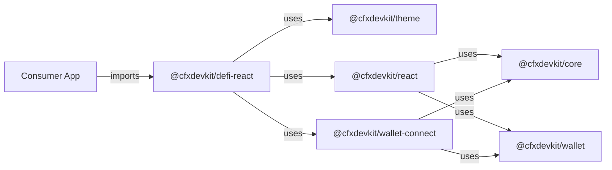

# Other — cfx-ui

# `@cfxdevkit/repo-cfx-ui` — Tier 0c React UI Surface

> **Carve-out target per ADR-0003**

The `cfx-ui` module is a **React-based UI surface layer** for the `@cfxdevkit` ecosystem. It provides opinionated, composable, and type-safe React components and hooks that abstract DeFi workflows (e.g., swaps, portfolio management, wallet connection) while enforcing consistent theming and integration with core services.

This module is structured as a **monorepo** of interdependent, publishable libraries — each targeting a specific concern in the UI stack.

---

## Architecture Overview

```mermaid
flowchart TD
    subgraph "UI Surface Layer (cfx-ui)"
        A["@cfxdevkit/theme"] -->|CSS tokens, design system| B["@cfxdevkit/react"]
        A -->|CSS tokens| C["@cfxdevkit/defi-react"]
        B -->|React hooks over core| C
        D["@cfxdevkit/wallet-connect"] -->|Wallet session management| C
        D -->|Wallet hooks| B
        C -->|DeFi widgets| "Consumer Apps"
    end

    subgraph "Core Layer"
        E["@cfxdevkit/core"] -->|Business logic, types| B
        E -->|Business logic, types| D
        E -->|Business logic, types| C
    end

    subgraph "Wallet Layer"
        F["@cfxdevkit/wallet"] -->|Wallet abstraction| D
        F -->|Wallet abstraction| B
    end
```

All packages in `cfx-ui` are **peer-dependent on React 19**, and use **workspace protocol (`workspace:*` / `workspace:^`)** to ensure tight coupling and version alignment with other `@cfxdevkit` packages.

---

## Package Structure

| Package | Role | Key Dependencies |
|--------|------|------------------|
| `@cfxdevkit/theme` | Design tokens, CSS variables, and theming utilities | `react` (peer) |
| `@cfxdevkit/react` | React hooks over `@cfxdevkit/core` (e.g., state sync, chain hooks) | `@cfxdevkit/core`, `@cfxdevkit/wallet` (peer) |
| `@cfxdevkit/wallet-connect` | Wallet connection logic + headless UI primitives | `@cfxdevkit/core`, `@cfxdevkit/wallet` (peer) |
| `@cfxdevkit/defi-react` | Opinionated DeFi widgets (swap, portfolio, picker) | `@cfxdevkit/core`, `@cfxdevkit/react`, `@cfxdevkit/services`, `@cfxdevkit/wallet-connect`, `@cfxdevkit/theme` (peer) |

> All packages are **library-type** (no entrypoint app), and follow a consistent build/test/lint pattern.

---

## Build & Development Tooling

Each package uses a **standardized toolchain**:

- **Build**: Vite (ES lib output, `dist/index.js` + `dist/index.d.ts`)
- **Type Checking**: TypeScript (via `tsc --noEmit`)
- **Testing**: Vitest (node environment)
- **Linting**: Biome (via `@cfxdevkit/biome-config`)
- **Clean**: `rm -rf dist .vitest coverage`

### Build Configuration Highlights

- **Entry**: `src/index.ts`
- **Output**: Single ES module (`index.js`)
- **Externals**: All `react*` imports are externalized (to avoid bundling React)
- **Target**: `es2023`
- **Source Maps**: Enabled
- **Minification**: Disabled (for debugging & tree-shaking)

```ts
// vite.config.ts (shared pattern)
const reactExternals = new Set(['react', 'react-dom', 'react/jsx-runtime']);
external: (id) => reactExternals.has(id) || (!id.startsWith('.') && !id.startsWith('/'))
```

Type declarations are generated via [`vite-plugin-dts`](https://github.com/egoist/vite-plugin-dts), ensuring accurate `.d.ts` output.

---

## Package Lifecycle & Public API

All packages follow a **stub-first** development model:

1. `src/index.ts` exports only a package identifier (`__packageName`)
2. Actual implementations are added incrementally
3. Public surface is documented in `API.md` (per-package)
4. `STRUCTURE.md` documents internal module layout

This ensures:
- Early validation of package boundaries
- Clear contract for consumers
- Gradual migration from legacy code

Example stub:

```ts
// src/index.ts
export const __packageName = '@cfxdevkit/defi-react' as const;
```

---

## Integration with the Broader Codebase

### Dependency Flow



### Key Integration Points

| Integration | Purpose |
|-------------|---------|
| `@cfxdevkit/theme` → `defi-react` | Ensures consistent styling across widgets |
| `@cfxdevkit/react` → `defi-react` | Enables hooks like `useChain`, `useAccount` in widgets |
| `@cfxdevkit/wallet-connect` → `defi-react` | Supplies wallet session state & actions (connect, disconnect, switch chain) |
| `@cfxdevkit/core` → all | Shared types, constants, and business logic (e.g., token metadata, chain config) |

---

## Versioning & Workspace Strategy

- All packages use `0.0.0` (pre-release), indicating active development
- Workspace protocol (`workspace:*` / `workspace:^`) ensures:
  - Local development uses the *exact* local version of dependencies
  - Consumers get compatible versions at publish time
- `pnpm-workspace.yaml` includes all `packages/*` directories

---

## Future Work & Extensibility

- `defi-react` is the primary surface for **end-user widgets** — this is where most UI logic will land
- `wallet-connect` is designed to be **headless**, enabling custom UI implementations
- `theme` is intended to support **dark/light modes**, dynamic theming, and CSS-in-JS or CSS Modules
- `react` will grow to include hooks for:
  - Chain state (`useChainId`, `useBlockNumber`)
  - Account state (`useAccount`, `useBalance`)
  - Transaction lifecycle (`useSendTransaction`, `useWaitForTransaction`)

---

## Conclusion

The `cfx-ui` module is the **React-facing layer** of the `@cfxdevkit` ecosystem — a modular, composable set of libraries that abstract DeFi UI complexity while enforcing consistency, type safety, and separation of concerns.

It is intentionally minimal today (stub packages), but designed for rapid expansion into a full-featured DeFi UI toolkit.
