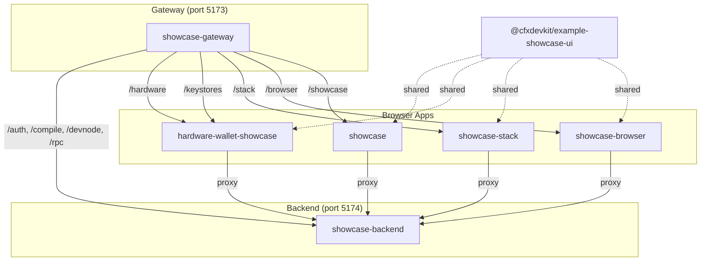

# Other — examples

# Other — Examples Module

The **Other — examples** module is a collection of standalone, self-contained demonstration applications and shared UI libraries that showcase the capabilities of the `@cfxdevkit/*` ecosystem. It serves as both a **developer reference** and a **living testbed**, illustrating how to integrate core wallet management, hardware wallet support, backend services, and frontend frameworks in real-world scenarios.

Unlike production modules, this module is not consumed as a library — it is a *set of example applications* meant to be run locally, inspected, and extended. Its primary goals are:

- Demonstrate end-to-end workflows (e.g., SIWE authentication → session-key delegation → contract deployment)
- Provide working patterns for integrating hardware wallets (Ledger via WebHID), browser wallets (MetaMask, Fluent), and memory/file keystores
- Validate internal APIs (`@cfxdevkit/core`, `@cfxdevkit/wallet`, `@cfxdevkit/services`, etc.) in realistic usage
- Support gateway-style local development with a unified entry point and reverse proxy

---

## Architecture Overview

The examples module is organized into **four main application apps**, plus a **shared UI library**, all coordinated by a **gateway app**:



All apps are Vite-based React applications, with `showcase-backend` running as an Express server. The gateway (`showcase-gateway`) acts as a **reverse proxy and unified dev entry point**, routing requests to the appropriate backend or frontend app on fixed internal ports.

---

## Key Applications

### 1. `showcase-backend` — Server-Side Showcase

**Purpose**: Demonstrates server-side operations — DevNode lifecycle, Solidity compilation, SIWE authentication, and session-key delegation.

**Key Features**:
- **DevNode management**: Start/stop/restart/wipe/mine local Conflux node (`/devnode/*`)
- **Compiler API**: Compile Solidity templates and return artifacts (`/compile/*`)
- **SIWE auth**: Issue and verify login nonces, validate signatures (`/auth/*`)
- **Session-key delegation**: Issue and verify capability-based session keys (`/session-key/*`)

**API Endpoints**:
| Path | Method | Description |
|------|--------|-------------|
| `/health` | GET | Health check |
| `/devnode/status` | GET | DevNode status snapshot |
| `/devnode/start` | POST | Start DevNode with config |
| `/devnode/stop` | POST | Stop DevNode |
| `/devnode/mine` | POST | Mine blocks |
| `/devnode/wipe` | POST | Wipe DevNode state |
| `/compile/templates` | GET | List available templates |
| `/compile` | POST | Compile a template |
| `/auth/nonce` | GET | Get login nonce |
| `/auth/verify` | POST | Verify SIWE signature |
| `/auth/me` | GET | Get authenticated user |
| `/session-key/issue` | POST | Issue session key |
| `/session-key/verify` | POST | Verify session key attestation |

**Implementation Highlights**:
- Uses `express` + `cors` for routing
- `DevNodeManager` and `CompileManager` abstract stateful operations
- SIWE validation uses `siwe` package; session keys use `@cfxdevkit/wallet/session-key`
- Full test coverage (`*.test.ts`) with `supertest` and `vitest`

---

### 2. `showcase-browser` — Browser Wallet Showcase

**Purpose**: Focuses on browser wallet integration — Fluent, MetaMask, and generic EIP-1193 providers — with no backend dependency.

**Key Features**:
- Dual-space wallet support (Core + eSpace)
- BIP-39/BIP-32/SLIP-0044 derivation (mnemonic generation, path derivation)
- Wallet connection UI (modal picker, status pills)
- RPC interaction via `wagmi` and `@cfxjs/use-wallet-react`

**UI Components**:
- `WalletPickerModal`: Modal to select wallet provider
- `ConnectWall`: Placeholder UI when wallet is not connected
- `SharedDevNodePill`: DevNode status pill (reused from `showcase-ui`)
- `DualWalletBar`: Side-by-side Core/eSpace wallet status indicators

**Core APIs Demonstrated**:
- `generateMnemonic`, `validateMnemonic`, `listChains` (`@cfxdevkit/core`)
- `rpcCoreAccounts`, `rpcCoreChainId`, `switchConfluxChain`, `buildAddChainParams`
- `useCoreWallet`, `useFluentCore`, `detectFluentCore`

---

### 3. `showcase-stack` — Full-Stack Integration

**Purpose**: Combines frontend (browser wallets) and backend (SIWE, DevNode, compiler) into a unified workflow.

**Workflow Example**:
1. User connects MetaMask (eSpace) or Fluent (Core)
2. User logs in via SIWE → backend issues session key
3. User compiles a Solidity template (via `/compile`)
4. User deploys contract using session-key-signed transaction
5. User interacts with deployed contract (ABI-driven)

**Key Integration Points**:
- `api` client (`src/lib/api.ts`) wraps backend endpoints
- `useShowcaseBackend` hook manages backend status
- Shared `@cfxdevkit/example-showcase-ui` components reused across apps

---

### 4. `hardware-wallet-showcase` — Ledger Hardware Wallet Demo

**Purpose**: Demonstrates secure signing via Ledger hardware wallet using WebHID.

**Key Features**:
- Ledger ETH app integration (`@ledgerhq/hw-app-eth`, `@ledgerhq/hw-transport-webhid`)
- Memory, file, and hardware wallet comparison UI
- Full signer spectrum: `MemoryWallet`, `FileWallet`, `LedgerWallet`

**Dependencies**:
- `@ledgerhq/hw-app-eth`: Ledger Ethereum app API
- `@ledgerhq/hw-transport-webhid`: WebHID transport for Ledger devices
- `buffer`: Polyfilled for browser compatibility

---

### 5. `showcase-gateway` — Unified Dev Entry Point

**Purpose**: Single public entry point (`http://localhost:5173`) that proxies all example apps and backend routes.

**Proxy Configuration**:
| Path Prefix | Target | Notes |
|-------------|--------|-------|
| `/showcase` | `http://127.0.0.1:5181` | `showcase` app |
| `/browser` | `http://127.0.0.1:5183` | `showcase-browser` app |
| `/stack` | `http://127.0.0.1:5182` | `showcase-stack` app |
| `/keystores` / `/hardware` | `http://127.0.0.1:5184` | `hardware-wallet-showcase` app |
| `/auth`, `/compile`, `/devnode`, `/rpc`, `/session-key` | `http://127.0.0.1:5174` | `showcase-backend` |
| `/api/*` | `http://127.0.0.1:5174` | Rewrites `/api` → `` |

**Special Handling**:
- Disables compression (`accept-encoding: identity`) to prevent `ERR_CONTENT_LENGTH_MISMATCH`
- Uses `aliasedAppProxy` for `/hardware` → `/keystores` rewrite

---

## Shared UI Library: `@cfxdevkit/example-showcase-ui`

**Purpose**: Centralizes reusable UI components and hooks across browser apps.

**Exports**:
- **Components**: `ConnectWall`, `WalletPickerModal`, `LogBox`, `CopyButton`
- **DevNode UI**: `SharedDevNodePill`, `ShowcaseOpsPanel`, `useShowcaseBackend`
- **Wallet State**: `deriveCoreState`, `deriveESpaceState`, `needsESpaceSwitch`, `coreChainLabel`, `espaceChainLabel`
- **Wallet Hooks**: `useCoreWallet`, `getFluentCoreProvider`, `switchConfluxChain`, `buildAddChainParams`
- **Shell Layout**: `ShowcaseNav`, `PanelSidebar`, `useActivePanelState`

**State Logic**:
- `deriveCoreState(status, chainId, targetHex)` → `{ isActive, onCorrectChain, showSwitch }`
- `deriveESpaceState(isConnected, chainId, targetChainId)` → `{ isConnected, onCorrectChain, showSwitch }`
- `needsESpaceSwitch(...)` → `boolean`

**Theme**: Dark mode with CSS variables (`--accent`, `--accent-2`, `--warn`, `--err`, `--glow-cyan`), Inter font, and monospace fallback.

---

## Development & Testing

### Running the Examples

From the monorepo root:

```bash
pnpm showcase
```

This starts:
- `showcase-backend` on port `5174`
- All frontend apps on fixed internal ports (`5181`, `5182`, `5183`, `5184`)
- `showcase-gateway` on port `5173`

Then open `http://localhost:5173` in your browser.

### Testing

Each app has its own test suite:
- `showcase-backend`: `vitest` + `supertest` for API tests
- `showcase-ui`: `vitest` for state logic (`wallet-state-*.test.ts`)
- Frontend apps: minimal smoke tests (`wiring.test.ts`, `App.test.ts`)

Example:
```bash
pnpm test --filter @cfxdevkit/example-showcase-backend
pnpm test --filter @cfxdevkit/example-showcase-ui
```

---

## Integration with Core Packages

This module exercises the following `@cfxdevkit/*` packages:

| Package | Usage |
|---------|-------|
| `@cfxdevkit/core` | Mnemonic generation, chain definitions, wallet utilities |
| `@cfxdevkit/wallet` | Signers, session keys, derivation paths |
| `@cfxdevkit/services` | Ledger hardware wallet integration |
| `@cfxdevkit/compiler` | Solidity template registry and compilation |
| `@cfxdevkit/devnode` | Local Conflux node management |
| `@cfxdevkit/contracts` | Pre-built contract ABIs and deployments |

---

## Summary

The **Other — examples** module is the **living documentation** of the `@cfxdevkit` ecosystem. It provides:

- ✅ Working examples of wallet management (memory, file, hardware)
- ✅ Full-stack patterns (SIWE, session keys, compiler, deploy)
- ✅ Browser wallet integration (wagmi, Fluent, MetaMask)
- ✅ Unified dev gateway for local testing
- ✅ Reusable UI primitives and state logic

It is not a library — it is a **reference implementation suite**. Developers should treat it as a sandbox to explore, copy, and adapt patterns for their own projects.
