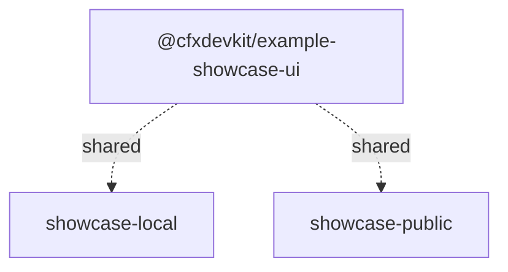

# Other — examples

# Other — Examples Module

The **Other — examples** module is a collection of standalone, self-contained demonstration applications and shared UI libraries that showcase the capabilities of the `@cfxdevkit/*` ecosystem. It serves as both a **developer reference** and a **living testbed**, illustrating how to integrate core wallet management, hardware wallet support, backend services, and frontend frameworks in real-world scenarios.

Unlike production modules, this module is not consumed as a library — it is a *set of example applications* meant to be run locally, inspected, and extended. Its primary goals are:

- Demonstrate end-to-end workflows (e.g., SIWE authentication → session-key delegation → contract deployment)
- Provide working patterns for integrating hardware wallets (Ledger via WebHID), browser wallets (MetaMask, Fluent), and memory/file keystores
- Validate internal APIs (`@cfxdevkit/core`, `@cfxdevkit/wallet`, `@cfxdevkit/services`, etc.) in realistic usage
- Support local development through the keeper showcase apps

---

## Architecture Overview

The examples module is organized around two keeper applications plus a shared UI library:



The keeper apps cover the supported release workflows directly. Legacy gateway, stack, browser, backend, and hardware-wallet demo apps have been retired after their surviving behavior moved into the keeper apps.

---

## Key Applications

### 1. `showcase-local` — Local Development Showcase

**Purpose**: Demonstrates local devnode workflows, Solidity compilation, deployment, SIWE authentication, keystore setup, and session-key delegation.

**Key Features**:
- **Devnode control**: Start, stop, mine, and inspect a local Conflux node.
- **Compiler and deployment**: Compile Solidity templates and deploy them through the shared client surface.
- **Keystore workflows**: Set up file-backed keystores, add wallets, unlock, and exercise reveal flows.
- **SIWE and session keys**: Demonstrate auth/session-key patterns through the local server surface.

---

### 2. `showcase-public` — Public API Showcase

**Purpose**: Focuses on public, browser-facing workflows including Fluent, MetaMask, generic EIP-1193 providers, token utilities, and hardware-wallet flows.

**Key Features**:
- Dual-space wallet support (Core + eSpace)
- BIP-39/BIP-32/SLIP-0044 derivation (mnemonic generation, path derivation)
- Wallet connection UI (modal picker, status pills)
- RPC interaction via `wagmi` and `@cfxjs/use-wallet-react`
- Ledger hardware wallet coverage through the supported wallet package

**UI Components**:
- `WalletPickerModal`: Modal to select wallet provider
- `ConnectWall`: Placeholder UI when wallet is not connected
- `SharedDevNodePill`: DevNode status pill (reused from `showcase-ui`)
- `DualWalletBar`: Side-by-side Core/eSpace wallet status indicators

**Core APIs Demonstrated**:
- `generateMnemonic`, `validateMnemonic`, `listChains` (`@cfxdevkit/core`)
- `rpcCoreAccounts`, `rpcCoreChainId`, `switchConfluxChain`, `buildAddChainParams`
- `useCoreWallet`, `useFluentCore`, `detectFluentCore`

## Shared UI Library: `@cfxdevkit/example-showcase-ui`

**Purpose**: Centralizes reusable UI components and hooks across browser apps.

**Exports**:
- **Components**: `ConnectWall`, `WalletPickerModal`, `LogBox`, `CopyButton`
- **DevNode UI**: `SharedDevNodePill`, `ShowcaseOpsPanel`, `useShowcaseBackend`
- **Wallet State**: `deriveCoreState`, `deriveESpaceState`, `needsESpaceSwitch`, `coreChainLabel`, `espaceChainLabel`
- **Wallet Hooks**: `useCoreWallet`, `getFluentCoreProvider`, `switchConfluxChain`, `buildAddChainParams`
- **Shell Layout**: `ShowcaseNav`, `PanelSidebar`, `useActivePanelState`

**State Logic**:
- `deriveCoreState(status, chainId, targetHex)` → `{ isActive, onCorrectChain, showSwitch }`
- `deriveESpaceState(isConnected, chainId, targetChainId)` → `{ isConnected, onCorrectChain, showSwitch }`
- `needsESpaceSwitch(...)` → `boolean`

**Theme**: Dark mode with CSS variables (`--accent`, `--accent-2`, `--warn`, `--err`, `--glow-cyan`), Inter font, and monospace fallback.

---

## Development & Testing

### Running the Examples

From the monorepo root:

```bash
pnpm showcase
```

This starts `showcase-local` and `showcase-public`.

### Testing

Each app has its own test suite:
- `showcase-ui`: `vitest` for state logic (`wallet-state-*.test.ts`)
- Keeper apps: smoke and route-level tests

Example:
```bash
pnpm test --filter @cfxdevkit/example-showcase-ui
```

---

## Integration with Core Packages

This module exercises the following `@cfxdevkit/*` packages:

| Package | Usage |
|---------|-------|
| `@cfxdevkit/core` | Mnemonic generation, chain definitions, wallet utilities |
| `@cfxdevkit/wallet` | Signers, session keys, derivation paths |
| `@cfxdevkit/services` | Ledger hardware wallet integration |
| `@cfxdevkit/compiler` | Solidity template registry and compilation |
| `@cfxdevkit/devnode` | Local Conflux node management |
| `@cfxdevkit/contracts` | Pre-built contract ABIs and deployments |

---

## Summary

The **Other — examples** module is the **living documentation** of the `@cfxdevkit` ecosystem. It provides:

- ✅ Working examples of wallet management (memory, file, hardware)
- ✅ Full-stack patterns (SIWE, session keys, compiler, deploy)
- ✅ Browser wallet integration (wagmi, Fluent, MetaMask)
- ✅ Unified local and public showcase workflows
- ✅ Reusable UI primitives and state logic

It is not a library — it is a **reference implementation suite**. Developers should treat it as a sandbox to explore, copy, and adapt patterns for their own projects.
