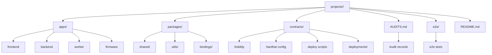

# Project Layout & Examples

# Project Layout & Examples Module

## Overview

The **Project Layout & Examples** module defines the structure, conventions, and usage patterns for **Tier 3 consumer applications** in the `cfxdevkit` monorepo. It serves two primary purposes:

1. **Standardization** — Enforces a consistent, scalable layout for end-user applications (`projects/<name>/`) across the workspace.
2. **Demonstration & Validation** — Provides a suite of runnable, self-contained examples (`projects/examples/`) that exercise the public API surface of the framework, domains, and platform packages.

This module is *not* a runtime component — it is a **structural and documentation contract** that ensures consistency, auditability, and maintainability across all Tier 3 projects.

---

## Architecture

### Tiered Architecture Context

```
repos/cfx-* (Tier 1: Framework & Platform)
     ↑
domains/* (Tier 2: Domain Logic)
     ↑
projects/* (Tier 3: Consumer Applications)
```

- **Tier 3 apps** *consume* shared packages from `repos/cfx-*` and `domains/*`.
- They *must not* be imported by higher-tier code.
- Reusable logic that spans multiple projects belongs in `domains/` or `platform/`, not in `projects/<name>/packages/`.

### Project Layout

All Tier 3 projects follow this canonical structure:



#### Key Directories

| Path | Purpose | Notes |
|------|---------|-------|
| `apps/` | Deployable units (frontend, backend, worker, firmware) | Each app is a self-contained Vite/Moon project |
| `packages/` | Project-internal libraries | Only for code *not* suitable for `domains/` |
| `contracts/` | Solidity sources + deployment metadata | Optional; if present, `AUDITS.md` required |
| `AUDITS.md` | Contract audit status & history | Required if `contracts/` exists |
| `e2e/` | Cross-app integration tests | Optional; uses Playwright or similar |

---

## Project Types

### 1. **CAS** (`projects/cas/`) — Automation Service

- **Type**: Full-stack web service + keeper worker
- **Apps**: `frontend` (Next.js), `backend` (Express), `worker` (Node)
- **Key Features**:
  - Order builder, DCA automation, execution engine
  - Uses `@cfxdevkit/executor`, `domains/automation`
  - Session-key signers for keeper via `@cfxdevkit/wallet`
- **Migration Risk**: **High** — live mainnet system; worker migrates last behind feature flag

### 2. **Chainbrawler** (`projects/chainbrawler/`) — On-Chain RPG

- **Type**: Web UI + game engine
- **Apps**: `web-ui` (Vite + Mantine)
- **Key Features**:
  - RPG rules (`packages/game-rules/`) kept project-local
  - Engine logic → `domains/game-engine`
  - Wallet integration via `@cfxdevkit/wallet-connect`
- **Migration Strategy**: Extract engine pieces to domain; keep game rules here

### 3. **Conflux Phaser** (`projects/conflux-phaser/`) — Phaser Game

- **Type**: Single-app Phaser 3 game
- **Apps**: `web` (Vite + Phaser)
- **Key Features**:
  - Minimal structure; ideal for framework validation
  - Replaces hand-rolled RainbowKit with `@cfxdevkit/wallet-connect`
- **Migration Priority**: **Lowest risk** — migrate first as a validation test

### 4. **Electro** (`projects/electro/`) — ESP32 + Conflux

- **Type**: Firmware + backend bridge
- **Apps**: `firmware` (PlatformIO/C++), `backend` (Express)
- **Key Features**:
  - Dual-core ESP32 firmware with generated pin map (`hardware/diagram.json` → `Pins.h`)
  - Project-local backend bridge for device telemetry
  - Thin wrapper over `@cfxdevkit/core`
- **Migration Effort**: **Low** — already follows target pattern

### 5. **Examples** (`projects/examples/`) — Public API Showcase

- **Type**: Demo suite + integration tests
- **Apps**:
  - `showcase-local/` — Local devnode, compiler, deploy, SIWE, and keystore workflows
  - `showcase-public/` — Public API, wallet, token, and hardware-wallet workflows
- **Shared Package**: `packages/showcase-ui/` — Theme, navigation, wallet UI primitives
- **Purpose**:
  - Validate public API surface
  - Document usage patterns
  - Surface known coverage gaps (e.g., `@cfxdevkit/theme`, `@cfxdevkit/llm-tools`)
- **Coverage Map**: See `SHOWCASE-COVERAGE.md`

---

## Audit & Deployment Discipline

### `AUDITS.md` Requirements

Every project with `contracts/` **must** maintain an `AUDITS.md` file with:

- List of all contracts, deployment scripts, and artifacts
- Internal review date, reviewer, commit SHA, findings, remediation status
- External audit report links (pre-mainnet)
- Deployment addresses + verified source references

> **Note**: Projects without `contracts/` (e.g., `cas`, `chainbrawler`, `conflux-phaser`, `electro`, `examples`) declare *no audit scope* in their `AUDITS.md`.

---

## Shared Example UI (`packages/showcase-ui/`)

### Role

A **Tier 2** shared package used *only* by example apps. It provides:

- Reusable UI components (`ConnectWall`, `WalletPickerModal`, `LogBox`)
- Wallet state helpers (`useCoreWallet`, `deriveCoreState`, `deriveESpaceState`)
- Shared theme (`theme.css`)
- Shell navigation & panel state (`Shell`, `PanelSidebar`, `useActivePanelState`)

### Constraints

- May import from `framework/` and `platform/`
- **Must not** import from `domains/` or higher tiers
- Not intended for reuse outside `projects/examples/`

### Build

- Vite library mode (`vite.config.ts`)
- Outputs `dist/` with TypeScript declarations
- Commands: `build`, `typecheck`, `lint`

---

## Local Development Workflow

### Keeper Showcase Apps

```bash
pnpm showcase
# Starts showcase-local and showcase-public
```

### Standalone App Workflow

```bash
pnpm --filter @cfxdevkit/example-showcase-local dev
pnpm --filter @cfxdevkit/example-showcase-public dev
```

---

## Adding a New Project

### Tier 3 Project (`projects/<name>/`)

1. `mkdir -p projects/<name>`
2. Add `README.md`, `AUDITS.md`, `package.json`, `pnpm-workspace.yaml`, `moon.yml`
3. Add `apps/`, `packages/`, `contracts/`, `e2e/` as needed
4. Register in `.moon/workspace.yml`
5. Run `pnpm install`

### Shared Example Package (`projects/examples/packages/<name>/`)

1. `mkdir -p projects/examples/packages/<name>`
2. Add `package.json` (`@cfxdevkit/example-<name>`)
3. Register in `.moon/workspace.yml`
4. Add `README.md` listing dependent apps
5. Run `pnpm install`

> **Note**: All `projects/examples` apps are Tier 3; shared packages are Tier 2.

---

## Known Gaps & Roadmap

| Area | Coverage | Notes |
|------|----------|-------|
| `@cfxdevkit/theme`, `@cfxdevkit/react` | Partial | Shared theme in place; dedicated component demos pending |
| `@cfxdevkit/cli`, `@cfxdevkit/llm-tools` | Gap | Add CLI/scaffold and LLM automation demos |
| `domains/automation`, `game-engine` | Gap | Add domain-specific examples after core flows stabilize |

---

## References

- **Framework Usage**: All projects reference `@cfxdevkit/core`, `@cfxdevkit/wallet`, `@cfxdevkit/wallet-connect`, and domain packages as needed.
- **Migration Notes**: Each project includes `README.md` and `STRUCTURE.md` with migration status and risk assessment.
- **Audit Policy**: Enforced via `AUDITS.md` — no contract deployment without audit record.
- **Template Promotion**: Successful patterns (e.g., Phaser+wallet scaffold) may be promoted to `platform/templates/`.
