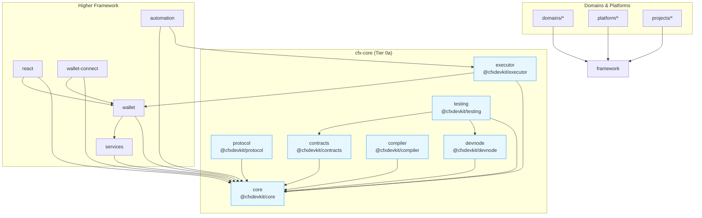
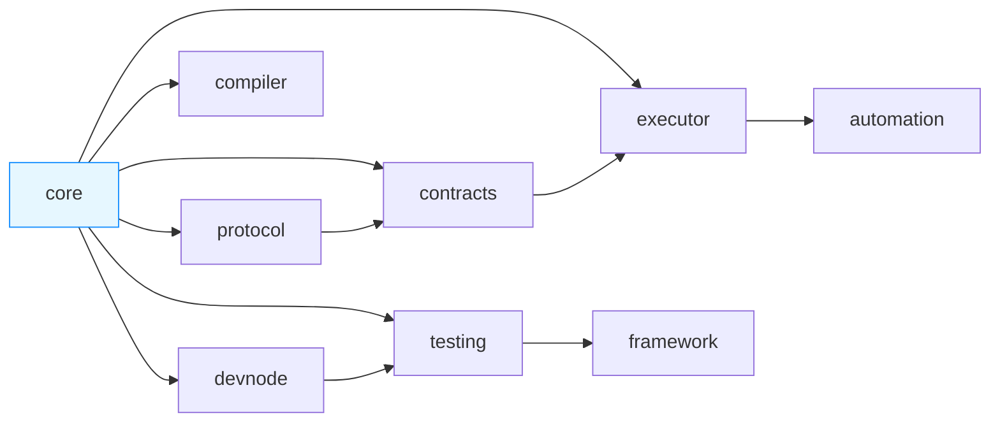

# Repository Layout — cfx-core

# `cfx-core` — Chain Primitives Module

The `cfx-core` module is the foundational layer of the Conflux DevKit monorepo. It provides **tier-0a chain primitives** — stable, low-level abstractions for interacting with Conflux networks (both **eSpace** and **Core Space**) — that all higher-level packages depend on.

Designed for long-term stability and minimal dependencies, `cfx-core` is split into **seven focused packages**, each with a single responsibility and strict boundary rules. This modular structure enables independent versioning, tree-shaking, and decoupled release cycles.

---

## Core Principles

| Principle | Rationale |
|---------|-----------|
| **No internal framework dependencies** | `cfx-core` packages may not import from `cfx-keys`, `cfx-ui`, `cfx-domain`, or `cfx-tools`. This ensures they remain reusable by external tooling and future frameworks. |
| **Functional, stateless API** | All public APIs are pure functions or simple factories. No mutable global state, no "client managers", no orchestrator classes. |
| **Cross-space first** | Every primitive supports both eSpace (EVM, viem-backed) and Core Space (Conflux-native, cive-backed) via discriminated unions. |
| **BigInt-only** | Token amounts, gas, block numbers — all use `bigint`. No `Number` conversions. |
| **Typed entrypoints + sourcemaps** | Every package publishes full TypeScript definitions and source maps for debugging. |

---

## Package Overview

| Package | npm | Purpose | Key Dependencies |
|--------|-----|---------|------------------|
| `core` | `@cfxdevkit/core` | **Chain primitives**: client, wallet, chains, units, contract I/O, batch, types, errors | `viem`, `cive`, `@noble/hashes`, `@noble/curves` |
| `protocol` | `@cfxdevkit/protocol` | **Protocol artifacts**: selectors, events, schemas, network metadata | — |
| `contracts` | `@cfxdevkit/contracts` | **Curated ABIs + deployments** (e.g., `Multicall3`, `Staking`, `CrossSpaceBridge`) | `core` |
| `compiler` | `@cfxdevkit/compiler` | **Solidity tooling**: `solc` wrapper + `revive` bridge | — |
| `executor` | `@cfxdevkit/executor` | **Background job runner**: generic queue, retry, gas-aware submission | `core`, `wallet` |
| `devnode` | `@cfxdevkit/devnode` | **Local devnet harness**: deterministic node lifecycle, pre-funded accounts | `@xcfx/node` |
| `testing` | `@cfxdevkit/testing` | **Test fixtures**: shared `DevWorld`, matchers, mocks, snapshots | `core`, `devnode`, `vitest`, `msw` |

> ✅ **All packages are browser-safe** (no `node:*` imports in `core`/`protocol`/`contracts`/`compiler`).

---

## Architecture Diagram



---

## `@cfxdevkit/core` — The Heart of the Module

This is the largest and most critical package. It provides **six sub-paths**, each with a single, well-defined responsibility.

### 1. `chains` — Chain Registry

A static, immutable catalog of chain configurations. **No I/O, no network calls.**

```ts
import { espaceTestnet, coreSpaceMainnet, getChain } from '@cfxdevkit/core/chains';

const chain = getChain('espace-testnet'); // throws if unknown
console.log(chain.rpc.http[0]); // "https://testnet.confluxrpc.com"
```

**Key types:**
- `ChainConfig`: `id`, `name`, `network`, `family`, `nativeToken`, `rpc`, `explorer`
- `ChainId`: `"cfx:core:2029"` | `"cfx:espace:2030"` | etc.

**Functions:**
- `getChain(idOrName)` — lookup by ID or name
- `listChains()` — all registered chains
- `defineChain(input)` — register custom chains (e.g., local testnets)

> 📌 **Boundary**: `chains` is pure data. It does *not* instantiate clients or perform RPC calls.

---

### 2. `client` — RPC Client Factory

Creates a **typed, chain-aware client** from a `ChainConfig` and `Transport`. One client per chain.

```ts
import { createClient, http } from '@cfxdevkit/core/client';
import { espaceTestnet } from '@cfxdevkit/core/chains';

const client = createClient({
  chain: espaceTestnet,
  transport: http('https://testnet.confluxrpc.com'),
});

const blockNumber = await client.getBlockNumber();
const balance = await client.getBalance('0x0000000000000000000000000000000000000000');
```

**Key types:**
- `Transport`: `http`, `ws`, or `fallback` (first-success-wins)
- `Client`: discriminated union (`EspaceClient` / `CoreSpaceClient`) with chain-specific actions:
  - eSpace: `getBlockNumber`, `getBlock`, `getBalance`, `getTransactionReceipt`, `estimateGas`
  - Core Space: `getEpochNumber`, `getStatus`, `getSponsorInfo`, `getAdmin`, `getLogs`

**Functions:**
- `http(url, opts?)`, `ws(url, opts?)`, `fallback(transports)`
- `createClient({ chain, transport })`

> ⚠️ **No caching, no auth, no signer**. Chain switching requires creating a new client.

---

### 3. `wallet` — HD Derivation & Signer Interface

Pure HD derivation + a minimal `Signer` interface. **No keystore I/O** (that lives in `services/keystore`).

```ts
import { deriveAccount, signerFromPrivateKey } from '@cfxdevkit/core/wallet';

const { account, privateKey } = deriveAccount({ mnemonic: '...' });
const signer = signerFromPrivateKey(privateKey);

const signed = await signer.signTransaction({
  chainId: 2030,
  to: '0x...',
  value: 1000000000000000000n,
});
```

**Key types:**
- `Account`: `{ address, publicKey }` (private key never exposed)
- `Signer`: `signTransaction`, `signMessage`, `signTypedData`
- `SignableTx`: `{ chainId, to?, value?, data?, nonce?, gas?, maxFeePerGas? }`

**Functions:**
- `deriveAccount(input)` — BIP-44 derivation (Conflux paths: `m/44'/503'/...`)
- `deriveAccounts(input)` — batch derivation
- `signerFromPrivateKey(pk)` — test-only (production uses `services/keystore`)

> 📌 **Design**: Mnemonic → private key is explicit. Production code should *never* hold private keys in memory.

---

### 4. `contract` — Typed Contract I/O

**One function per verb.** No "ContractInstance" objects. Pure, stateless.

```ts
import { readContract, writeContract, deployContract } from '@cfxdevkit/core/contract';

// Read
const balance = await readContract({
  client, address: tokenAddress, abi: erc20Abi, functionName: 'balanceOf', args: [userAddress]
});

// Write
const { hash } = await writeContract({
  client, signer, address: tokenAddress, abi: erc20Abi, functionName: 'transfer', args: [to, amount]
});

// Deploy
const { hash, address } = await deployContract({
  client, signer, abi: MyTokenAbi, bytecode: myBytecode, args: ['MyToken', 'MTK', 18]
});
```

**Functions:**
- `readContract`, `simulateContract`, `writeContract`, `deployContract`
- `watchEvent` → `AsyncIterable<DecodedEvent>` (cancellable via `AbortSignal`)
- `parseEventLog` — decode raw logs

> 📌 **No shared state**. Each call is independent. `simulateContract` returns a reusable `request` for `writeContract`.

---

### 5. `batch` — RPC Coalescing

**Reads only via Multicall3.** Writes via `multisend` (SafeMultisend).

```ts
import { multicall, multisend } from '@cfxdevkit/core/batch';

// Multicall3
const results = await multicall({
  client,
  calls: [
    { address: token1, abi: erc20Abi, functionName: 'balanceOf', args: [addr] },
    { address: token2, abi: erc20Abi, functionName: 'balanceOf', args: [addr] }
  ]
});

// Multisend (batched writes)
const { hash } = await multisend({
  client, signer,
  calls: [
    { to: token1, data: encodeFunctionData('transfer', [to, amount]) },
    { to: token2, data: encodeFunctionData('transfer', [to, amount]) }
  ]
});
```

**Functions:**
- `multicall(input)` — single RPC call for many reads
- `multisend(input)` — single transaction for many writes
- `createBatcher(opts?)` — stateful request coalescing (for high-throughput apps)

> 📌 **No caching**. Deduplication is handled by the batcher.

---

### 6. `abi`, `address`, `units`, `errors`, `types` — Supporting Primitives

| Sub-path | Purpose |
|---------|---------|
| `abi` | Static const ABIs: `erc20Abi`, `erc721Abi`, `multicall3Abi` |
| `address` | `isAddress`, `checksum`, `assertAddress`, `coreToEspace`, `espaceToCore` |
| `units` | `formatUnits`, `parseUnits`, `formatToken`, `formatCFX`, `parseCFX` (BigInt-only) |
| `errors` | `CfxError`, `RpcError`, `ContractError`, `WalletError`, `isCfxError` |
| `types` | Shared primitives: `Address`, `Hash`, `Hex`, `Wei`, `ChainId`, `BlockTag`, `Block`, `TxReceipt`, `RawLog`, `TypedData`, `Abi` |

---

## `@cfxdevkit/devnode` — Local Devnet Harness

A **dev-only** package that wraps `@xcfx/node` to spin up a deterministic local Conflux node.

```ts
import { createDevNode } from '@cfxdevkit/devnode';

const node = await createDevNode();
await node.start();

// node.urls.core → "http://127.0.0.1:12537"
// node.urls.espace → "http://127.0.0.1:8545"
// node.accounts[0] → pre-funded with 10,000 CFX

await node.stop();
```

**Key features:**
- Dual-space (Core + eSpace) on standard ports (`12537/12536`, `8545/8546`)
- Deterministic genesis (BIP-44 mnemonic, 10 funded accounts)
- Auto-miner (`mine({ numTxs: 1 })`) to pack pending txs
- Snapshot/restore for test isolation (`snapshot`, `revert`, `mineBlocks`)

> 📌 **Not for production**. Node.js host required.

---

## `@cfxdevkit/testing` — Shared Test Utilities

**Test-only.** Imported only from `*.test.ts`. Tree-shaken from production builds.

**Key fixtures:**
- `createDevWorld()` — returns `{ node, client, funded[], stop() }`
- `deployErc20()` — deploys a test ERC20 token
- `withSnapshot(node)` — Vitest hooks for automatic snapshot reset

**Custom matchers:**
- `expect(receipt).toBeMined()`
- `expect(receipt).toEmitEvent({ abi, name, args? })`
- `expect(call).toRevertWithCode('core/contract/revert')`
- `expect(addr).toBeAddress()`
- `expect(amount).toEqualWei('1.234', 18)`

> ✅ Auto-registered on import: `import '@cfxdevkit/testing/matchers'`.

---

## `@cfxdevkit/executor` — Background Job Runner

A **generic** job runner for off-chain automation (keepers, DEX bots, etc.). **No domain logic**.

```ts
import { createExecutor, createMemoryQueue } from '@cfxdevkit/executor';

const executor = createExecutor({
  queue: createMemoryQueue(),
});

executor.register('transfer', async (payload, ctx) => {
  const { signer, client } = ctx;
  const { to, amount } = payload;
  await writeContract({ client, signer, to, value: amount, ... });
});

await executor.start({ concurrency: 5 });
await executor.enqueue({ id: 'tx-1', kind: 'transfer', payload: { to: '0x...', amount: 1000000000000000000n } });
await executor.stop({ drainMs: 5000 });
```

**Key features:**
- Pluggable queues (`memory`, `redis`, `postgres`)
- Retry + exponential backoff
- Idempotency keys (`id`)
- Gas-aware submission (via handlers)

> 📌 **Domain strategies live in `@cfxdevkit/automation`**, which registers handlers via `executor.register`.

---

## `@cfxdevkit/protocol` — Protocol Artifacts

**Raw on-chain artifacts** for tooling (block explorers, indexers, MCP). Lower-level than `contracts`.

| Sub-path | Purpose |
|---------|---------|
| `selectors` | 4-byte function selectors → human signature (`0xa9059cbb → "transfer(address,uint256)"`) |
| `events` | Event topic0 → schema (`0x... → "Transfer(address,address,uint256)"`) |
| `schemas` | JSON schemas for on-chain payloads |
| `networks` | Network metadata (RPC endpoints, explorers, faucets) |

> 📌 **No opinionated TS surface**. Pure data for downstream tooling.

---

## `@cfxdevkit/contracts` — Curated ABIs + Deployments

**Curated ABIs** (e.g., `Staking`, `CrossSpaceBridge`, `SponsorWhitelistControl`) + **deployment addresses**.

```ts
import { stakingAbi, crossSpaceBridgeAbi } from '@cfxdevkit/contracts';
import { stakingAddress } from '@cfxdevkit/contracts/deployments/espace-mainnet';

const { result } = await readContract({
  client, address: stakingAddress, abi: stakingAbi, functionName: 'getStakeBalance', args: [userAddress]
});
```

> 📌 **Higher-level than `protocol`**, but **lower-level than `core/contract`**. No business logic.

---

## `@cfxdevkit/compiler` — Solidity Tooling

**Solidity compiler wrapper** (`solc`) + `revive` bridge for Conflux-specific features.

> 📌 Used by `framework/contracts` and project build tooling.

---

## Dependency Graph (One-Way)



---

## Anti-Goals (Explicitly Excluded)

| Area | Location |
|------|----------|
| Wallet UI / connector | `framework/wallet-connect` |
| Keystore I/O | `framework/services/keystore` |
| Session keys | `framework/wallet/session-key` |
| Caching layer | `framework/react` (react-query) |
| Strategy / scheduling | `domains/automation` + `framework/executor` |
| Solidity compilation | `framework/compiler` |

---

## Porting & Stability

The `PORTING.md` file documents the **symbol-by-symbol mapping** from the reference implementation (`devkit/packages/core@1.2.5`) to this contract. Every source export is accounted for as:

- `PORT` — copy and adapt
- `RENAME` — same shape, different identifier
- `RESHAPE` — class → functional verb
- `RELOCATE` — moved to another package
- `NEW` — required by docs, no source equivalent
- `DROP` — devkit-specific, internal, or duplicative

This ensures **100% coverage** and traceability.

---

## Conclusion

`cfx-core` is the **stable, dependency-light foundation** of the Conflux DevKit. By splitting primitives into focused packages with strict boundaries, it enables:

- ✅ Independent versioning and release cadence
- ✅ Tree-shaking and minimal bundle size
- ✅ Reusability across frameworks and tooling
- ✅ Long-term stability (tier-0a)

All higher-level packages (`services`, `wallet`, `react`, `automation`, etc.) build on top of `cfx-core`, relying on its clean, typed, and predictable API.
