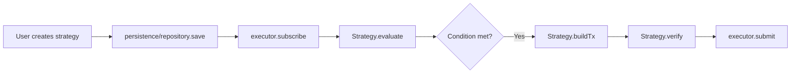
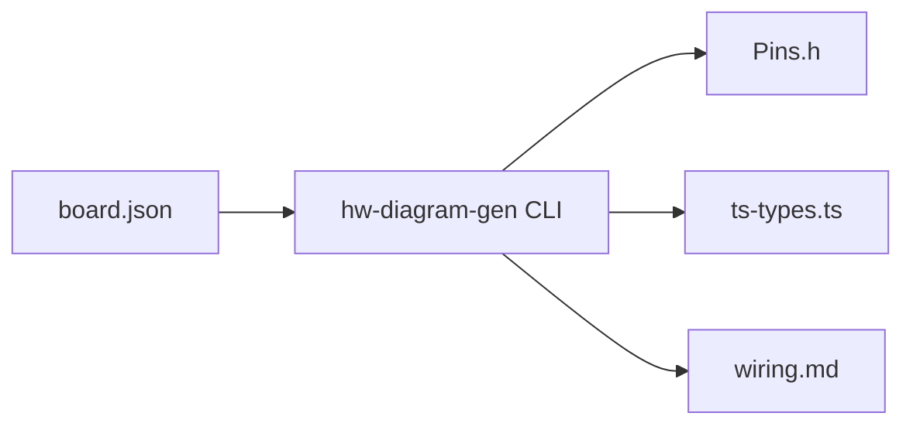

# Repository Layout — cfx-domain

# `cfx-domain` — Vertical Domain Module Documentation

## Overview

The `cfx-domain` module is a **Tier 2** vertical concern repository, introduced per [ADR-0003](../../docs/adr/0003-multi-repo-split.md). It encapsulates domain-specific logic that is reusable across multiple projects but not tied to any single one. This module serves as the staging ground for domain abstractions before they may eventually be split into independent repositories upon reaching sufficient reuse.

Currently, `cfx-domain` hosts three packages:

| Package | npm Name | Primary Consumers | Status |
|--------|----------|-------------------|--------|
| `game-engine` | `@cfxdevkit/game-engine` | `conflux-phaser`, `chainbrawler` | Phase A scaffold |
| `automation` | `@cfxdevkit/automation` | `cas`, `electro` | Phase A scaffold |
| `hardware-bridge` | `@cfxdevkit/hardware-bridge` | `electro` | Phase A scaffold |

Each package is designed to be **engine-agnostic**, **framework-agnostic**, and **UI-agnostic**, ensuring maximum portability and composability.

---

## Architecture Principles

### Dependency Rules

Per the [Architecture Tier Model](../../ARCHITECTURE.md), `cfx-domain` adheres to the following constraints:

- ✅ **May depend on**:  
  - `@cfxdevkit/core`  
  - `@cfxdevkit/wallet`  
  - `@cfxdevkit/contracts`  
  - `@cfxdevkit/executor`  
  - `@cfxdevkit/services`

- ❌ **Must not depend on**:  
  - `cfx-ui`  
  - `cfx-tools`

This enforces a strict **one-way dependency flow**:  
`projects → domains → platform → framework`

### Repository Strategy

- All packages currently coexist in a single monorepo for coordination and shared tooling.
- Packages are candidates for **future extraction** into standalone repos when:
  - A second consumer emerges (e.g., `hardware-bridge` currently has only one consumer: `electro`)
  - Versioning or release cycles diverge significantly
  - Ownership shifts to a different team

---

## Package Deep Dives

### 1. `@cfxdevkit/automation`

#### Purpose

Provides **off-chain automation strategies** — reusable, composable logic for executing transactions based on conditions, schedules, or market events — executable by `framework/executor`.

#### Core Responsibilities

- Define a generic `Strategy` interface (`evaluate`, `buildTx`, `verify`)
- Implement built-in strategies:  
  - Limit order  
  - Dollar-cost averaging (DCA)  
  - Scheduled transactions  
  - Stop-loss / trailing-stop  
  - Generic condition-based triggers  
- Define strategy persistence schema (e.g., for PostgreSQL or in-memory)
- Provide backtesting infrastructure (runner, data sources)

#### Non-Goals

- Transport/queueing (handled by `framework/executor`)
- Project-specific UI (e.g., CAS order builder remains in `projects/cas/`)

#### Structure Highlights

```
automation/
├── strategy/          ← Strategy interface & base class
├── strategies/        ← Concrete strategies (limit-order/, dca/, etc.)
├── conditions/        ← Reusable predicates (price, time, balance, event)
├── persistence/       ← Strategy storage (postgres, memory)
└── backtest/          ← Backtesting harness
```

#### Execution Flow (Simplified)



#### Origin

Extracted from:
- `cas/conflux-cas/worker`
- `cas/conflux-sdk` automation types

---

### 2. `@cfxdevkit/game-engine`

#### Purpose

Provides **engine-agnostic on-chain game primitives** — abstractions for game state, entities, and chain synchronization — without game-specific rules.

#### Core Responsibilities

- Local game state management (Zustand-style store, no React coupling)
- Game loop / state machine (turn/round/phase transitions)
- Entity interfaces (character, inventory, item, stats)
- Chain ↔ local-state bridge (optimistic updates, reconciliation)
- Renderer adapters (React hooks, Phaser scene bridge)

#### Non-Goals

- Game rules (e.g., RPG combat logic stays in `projects/chainbrawler/packages/game-rules/`)
- Rendering or UI

#### Structure Highlights

```
game-engine/
├── state/             ← Local store, persistence, selectors
├── engine/            ← State machine, actions, reducer, timing
├── entities/          ← Character, inventory, item, stats
├── chain-bridge/      ← Event listener, action dispatcher, sync
└── adapters/          ← React hooks, Phaser bridge
```

#### Key Abstractions

| Abstraction | Description |
|-------------|-------------|
| `GameState` | Immutable snapshot of game state |
| `EntityId` | Unique identifier for characters/items |
| `ActionDispatcher` | Maps local actions → on-chain writes |
| `EventListener` | Subscribes to chain events → updates local store |
| `OptimisticUpdate` | Local-first update with rollback on failure |

#### Execution Flow (Chain ↔ Local)

```mermaid
flowchart LR
    subgraph Chain
        A[On-chain event] --> B[framework/core]
    end
    subgraph Local
        B --> C[EventListener]
        C --> D[Store.update]
        D --> E[Selectors]
        E --> F[Renderer]
    end
    subgraph Local → Chain
        G[User action] --> H[ActionDispatcher]
        H --> I[OptimisticUpdate]
        I --> J[Contract.write]
    end
```

#### Origin

Extracted from `chainbrawler/packages/core`. RPG-specific rules remain in `projects/chainbrawler/packages/game-rules/`.

---

### 3. `@cfxdevkit/hardware-bridge`

#### Purpose

Provides **reusable infrastructure for physical hardware ↔ backend/chain communication**, including protocol, sensor types, and hardware description tooling.

#### Sub-Packages

| Sub-package | npm Name | Purpose |
|-------------|----------|---------|
| `ws-protocol` | `@cfxdevkit/hw-ws-protocol` | WebSocket message schemas & transport |
| `sensor-types` | `@cfxdevkit/hw-sensor-types` | Typed sensor descriptors & value encoders |
| `hardware-diagram` | `@cfxdevkit/hw-diagram` | JSON pin-mapping + codegen for firmware |

#### Core Responsibilities

- Define versioned message schemas (device ↔ backend)
- Encode/decode sensor values (CBOR/JSON)
- Provide reusable sensor catalog (temperature, humidity, motion, etc.)
- Generate firmware headers (`Pins.h`) and TypeScript types from board JSON
- Support board descriptors (e.g., ESP32-DevKitC, ESP32-S3)

#### Non-Goals

- Firmware implementation (stays in `projects/electro/apps/firmware/`)
- Hardware-specific drivers (handled in firmware)
- Project-specific dashboards

#### Structure Highlights

```
hardware-bridge/
├── ws-protocol/       ← Message schemas, codec, transport, auth
├── sensor-types/      ← Catalog, encoding, validation
└── hardware-diagram/  ← Schema, parser, codegen, board descriptors
```

#### Codegen Workflow



#### Origin

Extracted from `Electro/packages/{ws-protocol,sensor-types,hardware-diagram}`.

---

## Package Lifecycle & Development

### Phase A: Scaffold

All packages currently exist as **Phase A scaffolds** — minimal structure with:
- `__packageName` smoke export
- `STRUCTURE.md` documenting intent
- `API.md` placeholder

This phase validates:
- Package boundaries
- Dependency hygiene
- Naming & structure consensus

### Phase B: Implementation

Once consensus is reached, implementation proceeds in lockstep with:
- Public surface documented in `API.md`
- Tests added
- Examples added per sub-package
- Versioning aligned with workspace

### Phase C: Extraction (Future)

When reuse justifies it, a package may be extracted into its own repo with:
- New monorepo layout (e.g., `cfx-automation`)
- Independent versioning (`v1.0.0+`)
- Dedicated CI/CD and release process

---

## Integration with Other Modules

### Dependencies

All `cfx-domain` packages depend on **Tier 1** modules (`@cfxdevkit/core`, `@cfxdevkit/wallet`, etc.) and **Tier 0** (`contracts`, `services`). They do **not** depend on `cfx-ui` or `cfx-tools`, preserving separation of concerns.

### Consumers

| Domain Package | Consumer | Integration Pattern |
|----------------|----------|---------------------|
| `game-engine` | `conflux-phaser` | Phaser scene uses `adapters/phaser` |
| `game-engine` | `chainbrawler` | Uses `state/store`, `entities`, `chain-bridge` |
| `automation` | `cas` | CAS worker consumes `strategies/limit-order`, `backtest` |
| `automation` | `electro` | Uses `automation` for scheduled sensor uploads |
| `hardware-bridge` | `electro` | Firmware uses `ws-protocol`, `sensor-types`, `hardware-diagram` |

---

## Future Work

- ✅ Finalize `automation` strategy interface and built-ins
- ✅ Implement `game-engine` state machine and chain bridge
- ✅ Complete `hardware-bridge` codegen tooling
- 🚧 Add backtesting data sources (e.g., historical price feeds)
- 🚧 Add `game-engine` test fixtures (e.g., mock state transitions)
- 🚧 Add hardware simulator for `ws-protocol` testing

---

## References

- [ADR-0003 — Multi-Repo Split](../../docs/adr/0003-multi-repo-split.md)
- [Architecture Tier Model](../../ARCHITECTURE.md)
- `automation/STRUCTURE.md`
- `game-engine/STRUCTURE.md`
- `hardware-bridge/STRUCTURE.md`
