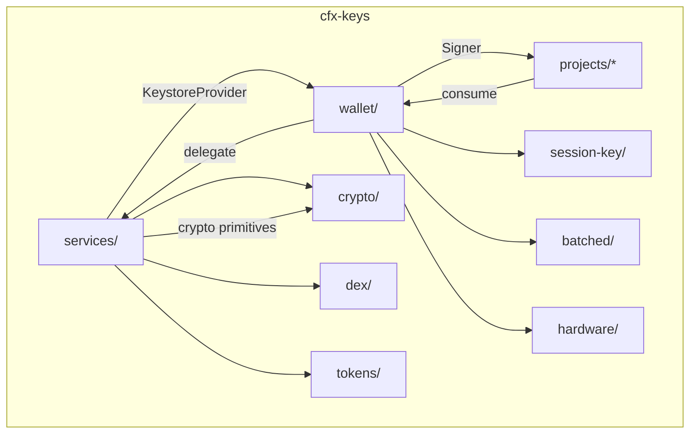

# Repository Layout — cfx-keys

# Repository Layout — `cfx-keys`

The `cfx-keys` repository is a **tier-0b audit-grade trust boundary** for cryptographic operations in the Conflux DevKit ecosystem. It is carved out as a standalone repository per [ADR-0003](../../docs/adr/0003-multi-repo-split.md) to isolate all code that handles private keys, enabling focused security audits, stricter release policies, and reduced blast radius.

> **Audit perimeter = repository perimeter.**  
> Anything that touches private keys lives here.

---

## High-Level Architecture



The repository is split into two primary packages:

| Package | npm | Role |
|--------|-----|------|
| `@cfxdevkit/services` | `services/` | **Pluggable keystore backends + crypto primitives** — stateless, interface-driven |
| `@cfxdevkit/wallet` | `wallet/` | **Signer orchestration + session-key lifecycle** — the *only* blessed entrypoint for automated signing |

---

## Package: `@cfxdevkit/services`

### Purpose

Provides **stateless, pluggable keystore backends** behind a single `KeystoreProvider` interface, plus supporting primitives (crypto, DEX, tokens). It is the *only* place where private material crosses a boundary — and only into a secure backend (e.g., hardware, OS keyring, KMS), never into application memory.

### Core Interface: `KeystoreProvider`

All backends implement this interface:

```ts
type KeystoreProvider = {
  readonly id: string
  readonly capabilities: { write: boolean; list: boolean; rotate: boolean }

  list(opts?): Promise<StoredSecret[]>
  has(ref, opts?): Promise<boolean>
  getSigner(ref, capability?, opts?): Promise<Signer>

  put?(input): Promise<void>          // optional
  updateMeta?(ref, meta, opts?): void // optional
  remove?(ref, opts?): void           // optional
  rotate?(ref, opts?): void           // optional
}
```

- `StoredSecret` is metadata-only — never contains private material.
- `getSigner` returns a `Signer` that *internally* delegates to the backend — private key never leaves the backend.
- `Capability` is enforced server-side (if supported) or client-side (via `wallet/session-key`).

### Backends

| Sub-path | Backend | Notes |
|---------|---------|-------|
| `keystore-file` | Encrypted local file (`cfx-v1` format: Argon2id KEK + AES-256-GCM) | Default for dev/test; supports SOPS+age export/import |
| `keystore-memory` | In-memory store | Tests-only; throws in production builds |
| `keystore-ledger` | Ledger hardware wallet (via Ethereum app) | Supports eSpace signing only; Core Space pending APDU support |
| `keystore-kms` | AWS KMS / GCP KMS / HashiCorp Vault | Read-only by default; keys never leave cloud custody |
| `keystore-os` | macOS Keychain / Windows DPAPI / Linux libsecret | Uses `@napi-rs/keyring`; may be unavailable in containers |
| `keystore-forward` | Host keyring socket (e.g., D-Bus, ssh-agent) | For containers; proxies to host keyring |

### Crypto Primitives (`crypto/`)

- `AES-256-GCM`: `encryptAesGcm`, `decryptAesGcm` (with optional AAD)
- `KDF`: `deriveKeyArgon2id`, `deriveKeyHkdf`
- `CSPRNG`: `randomBytes`
- `Encoding`: `toHex`, `fromHex`, `toBase64Url`, `fromBase64Url`

All functions are pure, side-effect-free, and deterministic.

### DEX & Tokens

- `dex/`: `DexAdapter` interface (`quote`, `swap`) + `swappi` adapter
- `tokens/`: `TokenRegistry` for metadata lookup (curated + on-chain fallback)

---

## Package: `@cfxdevkit/wallet`

### Purpose

The **only blessed entrypoint for automated signers**. Wraps `KeystoreProvider`-backed keys into capability-scoped, session-aware signers and provides batched transaction helpers.

> ⚠️ **Security rule**: Any non-interactive signing *must* go through this package.

### Session Keys: Ephemeral, Capability-Limited Signers

A session key is an ephemeral keypair derived *in memory* from a parent signer, signed by the parent, and valid only within a `Capability` and `notAfter` deadline.

```ts
type SessionKey = {
  publicKey: Hex
  address: Address
  capability: Capability
  issuedAt: Timestamp
  notAfter: Timestamp
  parent: Address
  attestation: Hex  // parent signature over (publicKey, capability, notAfter)
}
```

#### Lifecycle

- `issueSessionKey(parent, capability, ttlMs)` → `SessionSigner`
- `rotateSessionKey(current, parent, ttlMs)` → new `SessionSigner`
- `revokeSessionKey(session, parent, registry?)` → on-chain revocation (if registry configured)
- `verifyAttestation(session, expectedParent)` → off-chain validation

Session keys live **only in RAM** — never persisted by this package.

#### Policy Enforcement

`wallet/policies` provides composable capability presets:

```ts
combine(
  allowlistContracts([addr1, addr2]),
  allowlistSelectors([selector]),
  valueCap(maxWei),
  timeWindow(notAfter)
)
```

### Signer Factories

| Factory | Input | Use case |
|--------|-------|----------|
| `signerFromKeystore(provider, ref, capability?)` | `KeystoreProvider` + `SecretRef` | Default for all non-interactive signing |
| `signerFromHardware(transport, path?)` | Ledger transport | Direct hardware signing (e.g., CLI tools) |
| `readonlySigner(address)` | `Address` | Watch-only (throws on sign) |

### Batched Transactions

- `createNonceManager(client, address)` → sequential nonce management
- `multicallRead(client, calls)` → batched read calls
- `multisendWrite(client, signer, calls)` → batched writes (delegate-call multisend)

> Note: `core/batch` remains signer-free; `wallet/batched` adds signer + nonce concerns.

### Hardware Wallet Support

- `wallet/hardware/ledger`: Ledger adapter (shares signer with `services/keystore-ledger`)
- `wallet/hardware/onekey`: OneKey adapter
- `wallet/hardware/satochip`: Satochip local bridge adapter

All adapters return a `HardwareWalletAdapter` and a `Signer`.

---

## Dependency Rules & Security Boundaries

### `cfx-keys` packages may depend on:
- `@cfxdevkit/core` (via npm, never workspace after carve-out)

### `cfx-keys` packages **must not** depend on:
- `cfx-ui`, `cfx-domain`, `cfx-tools`

### Consumers must:
- Use **tilde ranges** (`~x.y.z`) to force conscious patch upgrades
- Avoid importing raw private keys — always go through `wallet/session-key` or `wallet/signers`

---

## CI & Release Requirements (Post Carve-Out)

- `pnpm audit --prod` + `socket.dev` scan on every PR
- Reproducible builds (`SOURCE_DATE_EPOCH` pinned)
- CycloneDX SBOM attached to every release
- `Signed-off-by` enforced on `main` (2 reviewers minimum)

---

## Worked Example: Keystore Stack Flow

```
core (types/errors/wallet primitives)
   ↓
services (KeystoreProvider + crypto + file backend)
   ↓
wallet (signerFromKeystore + hardware adapters + init)
   ↓
projects/* (consume @cfxdevkit/wallet → call initLocalWallet)
```

### Example: Local File Keystore → Session Signer

```ts
import { initFileKeystore } from '@cfxdevkit/wallet'
import { issueSessionKey } from '@cfxdevkit/wallet/session-key'
import { combine, allowlistContracts } from '@cfxdevkit/wallet/policies'

// 1. Initialize keystore (one-time)
await initFileKeystore({ path: './keystore.json', passphrase: '...' })

// 2. Get keystore provider
const provider = createFileKeystore({
  path: './keystore.json',
  unlock: () => promptPassphrase()
})

// 3. Get signer from keystore
const signer = await signerFromKeystore({
  provider,
  ref: { service: 'file', account: 'deployer' }
})

// 4. Issue capability-scoped session key
const capability = combine(
  allowlistContracts(['0x...']),
  valueCap(1000000000000000000n) // 1 CFX
)

const session = await issueSessionKey({
  parent: signer,
  capability,
  ttlMs: 3600_000 // 1 hour
})

// 5. Use session.signer for signing (within capability)
await session.signTransaction({ ... })
```

---

## Anti-Goals (Explicitly Out of Scope)

- ❌ Wallet UI / connectors (lives in `framework/wallet-connect`)
- ❌ Mnemonic generation UX (lives in `platform/devtools/cfx-keystore`)
- ❌ Persistent session-key store (projects decide persistence strategy)

---

## Future Packages (Staged for `cfx-keys`)

- `keystore-os`, `keystore-kms`, `keystore-forward` (already in `services/`)
- `wallet/policies`, `wallet/session-key`, `wallet/batched` (already in `wallet/`)
- `wallet/audit`, `wallet/revocation-registry`, `wallet/backup`

---

## Summary

`cfx-keys` is the **cryptographic trust boundary** of the DevKit:

- **`services/`** = pluggable, auditable backends for key storage
- **`wallet/`** = capability-aware, session-based signing orchestration

All private keys stay inside secure backends. All signing flows go through `wallet/`.  
This separation enables focused audits, independent releases, and minimal attack surface.
