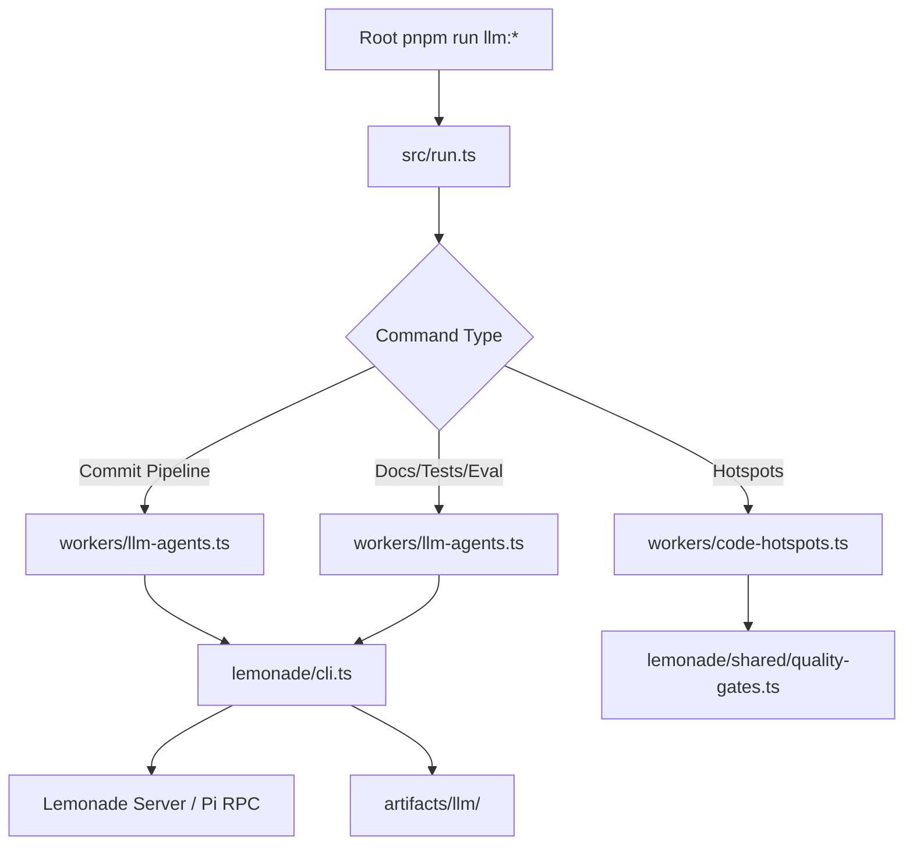

# Repository Layout — cfx-llm

# Repository Layout — `cfx-llm`

The `cfx-llm` module is a **tier-1, standalone repository slice** dedicated to local LLM and AI-assisted developer automation. It isolates evolving LLM workflows — such as commit pipelines, documentation upkeep, and code hotspot scanning — from general developer tooling to enable independent iteration, auditing, and potential future carve-out.

This document describes the module’s purpose, architecture, key components, and how it integrates with the broader `cfx-tools` monorepo.

---

## Purpose & Rationale

### Why a Separate Slice?

LLM automation is inherently experimental, rapidly changing, and tightly coupled to local model behavior, prompt engineering, and corpus management. Mixing it into core developer tooling (`cfx-tools`) would:

- Introduce tight coupling between stable CLI tooling and volatile AI workflows.
- Complicate dependency management and auditability.
- Blur separation of concerns between *runtime* tooling and *development-time* automation.

By carving out `cfx-llm`, the project achieves:

- **Modularity**: LLM-specific logic can evolve independently.
- **Auditability**: All AI-assisted workflows live in one place for review and compliance.
- **Scalability**: New agents and prompts can be added without touching core tooling.

This aligns with [ADR-0003](../../docs/adr/0003-multi-repo-split.md), which defines `cfx-llm` as a Tier-1 carve-out target.

---

## High-Level Architecture



### Key Flows

1. **CLI Entry**: Developers invoke commands via `pnpm run llm:*` at the workspace root. These scripts route through `src/run.ts`.
2. **Worker Dispatch**: `run.ts` routes to domain-specific workers (`code-hotspots.ts`, `llm-agents.ts`, etc.).
3. **LLM Orchestration**: Workers delegate to `lemonade/cli.ts`, which:
   - Builds context (source, docs, git metadata, GitNexus output).
   - Calls Lemonade Server (default) or Pi RPC (via `--agent pi-rpc`).
   - Writes deterministic artifacts to `artifacts/llm/`.
4. **Quality Gates**: Critical gates (e.g., `hotspots --fail-on-hard`) block workflows if thresholds are violated.

---

## Package Structure

| Path | Purpose |
|------|---------|
| `packages/llm-tools/` | The sole package in `cfx-llm`, published as `@cfxdevkit/llm-tools`. Contains all CLI, workers, and LLM integration logic. |
| `src/` | Core entry points and metadata registry. |
| `workers/` | Domain-specific automation logic. |
| `workers/agents/runtime/` | Shared helpers for deterministic agents (e.g., report rendering, folder scoping). |
| `workers/lemonade/` | LLM backend integration (Lemonade/Pi), context assembly, and command dispatch. |

### Public API

The package exposes:

- `llmCommands`: Registry of all available commands and metadata.
- `findLlmCommand`: Lookup helper for tooling integrations.

CLI surface:

```bash
# Developer-facing commands (via root pnpm scripts)
pnpm run llm:commit
pnpm run llm:docs-upkeep -- --write --scope docs/architecture
pnpm run llm:hotspots -- --fail-on-hard

# Direct CLI (after build)
cfx-llm llm -- hotspots --fail-on-hard
```

---

## Core Components

### 1. `src/run.ts` — Command Router

Routes root-level `llm:*` scripts to domain workers. Ensures backward compatibility for developers while allowing internal refactoring.

### 2. `workers/code-hotspots.ts` — Code Size & Churn Scanner

Deterministic scanner enforcing the **framework design-principles file budget** (max 300 lines per source file). Outputs:

- `artifacts/llm/reports/code-hotspots.md`
- Blocks `llm:commit` if any file exceeds the hard limit.

### 3. `workers/llm-agents.ts` — LLM Orchestration Hub

Delegates to domain-specific agents under `workers/lemonade/`. Supports:

| Agent | Purpose |
|-------|---------|
| `commit/` | Hardened commit pipeline with gates, changelog, and explicit staging. |
| `docs/` | Documentation upkeep: discovery, generation, validation, and optional writes. |
| `tests/` | Test coverage analysis and generation. |
| `completion/` | Context assembly, JSON parsing, and Lemonade/Pi client. |

### 4. `workers/lemonade/` — LLM Backend Integration

| Submodule | Responsibility |
|-----------|----------------|
| `cli.ts` | Command dispatcher (e.g., `ask`, `review`, `serve-check`). |
| `commands.ts` | Models, config, named repo actions (e.g., `read-docs`, `list-changed-files`). |
| `completion/` | Lemonade client, context builder, JSON post-processing, and runner. |
| `commit/` | Commit pipeline orchestration: gates, scope, changelog, message drafting. |
| `docs/` | Markdown folder discovery, bounded context, and write-mode logic. |
| `shared/` | Constants, logging, quality gates, and repo action helpers. |

#### Backend Options

- **Default**: Lemonade Server (local LLM via HTTP).
- **Pi Mode**: `--agent pi-rpc` registers a local Lemonade provider extension under `artifacts/llm/config/`.

---

## Boundaries & Constraints

| Allowed | Not Allowed |
|---------|-------------|
| ✅ Read source, docs, git metadata, GitNexus output, and generated LLM artifacts. | ❌ Runtime dependency of deployed packages/apps. |
| ✅ Orchestrate local dev commands (lint, typecheck, tests, docs checks, commit prep). | ❌ Mix LLM logic into `cfx-tools` or root scripts. |
| ✅ Write deterministic artifacts to `artifacts/llm/`. | ❌ Modify source files outside `--write` mode (docs only). |

### `--write` Mode Safety

- Only edits existing markdown files in the current folder scope.
- Requires exact match of old text (single occurrence).
- Never creates new files.
- Skips updates outside scope.

---

## Execution Example: `llm:commit`

1. Developer runs `pnpm run llm:commit`.
2. `run.ts` → `workers/llm-agents.ts` → `lemonade/commit/`.
3. `commit/` runs `hotspots --fail-on-hard` as a **non-bypassable gate**.
4. If hotspots pass:
   - Scans changed files and builds context.
   - Asks Lemonade to draft commit message + changelog.
   - Stages changes explicitly (via `git add`).
   - Executes commit with message.
5. All artifacts written to `artifacts/llm/reports/commit/`.

---

## Integration with the Monorepo

- **Root Scripts**: `pnpm run llm:*` scripts in `package.json` delegate to `@cfxdevkit/llm-tools`.
- **Artifacts**: All outputs live under `artifacts/llm/`, isolated from other tooling.
- **No Runtime Impact**: The package is dev-only and never imported by apps or libraries.

---

## Future Considerations

- **Extensibility**: New agents can be added under `workers/lemonade/` without touching CLI surface.
- **Carve-Out Readiness**: The module is structured for independent publishing and versioning.
- **Auditability**: All LLM workflows are traceable via `artifacts/llm/` and deterministic agents.

---
