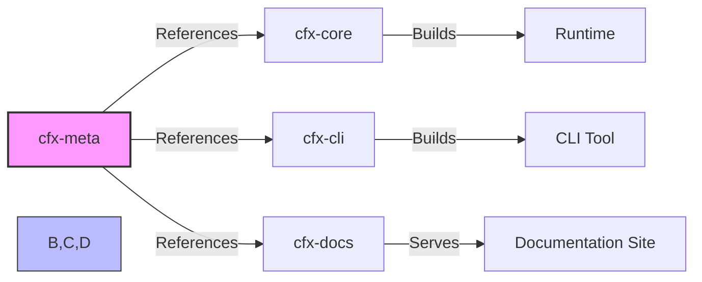

# Repository Layout — cfx-meta

# Repository Layout — `cfx-meta`

The `cfx-meta` module is a **metadata and orchestration repository**, serving as the central source of truth for architectural governance, release coordination, and cross-repository integration tracking within the `cfx` ecosystem. It contains no executable code and is not built or deployed. Instead, it provides structure, documentation, and versioning artifacts that support the broader monorepo and multi-repo development lifecycle.

---

## Purpose

`cfx-meta` exists to:

- **Preserve architectural intent** through formalized design documentation and decisions  
- **Orchestrate monthly integration releases**, ensuring compatibility across repositories  
- **Mark the carve-out boundary** for future repository splitting — i.e., it defines what will be moved out of `root/` into its own dedicated repository

This module is foundational for long-term maintainability, traceability, and governance — especially as the project scales beyond a single monorepo.

---

## Key Components

| Path | Purpose |
|------|---------|
| `ARCHITECTURE.md` | High-level system overview, principles, and component relationships |
| `SECURITY.md` | Security policy, reporting guidelines, and threat model documentation |
| `CONTRIBUTING.md` | Contribution guidelines, PR process, and coding standards |
| `docs/adr/` | **Architecture Decision Records (ADRs)** — immutable, signed-off decisions with context, alternatives, and consequences |
| `docs/architecture/` | Design notes, diagrams, and exploratory documentation (not yet formalized into ADRs) |
| `integration-YYYY-MM` tags | Git tags (e.g., `integration-2025-04`) capturing the *tested* versions of all participating repositories in a given month |

> 💡 **Note**: While in `root/`, these documents reside at the repository root and under `docs/`. The `cfx-meta` folder structure represents the *target layout* after carve-out.

---

## Integration Tagging Workflow

Monthly integration tags are the core release orchestration artifact. Each tag encodes a **compatible set of versions** across repositories, determined via integration testing.

### Tagging Process

1. **Integration Testing Window**  
   A scheduled test run exercises the full system using latest development branches or release candidates from all repos.

2. **Version Pinning**  
   Upon successful validation, the exact commit SHAs (or release versions) of each participating repo are recorded.

3. **Tag Creation**  
   A lightweight Git tag `integration-YYYY-MM` is created in `cfx-meta`, optionally annotated with a manifest (e.g., JSON or YAML) listing:
   ```yaml
   repos:
     cfx-core: "v1.2.3"
     cfx-cli: "sha:abc123"
     cfx-docs: "v0.9.1"
   ```

4. **Consumption**  
   CI/CD pipelines, release tooling, and developers reference these tags to:
   - Reproduce known-good integration environments  
   - Audit compatibility for bug reports or regression investigations  
   - Plan upgrades across the ecosystem

---

## Relationship to the Broader Codebase

`cfx-meta` is **not part of the build or runtime graph** — it has no incoming, outgoing, or internal calls. Its role is *declarative* and *referential*.



- **Consumers**: CI/CD pipelines, release engineers, architects, and auditors  
- **Dependencies**: None (no code dependencies)  
- **Consumed by**: External tooling that needs to resolve integration points or verify compatibility

---

## Carve-Out Strategy

The `cfx-meta` layout is designed to be cleanly extracted from `root/` into its own repository. This separation:

- Reduces cognitive load in the main codebase  
- Enables independent versioning and governance  
- Clarifies ownership boundaries (e.g., architecture decisions live in `cfx-meta`, not `cfx-core`)

After carve-out, `cfx-meta` will be:
- The canonical source for architectural artifacts  
- The single source for integration tags  
- A lightweight, non-executable repo — ideal for low-latency updates and long-term archival

---

## Maintenance Guidelines

| Task | Owner | Frequency |
|------|-------|-----------|
| Add/update ADRs | Architecture Council | As decisions are made |
| Update `ARCHITECTURE.md` | Tech Lead | Quarterly or after major refactors |
| Create integration tags | Release Engineer | Monthly (or per release cycle) |
| Archive old design notes | Docs Team | Annually |

> ✅ **Best Practice**: All documentation in `cfx-meta` should be written in Markdown, version-controlled, and reviewed like code — with clear authorship and approval workflows.

---

## Summary

`cfx-meta` is the **architectural and release backbone** of the `cfx` ecosystem. Though it contains no code, its artifacts directly influence system reliability, developer velocity, and long-term scalability. Treat it with the same rigor as any production module — because it *is* production infrastructure, just in a different form.
