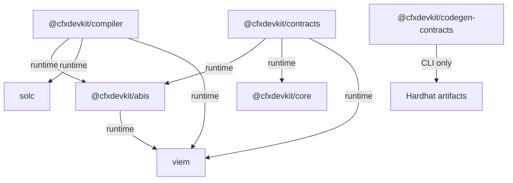

# Repository Layout — cfx-solidity

# Repository Layout — `cfx-solidity`

The `cfx-solidity` module is a **self-contained Solidity toolchain** for the Conflux DevKit. It provides standardized, framework-agnostic ABI definitions, a deterministic Solidity compiler pipeline, and high-level contract bindings for both eSpace and Core Space — all without pulling in the full DevKit.

This module is designed for **modularity**, **stability**, and **tree-shaking efficiency**, enabling consumers to use only the parts they need (e.g., ABIs alone, or compiler + bindings) without coupling to unrelated infrastructure.

---

## Overview

`cfx-solidity` implements four core packages:

| Package | Purpose | Dependency Tier |
|--------|---------|-----------------|
| `@cfxdevkit/abis` | Standard EVM ABI constants (ERC-20/721/1155/Multicall3) | Leaf (zero internal deps) |
| `@cfxdevkit/compiler` | Solidity compilation pipeline (solc, resolver, templates) | Utility (no framework deps) |
| `@cfxdevkit/contracts` | Contract bindings + `read`/`write`/`deploy` surface | Framework tier (uses `@cfxdevkit/core`) |
| `@cfxdevkit/codegen-contracts` *(planned)* | Hardhat artifact → TS codegen | Standalone CLI (future) |

All packages are **independent npm modules**, versioned and published separately, with explicit dependency boundaries to avoid circularity and bloat.

---

## Architecture

### Package Dependency Graph



- `abis` is the **only leaf package** — it has *no* internal workspace dependencies.
- `compiler` and `contracts` depend on `abis`, but **not on each other**.
- `contracts` depends on `@cfxdevkit/core` for transport/signing, but uses `viem` only for ABI encoding/decoding.
- `codegen-contracts` is currently a scaffold — intended to feed `contracts` in future.

---

## Package Details

### `@cfxdevkit/abis`

**Purpose:** Provide stable, framework-stable ABI constants sourced from `viem`.

**Key Features:**
- Zero runtime dependencies beyond `viem`.
- Re-exports canonical EIP ABIs under stable names (`ERC20_ABI`, `MULTICALL3_ABI`, etc.).
- Safe for use in *any* package (including `abis` itself, `compiler`, `core`, or external dApps).

**API Surface:**
```ts
import {
  ERC20_ABI,
  ERC721_ABI,
  ERC1155_ABI,
  MULTICALL3_ABI,
  MULTICALL3_ADDRESS,
} from '@cfxdevkit/abis';
```

**Why separate?**  
Avoids circular dependencies: if `contracts` or `compiler` exported ABIs directly, `abis` would need to depend on them — breaking the leaf pattern. This package is the **single source of truth** for ABI constants.

---

### `@cfxdevkit/compiler`

**Purpose:** Deterministic Solidity compilation + import resolution + template registry.

**Key Features:**
- Wraps `solc-js` with typed, async `compile()` API.
- Pluggable import resolvers (`npm`, `remappings`, `local`).
- Curated contract templates (ERC-20, ERC-721, Ownable, Governor, etc.).
- No caching — artifact persistence is caller’s responsibility.

**API Surface:**
```ts
import { compile } from '@cfxdevkit/compiler';
import { npmResolver, remappingResolver } from '@cfxdevkit/compiler/resolver';
import { templates } from '@cfxdevkit/compiler/templates';

// Compile sources
const output = await compile({
  sources: [{ path: 'Token.sol', content: '...' }],
  solcVersion: '0.8.26',
  optimizer: { enabled: true, runs: 200 },
});

// Resolve imports
const resolver = compose([
  npmResolver({ rootDir: process.cwd() }),
  remappingResolver(['openzeppelin/=node_modules/@openzeppelin/']),
]);
```

**Error Handling:**
- Typed `CompileError` with codes: `compiler/solc/syntax`, `compiler/resolver/not-found`, etc.

**Browser Safety:**  
Selects `solc` WASM path when running in browser (via `vite.config.ts`).

---

### `@cfxdevkit/contracts`

**Purpose:** High-level contract bindings + `read`/`write`/`deploy` operations for Conflux.

**Key Features:**
- **Family-aware dispatch:** `client.family === 'espace'` → `eth_call`; `client.family === 'core'` → `cfx_call`.
- **Address validation:** Enforces hex (eSpace) vs base32 (Core) per family.
- **Typed helpers:** `erc20.balanceOf`, `bridge.transferToEspace`, etc.
- **Signer integration:** Uses `@cfxdevkit/core`’s `Signer` for signing and broadcasting.

**API Surface:**
```ts
import { erc20, bridge } from '@cfxdevkit/contracts';
import { createClient, http } from '@cfxdevkit/core';
import { espaceTestnet } from '@cfxdevkit/core';

const client = createClient({ chain: espaceTestnet, transport: http() });

// Read
const symbol = await erc20.symbol({ client, address: '0x...' });

// Write
const { hash } = await erc20.transfer({ client, address, signer }, to, amount);

// Cross-space (Core → eSpace)
const { hash } = await bridge.transferToEspace({ client, signer, to, value });
```

**Bridge Support:**
- Only `client.family === 'core'` allowed.
- Uses internal contract `0x0888...0006` (CrossSpaceCall).
- Helpers: `transferToEspace`, `callEspace`, `withdrawFromMapped`, `getMappedBalance`, etc.

**Error Handling:**
- `ContractsError` with codes: `contracts/unsupported-family`, `contracts/reverted`, `contracts/receipt-timeout`, etc.

**Tree-Shaking:**  
Sub-path imports (`./read`, `./write`, `./erc20`) recommended to avoid bundling unused code.

---

### `@cfxdevkit/codegen-contracts`

**Purpose:** *(Planned)* Extract ABI + bytecode from Hardhat artifacts and generate TypeScript modules for `@cfxdevkit/contracts`.

**Current State:**  
Scaffold only — exports a single marker constant.

**Planned CLI:**
```bash
pnpm exec cfxdevkit-extract-contracts ./artifacts --out ./src/generated
```

**Future Role:**  
Bridge between build-time tooling (Hardhat) and runtime bindings (`contracts`). Generates typed contract modules like:
```ts
// src/generated/ERC20.ts
export const ERC20 = {
  address: '0x...',
  abi: ERC20_ABI,
  balanceOf: (client, owner) => erc20.balanceOf({ client, address: ERC20.address }, owner),
  // ...
};
```

---

## Module Layout & Structure

### Directory Tree

```
cfx-solidity/
├── README.md
├── packages/
│   ├── abis/                     # Leaf ABI constants
│   │   ├── src/index.ts
│   │   ├── API.md
│   │   ├── STRUCTURE.md
│   │   └── package.json
│   │
│   ├── compiler/                 # Solc + resolver + templates
│   │   ├── src/
│   │   │   ├── solc/             # compile, version, settings, errors
│   │   │   ├── resolver/         # npm, local, remappings
│   │   │   ├── templates/        # ERC-20, ERC-721, etc.
│   │   │   └── verify/           # ConfluxScan, standard-json
│   │   ├── API.md
│   │   └── package.json
│   │
│   ├── contracts/                # Contract bindings + ops
│   │   ├── src/
│   │   │   ├── abis/
│   │   │   ├── read/
│   │   │   ├── write/
│   │   │   ├── deploy/
│   │   │   ├── erc20/
│   │   │   └── bridge/
│   │   ├── API.md
│   │   └── package.json
│   │
│   └── contracts-extract/        # Codegen scaffold (future)
│       ├── src/index.ts
│       └── package.json
```

### Build & Distribution

- **Entry Points:** Each sub-path (`./solc`, `./read`, `./erc20`, etc.) is a separate entry.
- **Output:** One `.js` + one `.d.ts` per entry (via `vite-plugin-dts`).
- **Bundle Size:** ~0.4–4 kB per sub-path (tree-shakeable).
- **No CJS:** ESM-only (via `vite.config.ts`).

---

## Integration with the DevKit

`cfx-solidity` is **not part of `@cfxdevkit/core`**, but is designed to integrate cleanly:

- `@cfxdevkit/core` depends on `@cfxdevkit/contracts` for high-level contract ops.
- `@cfxdevkit/contracts` depends on `@cfxdevkit/core` for transport/signing — but **not vice versa**.
- `@cfxdevkit/compiler` is used by build tooling (e.g., Hardhat plugins) or CLI scripts.

This separation ensures:
- Core remains lightweight and transport-focused.
- Solidity tooling evolves independently.
- Consumers can opt-in to only what they need.

---

## Usage Examples

### 1. Use ABIs alone (e.g., in a dApp)
```ts
import { ERC20_ABI, MULTICALL3_ADDRESS } from '@cfxdevkit/abis';
import { createPublicClient, http } from 'viem';

const client = createPublicClient({ transport: http() });
const [balance, totalSupply] = await client.multicall({
  contracts: [
    { address: '0x...', abi: ERC20_ABI, functionName: 'balanceOf', args: ['0x...'] },
    { address: '0x...', abi: ERC20_ABI, functionName: 'totalSupply' },
  ],
});
```

### 2. Compile a contract in a build script
```ts
import { compile } from '@cfxdevkit/compiler';
import fs from 'fs/promises';

const sources = [{ path: 'Token.sol', content: await fs.readFile('Token.sol', 'utf8') }];
const { artifacts } = await compile({ sources, solcVersion: '0.8.26' });

await fs.writeFile('build/Token.json', JSON.stringify(artifacts[0]));
```

### 3. Read/write an ERC-20 on Core Space
```ts
import { erc20 } from '@cfxdevkit/contracts';
import { createClient, http } from '@cfxdevkit/core';
import { coreSpace } from '@cfxdevkit/core';

const client = createClient({ chain: coreSpace, transport: http() });
const balance = await erc20.balanceOf({ client, address: '0x...' }, '0x...');
```

---

## Future Work

- **ERC-721/1155 helpers** (ABIs exported today; typed helpers pending).
- **Multicall3 batching** (`multicall({ client, calls })`).
- **Conflux internal contracts** (Sponsor, Staking).
- **Event subscription helpers** (`watchTransfers`, etc.).
- **`codegen-contracts` implementation** (Hardhat artifact extraction + TS renderer).

---

## References

- [viem ABIs](https://viem.sh/docs/contract/abis) — source of truth for standard ABIs.
- [Conflux CrossSpaceCall Spec](https://docs.conflux.net/conflux-core-space/interoperability/cross-space-call) — defines bridge semantics.
- [Foundry Remappings](https://book.getfoundry.sh/reference/config/programming#remappings) — resolver format.
