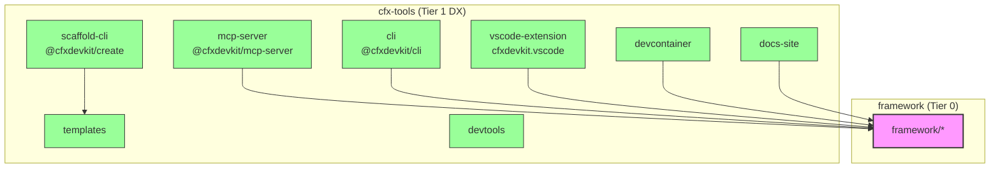

# Repository Layout — cfx-tools

# Repository Layout — `cfx-tools`

The `cfx-tools` monorepo is the **Tier 1 developer experience (DX)** surface of the Conflux DevKit. It houses all tooling, scaffolding, and developer-facing integrations — but **never** runtime dependencies of deployed applications.

> **Design principle**: Fast iteration (weekly releases), no semver discipline, and zero impact on production binaries.

---

## High-Level Architecture



### Key Boundaries

| Direction | Allowed? | Reason |
|-----------|----------|--------|
| `cfx-tools` → `framework/*` | ✅ | DX tools *consume* framework primitives |
| `framework/*` → `cfx-tools` | ❌ | Framework must not depend on dev tooling |
| `projects/<app>` → `cfx-tools` | ❌ | Runtime apps never depend on DX tooling |
| `domains/*` → `cfx-tools` | ❌ | Domain logic stays isolated from dev tooling |

---

## Package Inventory

| Package | npm Name | Role | Status |
|---------|----------|------|--------|
| `scaffold-cli` | `@cfxdevkit/create` | Project generator (`pnpm dlx @cfxdevkit/create`) | Phase A scaffold |
| `mcp-server` | `@cfxdevkit/mcp-server` | AI agent bridge via Model Context Protocol | Phase A scaffold |
| `vscode-extension` | `cfxdevkit.vscode` | VS Code extension for local dev, wallet, node, contracts | **Active** |
| `devcontainer` | — | Reproducible Docker dev environment | Phase 2 |
| `devtools` | — | Internal tooling (Hardhat, Express server, UI) | **Active** |
| `docs-site` | `@cfxdevkit/docs-site` | Public docs site (`docs.cfxdevkit.dev`) | **Active** |
| `templates` | — | Standalone starter templates | **Active** |
| `cli` | `@cfxdevkit/cli` | Developer CLI (`cfx status`, `derive`, `generate`) | **Active** |

> **Note**: `devtools` and `templates` are *not* published — they’re internal workspace packages.

---

## Core Packages Deep Dive

### `@cfxdevkit/cli`

A minimal CLI for developer diagnostics and account derivation.

#### Commands

| Command | Description |
|---------|-------------|
| `cfx status [--chain core-testnet]` | Probe chain heads + latency |
| `cfx derive [--generate | --mnemonic "..."]` | Derive EVM + Core accounts |
| `cfx generate` | Emit a fresh BIP-39 mnemonic |

#### Key Features

- Dual-space derivation (`0x…` EVM + `cfx[net]:…` Core)
- `--show-private-keys` opt-in for debugging
- `--json` for machine-readable output
- Default network ID: `1029` (mainnet Core), `1` (testnet), `2029` (devnet)

#### Structure

```
cli/
├── src/
│   ├── args.ts          # CLI argument parsing
│   ├── run.ts           # Command dispatcher
│   └── commands/
│       ├── derive.ts    # Dual-space derivation
│       ├── generate.ts  # Mnemonic generation
│       └── status.ts    # Chain probing
└── dist/bin.js          # CLI entrypoint
```

---

### `devtools`

Internal tooling for framework developers — **never** shipped to users.

| Subfolder | Purpose |
|-----------|---------|
| `contracts/` | Hardhat workspace for framework-owned contracts (e.g., `session-key-validator`) |
| `devkit-server/` | Express server for local devnode, compile, deploy, keystore |
| `devkit-ui/` | Next.js UI embedded in `devkit-server` |
| `cfx-keystore/` | Standalone TUI for file-based keystore management |

#### Why `devtools`?

- Centralizes complex local dev workflows (node lifecycle, contract deployment, keystore)
- Avoids duplication across `framework/` and `projects/`
- Enables CI tooling (e.g., `devkit-server` powers automated test setups)

---

### `vscode-extension`

The primary VS Code integration for Conflux developers.

#### Capabilities

- **Network selection**: `local`, `testnet`, `mainnet`
- **Space targeting**: Core Space (`cfx:…`) and eSpace (`0x…`)
- **Node lifecycle**: Start/stop/wipe/restart local devnode
- **Keystore management**: File, OneKey, Satochip backends
- **Wallets & accounts**: Mnemonic-root → derived accounts (per network)
- **Contract workflows**: Deploy, import, ABI read/write calls

#### State Persistence

| Key | Location | Purpose |
|-----|----------|---------|
| `selectedNetwork` | VS Code workspace state | `local`/`testnet`/`mainnet` |
| `keystoreBackend` | VS Code workspace state | `file`/`onekey`/`satoshi` |
| `keystoreFile` | `.cfxdevkit/keystore.json` | Encrypted keystore path |
| `deployments` | `.cfxdevkit/deployments.json` | Contract deployment registry |

#### Views

- `NetworkView`: Network + space selector
- `NodeView`: Local devnode controls
- `AccountsView`: Derived accounts (grouped by wallet)
- `ContractsView`: Deployed contracts (grouped by network/space)

> **Note**: Hardware backends (OneKey/Satochip) support eSpace only. Core Space writes require the `file` backend.

---

### `scaffold-cli` & `templates`

A project generator with composable templates.

#### Template Contract

Every template must be:
- **Self-contained** (no monorepo coupling)
- **Runnable standalone** after scaffolding
- **Versioned** via `template.json` metadata

#### Template Registry

| Template | Scope |
|----------|-------|
| `minimal-dapp/` | Bare wagmi + viem + framework |
| `project-example/` | Full-feature reference dapp |
| `wallet-probe/` | Wallet diagnostics tool |
| `nextjs-app/` | Next.js 15 + framework |
| `phaser-game/` | Phaser + wallet integration |
| `keeper/` | Executor + automation strategy |

#### CLI Surface (Planned)

```sh
create-cfx new <template> <dir>   # scaffold new project
create-cfx add <feature>          # add wallet/MCP/devcontainer
create-cfx list                   # list available templates
```

#### Post-Scaffold Steps

- `pnpm install`
- `git init`
- `.env` setup
- `moon` initialization

---

### `mcp-server`

AI agent bridge for Conflux operations.

#### Security Model

- **Session keys only** — raw private keys rejected at startup
- **Write tools require confirmation** (via `policy/confirm.ts`)
- **Strict allowlist** — write tools disabled by default

#### Tool Categories

| Category | Examples |
|----------|----------|
| Chain | `get-block`, `get-balance`, `call` |
| Contract | `read`, `simulate`, `deploy`, `verify` |
| Wallet | `list-accounts`, `issue-session-key`, `revoke-session-key` |
| Dev | `start-devnode`, `compile`, `scaffold` |

#### Transport Layers

- `stdio` (default for CLI agents)
- `sse` (web-friendly)
- `ws` (real-time updates)

---

### `devcontainer`

Reproducible dev environment for local and CI contributors.

#### Key Features

- **No host tooling required** — Docker + VS Code only
- **Keystore mounted at runtime** — no key material in image
- **Fast rebuilds** — deps in separate layer, framework prebuilt

#### Structure Highlights

```
devcontainer/
├── Dockerfile              # Node 20, pnpm, moon, foundry, age, sops
├── post-create.sh          # pnpm install, moon setup
├── features/               # Composable Dev Container Features
│   ├── conflux-toolchain/
│   ├── cfx-keystore/
│   └── platformio/
└── env/                    # Documented `.env` variables
```

---

### `docs-site`

Public documentation site (`docs.cfxdevkit.dev`).

#### Tech Stack

- **VitePress** — Vite-native static site generator
- **Source in `root/docs/`** — Markdown sources live outside this package
- **Build-time symlink** — `content/ → ../../docs/` (created in CI)

#### Plugins

- `adr-loader.ts` — pulls `docs/adr/*.md` into ADR section
- `api-loader.ts` — pulls `docs/api/*` (TypeDoc output)

#### Deployment

- Fully static output (`dist/`)
- Deployable to Cloudflare Pages, Netlify, S3, nginx, etc.

---

## Integration Points

### With `framework/`

All `cfx-tools` packages depend on `framework/*` (e.g., `@cfxdevkit/core`, `wallet`, `compiler`). This is the **only** allowed direction.

Example: `vscode-extension` uses:
- `@cfxdevkit/devnode` for local node lifecycle
- `@cfxdevkit/wallet` for signing
- `@cfxdevkit/compiler` for Solidity compilation
- `@cfxdevkit/contracts` for deployment artifacts

### With `cfx-llm/`

Local LLM and AI-assisted automation lives in `../cfx-llm/`. `mcp-server` is the bridge between `cfx-llm` and `framework`.

---

## Development Workflow

### Local Setup

```sh
# Install dependencies
pnpm install

# Build CLI
pnpm --filter @cfxdevkit/cli build

# Run CLI
node repos/cfx-tools/packages/cli/dist/bin.js status

# Start devkit-server (for internal tooling)
pnpm --filter devkit-server dev
```

### Template Development

1. Add a new folder in `templates/`
2. Include `template.json` with `name`, `description`, `prompts[]`
3. Use Handlebars `{{var}}` for variable substitution
4. Reference shared fragments in `_shared/`

### VS Code Extension Debugging

1. Open `repos/cfx-tools/packages/vscode-extension`
2. Press `F5` to launch Extension Development Host
3. Use `View > Command Palette > CFX DevKit: ...` to trigger commands

---

## Future Roadmap

| Package | Phase | Goal |
|---------|-------|------|
| `scaffold-cli` | Phase B | Template registry + remote templates |
| `mcp-server` | Phase B | Tool allowlist UI, audit logs |
| `devcontainer` | Phase 2 | Feature composition, host keyring forwarding |
| `docs-site` | Phase 2 | Search, versioning, API reference |

---

## Conclusion

`cfx-tools` is the **developer experience engine** of the Conflux DevKit — a curated set of packages that make local development, CI, and AI-assisted workflows fast, safe, and reproducible.

It respects strict architectural boundaries:
- **Consumes** `framework/` but never **depends on** it
- **Never** becomes a runtime dependency
- **Enables** fast iteration without compromising production stability

All tooling is designed for:
- **Terminal-first** workflows (`cli`, `scaffold-cli`)
- **IDE integration** (`vscode-extension`)
- **Reproducibility** (`devcontainer`, `devtools`)
- **AI augmentation** (`mcp-server`)
- **Documentation** (`docs-site`)
