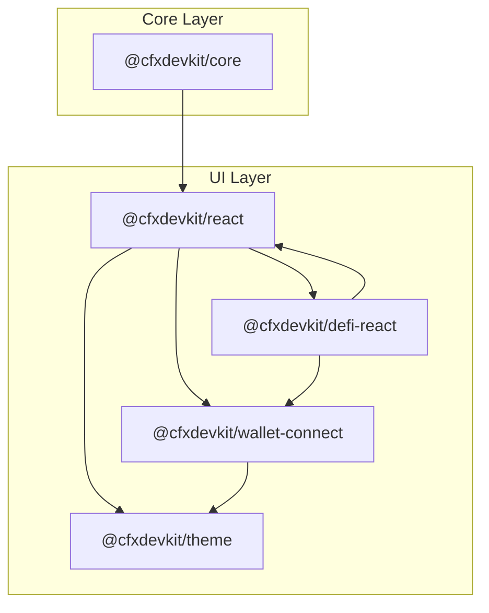
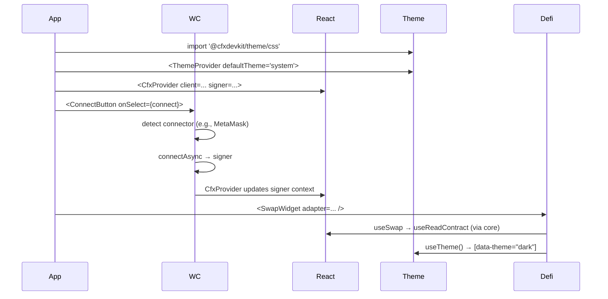

# Repository Layout — cfx-ui

# **cfx-ui — React UI Surface Module**

> **Tier 0c — React UI surface**  
> *Carve-out target per [ADR-0003](../../docs/adr/0003-multi-repo-split.md)*

The `cfx-ui` module provides a suite of **headless, composable React packages** for building DeFi and wallet-integrated UIs on top of the `@cfxdevkit/*` stack. It is intentionally decoupled from domain logic (`cfx-domain`) and tooling (`cfx-tools`) to enable rapid iteration on UI while maintaining stable integration with core primitives.

---

## 🎯 Purpose & Design Philosophy

`cfx-ui` exists to:

- **Separate concerns**: UI evolves independently from chain logic.
- **Enable composition**: All packages are headless — no opinionated styling, no hardcoded layouts.
- **Standardize patterns**: Shared tokens, hooks, and connectors reduce duplication across apps.
- **Support SSR & testing**: Providers accept external state (e.g., `QueryClient`, `Signer`), avoiding hidden side effects.

It follows a **layered architecture**:

```
cfx-core (primitives)
     ↑
cfx-ui/react (hooks + providers)
     ↑
cfx-ui/defi-react (DeFi UX patterns)
     ↑
cfx-ui/wallet-connect (wallet integration)
     ↑
cfx-ui/theme (design system)
```

Apps consume these packages directly — no monolithic SDK.

---

## 📦 Package Overview

| Package | npm | Responsibility | Dependencies |
|--------|-----|----------------|--------------|
| `@cfxdevkit/react` | `react` | Headless hooks & providers over `core` | `core`, `@tanstack/react-query` |
| `@cfxdevkit/defi-react` | `defi-react` | DeFi widgets (swap, balance, token picker) | `react`, `services`, `core` |
| `@cfxdevkit/theme` | `theme` | Design tokens + CSS/Tailwind presets | *none* |
| `@cfxdevkit/wallet-connect` | `wallet-connect` | Wallet connectors + SIWE + ConnectKit wiring | `core`, optional `react`, optional `theme` |

### ✅ Allowed Dependencies
- `@cfxdevkit/core`, `@cfxdevkit/wallet`, `@cfxdevkit/services`
- React, TanStack Query, Wagmi, Viem, ConnectKit (where applicable)

### ❌ Forbidden Dependencies
- `cfx-domain`, `cfx-tools`
- Chain primitives duplicated (e.g., ABI parsing, encoding)

---

## 🔗 Module Architecture



> **Key**: `cfx-ui` packages depend *only* on `core` and each other where necessary. No circular dependencies.

---

## 🧩 Core Packages Deep Dive

### 1. `@cfxdevkit/react` — Headless Hooks & Providers

**Purpose**: Thin React adapters over `core`, exposing **no internal state management**.

#### Key Patterns
- **Provider accepts external state**: `CfxProvider` receives `client`, `signer`, `queryClient` — *does not create them*.
- **Hooks are pure wrappers**: `useReadContract`, `useSendTransaction`, etc., map 1:1 to `core` functions.
- **No wallet UI**: Connection logic lives in `wallet-connect`.

#### Public API Highlights
```ts
// Top-level provider (stateless)
const CfxProvider: React.FC<{ client: Client; signer?: Signer; queryClient?: QueryClient }>

// Hooks
function useClient(): Client
function useChain(): ChainConfig
function useReadContract<T>(...): { data: T | undefined; error; isLoading }
function useWriteContract(): { writeAsync; isPending; error }
```

#### Structure
```
react/
├── provider/     → ChainProvider, QueryProvider
├── hooks/        → useBalance, useContractRead, useTransactionReceipt, etc.
├── components/   → Address, Amount, TxStatus (render-prop / asChild)
└── utils/        → SSR guards, formatting helpers
```

---

### 2. `@cfxdevkit/defi-react` — DeFi UX Patterns

**Purpose**: Opinionated composition layer for common DeFi flows — **no protocol logic**.

#### Key Patterns
- **Hooks delegate to services**: `useSwap` → `services/dex`, `useTokenBalance` → `services/tokens`.
- **Widgets are composable**: `SwapWidget`, `PortfolioTable`, `TokenPicker` accept props for customization.
- **No state persistence**: Apps manage history, preferences, etc.

#### Public API Highlights
```ts
// Swap UX
function useSwap(input: {
  adapter: DexAdapter
  tokenIn: Address
  tokenOut: Address
  amountIn: Wei
  slippageBps?: number
}): { quote; isQuoting; swapAsync; isSwapping; error }

const SwapWidget: React.FC<{
  adapter: DexAdapter
  tokens?: TokenInfo[]
  onSwapSubmitted?: (tx: { hash }) => void
}>

// Portfolio
function usePortfolio(input: { address; tokens; refreshMs? }): { rows; totalUsd; isLoading }

// Token picker (headless)
const TokenPicker: React.FC<{ registry; chainId; selected; onSelect }>

// Tx status
const TxStatusToast: React.FC<{ hash; onConfirm }>
```

#### Structure
```
defi-react/
├── token/        → useToken, useTokenBalance, useApprove
├── swap/         → useQuote, useSwap, useSlippage
├── liquidity/    → useAddLiquidity, useRemoveLiquidity
└── format/       → price formatting
```

---

### 3. `@cfxdevkit/theme` — Design Tokens

**Purpose**: Shared design system — **no components**, no CSS-in-JS.

#### Key Patterns
- **Tokens → CSS variables**: `colors.bg.default` → `--cfx-color-bg-default`.
- **Theme switching via `[data-theme]`**: SSR-safe via `ThemeProvider`.
- **Tailwind preset**: Opt-in integration.

#### Public API Highlights
```ts
// Tokens (JS)
const colors: { bg: { default; subtle; emphasis }; brand: { primary; accent }; ... }
const spacing: { 0; 1; 2; 3; 4; 6; 8; 12; 16 }
const typography: { sans; mono; sizes; weights }

// CSS (side-effect import)
import '@cfxdevkit/theme/css'      // light theme
import '@cfxdevkit/theme/dark'     // dark theme

// React
const ThemeProvider: React.FC<{ defaultTheme: 'light' | 'dark' | 'system' }>
function useTheme(): { theme; resolved; set }
```

#### Structure
```
theme/
├── tokens/       → color, spacing, typography, shadow, motion
├── modes/        → light, dark, high-contrast
├── outputs/      → css-variables, tailwind-preset, json
└── internal/     → token-scale helpers
```

---

### 4. `@cfxdevkit/wallet-connect` — Wallet Integration

**Purpose**: Pre-wired wallet connectors + SIWE + ConnectKit.

#### Key Patterns
- **Connector interface**: Unified API for injected, WC, Fluent, Coinbase.
- **Hooks manage connection flow**: `useConnect`, `useDisconnect`, `useActiveConnector`.
- **UI primitives are unstyled**: `ConnectButton`, `AccountBadge` accept `className`.

#### Public API Highlights
```ts
// Connectors
const fluentConnector: () => Connector
const walletConnectConnector: (opts: { projectId; metadata }) => Connector

// Hooks
function useConnectors(): readonly Connector[]
function useConnect(): { connectAsync; isPending; error }
function useActiveConnector(): Connector | null

// SIWE
function createMessage({ address, nonce, chainId }): string
function verifySignature(message, signature, address): Promise<boolean>
```

#### Structure
```
wallet-connect/
├── config/       → Wagmi config builder (Conflux chains + connectors)
├── connectors/   → injected, wallet-connect, coinbase, fluent
├── connectkit/   → ConnectKitProvider + theme mapping
├── siwe/         → message, verify, nonce
├── hooks/        → useConnectFlow, useSiweSession
└── internal/     → SSR-safe storage
```

---

## 🔄 Integration Flow Example

A typical app flow:



---

## 🧪 Testing & SSR

- **No hidden state**: Providers accept `client`, `signer`, `queryClient` — trivial to mock.
- **SSR-safe**: `ThemeProvider` writes `[data-theme]` on `<html>` before hydration.
- **Hooks are pure**: All hooks use `useQuery`/`useMutation` — testable with `@tanstack/react-query` mocks.

---

## 📦 Versioning & Stability

- **Packages are versioned independently** (e.g., `@cfxdevkit/react@1.2.0`, `@cfxdevkit/defi-react@0.5.3`).
- **Stable contracts**: `cfx-ui` depends on `cfx-core` via `^` ranges — UI updates do not block chain releases.
- **Breaking changes**: Only in major versions; minor/patch updates are additive.

---

## 🚫 Anti-Goals

- ❌ No styling assumptions (no `clsx`, no `twind`, no CSS-in-JS).
- ❌ No wallet connection UI (modal, onboarding) — only primitives.
- ❌ No protocol logic (e.g., swap routing, liquidity math).
- ❌ No state persistence (history, preferences) — apps manage this.

---

## 📚 Related Documentation

- [ADR-0003: Multi-Repo Split](../../docs/adr/0003-multi-repo-split.md)
- [Framework Core API](../../repos/cfx-core/API.md)
- [Services Layer](../../repos/cfx-services/README.md)

--- 

> **Tip for contributors**:  
> When adding a new hook or component, ask:  
> *“Does this belong in `react`, `defi-react`, or `wallet-connect`?”*  
> If it’s generic (e.g., `useBalance`), it goes in `react`.  
> If it’s domain-specific (e.g., `useSwap`), it goes in `defi-react`.  
> If it’s wallet-specific (e.g., `useConnect`), it goes in `wallet-connect`.
