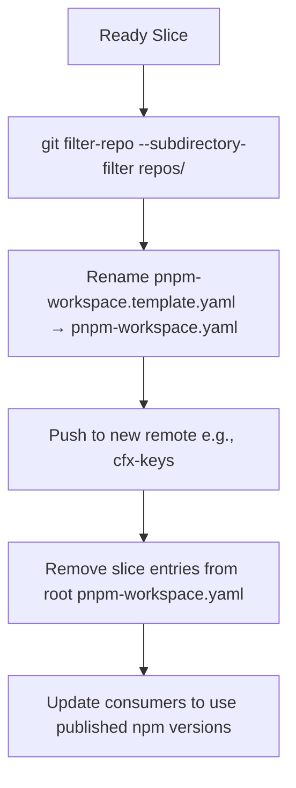

# Repository Layout — repos

# Repository Layout — `repos/`

The `repos/` directory implements a **tier-aligned multi-repository split**, as defined in [ADR-0003](../docs/adr/0003-multi-repo-split.md). Its purpose is to prepare a monorepo for eventual decomposition into independent, auditable, and independently versioned repositories — while preserving day-to-day developer workflow during the transition.

> This module is *not* a runtime component — it is a structural and organizational layer. It has no execution flow, no internal calls, and no outgoing dependencies beyond the workspace itself.

---

## Core Purpose

The `repos/` directory contains **repository slices**, each representing a logical boundary aligned with system tiering and security posture. Each slice is structured *as if it were already a standalone git repository*, enabling:

- **Gradual carve-out**: Slices can be extracted with minimal friction using `git filter-repo`.
- **Independent release cycles**: Each slice can be versioned and published separately.
- **Clear audit boundaries**: Especially for trust-critical components (e.g., `cfx-keys`).
- **Consumer decoupling**: Downstream consumers can switch from local workspace deps to published npm packages.

---

## Structure & Template Conventions

Each subdirectory under `repos/` follows a consistent template layout:

```
repos/<slice>/
├── packages/               # Contains one or more packages (e.g., `cfx-core`, `cfx-wallet`)
│   └── <pkg>/
│       ├── package.json
│       └── ...
├── pnpm-workspace.template.yaml   # ⚠️ Template — *not* active workspace config
├── README.md
└── ...
```

### Why a `.template.yaml`?

- pnpm treats any `pnpm-workspace.yaml` as a *root* workspace marker.
- If present in each slice, pnpm would treat them as *separate* workspaces, breaking cross-slice resolution (e.g., `tools/*` imports).
- During development, the **root** `pnpm-workspace.yaml` uses globs like `repos/*/packages/*` to unify all packages.
- At carve-out time, the template is renamed to `pnpm-workspace.yaml`, and the slice is removed from the root config.

---

## Slice Inventory & Tier Alignment

| Slice | Tier | Description | Public Surface |
|-------|------|-------------|----------------|
| `cfx-meta` | — | Architecture, ADRs, release orchestration | `docs/`, `adr/`, `release/` |
| `cfx-core` | 0a | Chain primitives: core, protocol, executor, devnode, testing | `cfx-core`, `cfx-executor`, `cfx-testing` |
| `cfx-keys` | 0b | **Audit-grade trust boundary**: keystore, wallet, hardware adapters | `cfx-keystore`, `cfx-wallet`, `cfx-hw` |
| `cfx-ui` | 0c | UI stack: React, theme, defi-react, wallet-connect | `cfx-ui`, `cfx-theme`, `cfx-wc` |
| `cfx-domain` | 2 | Game engine, automation, hardware-bridge | `cfx-game`, `cfx-bridge` |
| `cfx-tools` | 1 | Developer tooling: scaffold-cli, MCP server, VS Code extension, devcontainer | `cfx-scaffold`, `cfx-mcp`, `cfx-devtools` |
| `cfx-llm` | 1 | LLM-powered tooling: repo review, hotspot scanning, commit assistance | `cfx-llm-scan`, `cfx-commit-assist` |

> **Tier 0a/0b/0c** are security-critical and may require separate audit, CI, and release governance.

---

## Carve-Out Workflow

When a slice is ready to become its own repository, follow this deterministic process:



### Step-by-step

1. **Extract history**  
   ```bash
   git clone <root-repo> cfx-keys-temp && cd cfx-keys-temp
   git filter-repo --subdirectory-filter repos/cfx-keys
   ```

2. **Activate workspace config**  
   ```bash
   mv repos/cfx-keys/pnpm-workspace.template.yaml repos/cfx-keys/pnpm-workspace.yaml
   ```

3. **Push to new remote**  
   ```bash
   git remote add origin git@github.com:conflux-fans/cfx-keys.git
   git push -u origin main
   ```

4. **Decommission in root**  
   - Remove `repos/cfx-keys/packages/*` from root `pnpm-workspace.yaml`.
   - (Optional) Add `repos/cfx-keys` to `.gitignore`.

5. **Consumer migration**  
   - Update `package.json` dependencies to reference published versions (e.g., `@conflux/cfx-keys@^1.0.0`).
   - Update import paths (e.g., `import { Wallet } from '@conflux/cfx-keys'`).

---

## Integration with the Root Monorepo

During the transition, `repos/` remains fully integrated:

- **Root `pnpm-workspace.yaml`** includes:
  ```yaml
  packages:
    - 'repos/*/packages/*'
    - 'tools/*'
  ```

- **Build/test tooling** (e.g., `pnpm build`, `pnpm test`) works unchanged — no special flags needed.

- **Cross-slice references** (e.g., `cfx-ui` → `cfx-keys`) resolve via workspace symlinks.

This ensures zero disruption to developers until the carve-out is complete.

---

## Future State

Once all slices are carved out:

- `repos/` may be removed or retained as a *reference archive*.
- The root monorepo becomes a lightweight **orchestration layer** (e.g., release coordination, CI matrix).
- Each slice evolves independently — with its own:
  - CI/CD pipeline
  - release schedule
  - security review cadence
  - versioning strategy

---

## Related Documentation

- [ADR-0003: Multi-Repo Split](../docs/adr/0003-multi-repo-split.md) — architectural decision rationale
- `tools/scaffold-cli/` — may generate new slices using `repos/<slice>/` templates
- `cfx-meta/` — contains release tooling and versioning policies for carved-out repos
