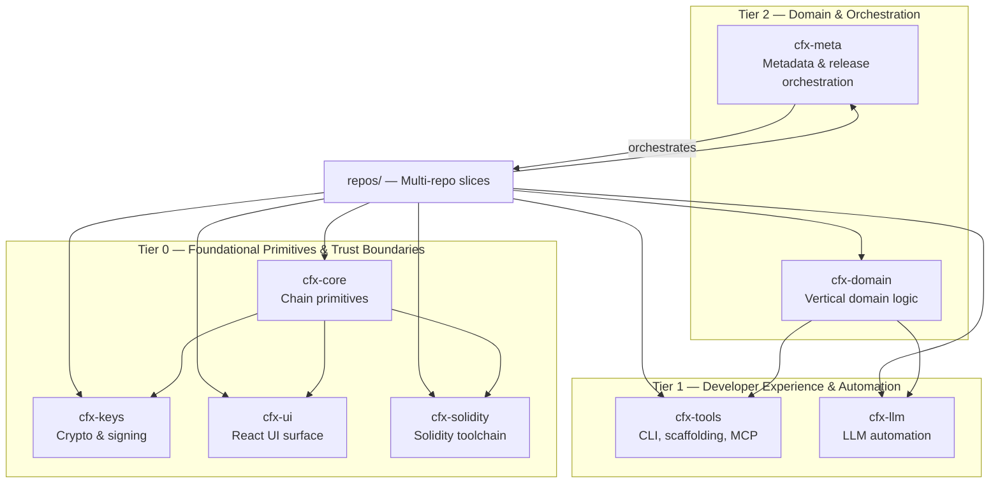

# Repository Layout

# Repository Layout — Overview

The **Repository Layout** module defines the structural and organizational backbone of the Conflux DevKit monorepo and its eventual decomposition into independent, auditable repositories. It implements the **tier-aligned multi-repository split** strategy from [ADR-0003](../docs/adr/0003-multi-repo-split.md), balancing immediate developer velocity with long-term modularity, security, and versioning discipline.

At a high level, the layout is organized into **three layers**, each serving a distinct architectural purpose:

## Layered Architecture

### 🔹 Tier 0 — Foundational & Audit-Grade
These modules form the stable, low-level core of the DevKit. They are designed for long-term stability, minimal dependencies, and (where applicable) strict security isolation.

- [`cfx-core`](cfx-core.md): Tier-0a chain primitives (e.g., network abstractions, types, utilities) — the dependency root for all other modules.
- [`cfx-keys`](cfx-keys.md): Tier-0b cryptographic trust boundary — isolates private key handling for auditability and reduced blast radius.
- [`cfx-ui`](cfx-ui.md): Tier-0c React UI surface — headless, composable components for wallet and DeFi interfaces.
- [`cfx-solidity`](cfx-solidity.md): Tier-0a Solidity toolchain — ABIs, compiler pipeline, and contract bindings.

> All Tier 0 modules are carved out as independent repositories per ADR-0003, with strict boundary rules and independent versioning.

### 🔹 Tier 1 — Developer Experience & Automation
These modules enable rapid iteration on tooling and developer workflows, with no impact on production binaries.

- [`cfx-tools`](cfx-tools.md): Tier-1 CLI, scaffolding, MCP server, and VS Code extension — fast-release, no semver discipline.
- [`cfx-llm`](cfx-llm.md): Tier-1 LLM automation slice — local AI pipelines for commits, docs, and code scanning.

> These modules may depend on Tier 0 primitives but remain decoupled from domain logic.

### 🔹 Tier 2 — Domain & Orchestration
These modules coordinate reusable business logic and architectural governance.

- [`cfx-domain`](cfx-domain.md): Tier-2 vertical domain logic (e.g., `game-engine`, `automation`) — staging ground for reusable abstractions before carve-out.
- [`cfx-meta`](cfx-meta.md): Metadata and release orchestration — no code, only docs, version manifests, and integration tracking.

> `cfx-meta` serves as the source of truth for architectural decisions and cross-repo release coordination.

## Cross-Module Workflows

### 🔄 Development Flow
1. A developer starts with [`cfx-tools`](cfx-tools.md) (e.g., `scaffold-cli`) to bootstrap a project.
2. The project imports primitives from [`cfx-core`](cfx-core.md) and [`cfx-solidity`](cfx-solidity.md) for chain interaction.
3. Wallet signing is handled via [`cfx-keys`](cfx-keys.md), ensuring private key logic stays isolated.
4. UI components are composed from [`cfx-ui`](cfx-ui.md), which consumes `cfx-core` types and `cfx-keys` signers.
5. Domain-specific logic (e.g., game rules) lives in [`cfx-domain`](cfx-domain.md), consumed by both CLI and UI tooling.

### 🔄 Release & Integration Flow
1. [`cfx-meta`](cfx-meta.md) tracks compatibility across repositories and coordinates monthly integration releases.
2. As domain or tooling packages mature, they may be carved out into standalone repos (e.g., `cfx-domain` → `@cfxdevkit/game-engine`).
3. The `repos/` directory holds **repository slices** — each representing a logical boundary aligned with tiering and security posture — enabling gradual decomposition while preserving monorepo workflows.

### 🔐 Security & Audit Flow
- Any code handling private keys lives exclusively in [`cfx-keys`](cfx-keys.md), making it the audit perimeter.
- [`cfx-meta`](cfx-meta.md) enforces release policies (e.g., mandatory audit sign-off for `cfx-keys`).
- [`cfx-core`](cfx-core.md) and [`cfx-solidity`](cfx-solidity.md) are versioned strictly to avoid breaking changes in downstream dependencies.

---

> **Note**: This module group is *not* a runtime component — it is a structural and organizational layer. It has no execution flow, no internal calls, and no outgoing dependencies beyond the workspace itself. Each sub-module is documented in detail on its own page.
