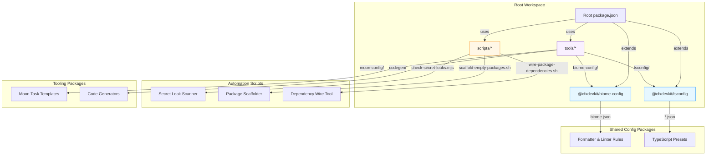

# Tooling & Config

# Tooling & Config Module

The **Tooling & Config** module is the foundational infrastructure layer of the Conflux DevKit monorepo. It provides shared, reusable developer tooling, configuration presets, and automation scripts that ensure consistency, correctness, and developer velocity across all packages and projects.

This module is *not* a runtime dependency — all packages here are **dev-only**, consumed via workspace dependencies (`workspace:*`) and never imported at runtime. Its purpose is to enforce standards, reduce duplication, and enable scalable collaboration.

---

## High-Level Architecture



---

## Core Components

### 1. Shared Configuration Packages

#### `@cfxdevkit/tsconfig` (`repos/cfx-config/packages/tsconfig/`)
A config-only package providing TypeScript compiler presets for different project types.

| File | Purpose |
|------|---------|
| `base.json` | Strict, modern defaults: `ES2023`, `moduleResolution: "Bundler"`, full strictness, `isolatedModules`, `verbatimModuleSyntax` |
| `lib.json` | Library preset: adds `jsx: "preserve"`, Node types, DOM libs for React interop |
| `app-web.json` | Browser app preset: `jsx: "react-jsx"`, DOM APIs, Vite client types |
| `app-node.json` | Node app preset: `module: "NodeNext"`, Node types |

**Usage in packages:**
```json
{
  "extends": "@cfxdevkit/tsconfig/lib.json"
}
```

#### `@cfxdevkit/biome-config` (`repos/cfx-config/packages/biome-config/`)
A config-only package defining shared formatting and linting rules.

Key features:
- Single source of truth for formatting (2-space indent, single quotes, LF line endings)
- Strict lint rules: `noExplicitAny: warn`, `useImportType: error`, `noDefaultExport: error`
- Permissive overrides for tests and config files (e.g., `noDefaultExport: off` in `vite.config.ts`)
- Integrated with Git via `tools/git-hooks/`

**Usage in packages:**
```json
{
  "$schema": "https://biomejs.dev/schemas/2.4.13/schema.json",
  "extends": ["./repos/cfx-config/packages/biome-config/biome.json"]
}
```

#### `@cfxdevkit/moon-config` (`repos/cfx-config/packages/moon-config/`)
A config-only package providing reusable Moon task templates.

| Template | Purpose |
|----------|---------|
| `templates/library.yml` | Standard tasks for libraries: `build`, `test`, `typecheck`, `lint`, `clean` |

Projects copy this template into their `moon.yml` to ensure consistent CI/CD behavior.

---

### 2. Automation Scripts (`scripts/`)

#### `check-secret-leaks.mjs`
A security scanner that prevents accidental exposure of secrets (mnemonics, private keys, passphrases) in source code.

**How it works:**
1. Walks `repos/`, `projects/`, `tools/`, `scripts/` directories
2. Skips `node_modules`, `dist`, `coverage`, `.git`, etc.
3. Scans `.ts`, `.tsx`, `.js`, `.jsx`, `.mjs`, `.cjs` files
4. Applies regex rules to detect:
   - `workspaceState.update(...mnemonic|privateKey...)`
   - `console.log(...${...privateKey...})`
   - `appendLine(...Recovery mnemonic...)`
5. Fails CI if any match is found

**Usage:**
```bash
pnpm run security:secrets
```

#### `scaffold-empty-packages.sh`
An idempotent script that creates boilerplate packages for new libraries.

**Generates for each package:**
- `package.json` (with correct exports, scripts, devDeps)
- `tsconfig.json` (extends `@cfxdevkit/tsconfig`)
- `vite.config.ts` (ES lib build + dts plugin)
- `vitest.config.ts`
- `src/index.ts` (placeholder export)
- `src/index.test.ts` (smoke test)
- `moon.yml` (library type)

**Usage:**
```bash
pnpm run scaffold:packages  # runs the script
```

#### `wire-package-dependencies.sh`
An idempotent script that wires internal workspace dependencies per API contracts.

**How it works:**
- Uses `pnpm --filter <pkg> add --save-prod/--save-peer <dep>`
- Ensures dependency graph matches documented layering (e.g., `@cfxdevkit/wallet` depends on `@cfxdevkit/core` and `@cfxdevkit/services`)
- Prevents circular or missing dependencies

**Usage:**
```bash
pnpm run wire:deps  # runs the script
```

---

### 3. Code Generators (`tools/codegen/`)

Documented conventions for code generation — no runtime code, only patterns.

| Sub-package | Purpose |
|-------------|---------|
| `wagmi/` | Per-project `wagmi.config.ts` pattern for contract hooks |
| `api-types/` | OpenAPI → TypeScript pattern for backend/frontend type sync |

> Note: Solidity-specific codegen (`contracts-extract`) lives in `repos/cfx-solidity/packages/contracts-extract/`.

---

### 4. Git Hooks & Pre-Commit Enforcement (`tools/git-hooks/`)

Enforces quality gates before commits land.

| Hook | Tool | Purpose |
|------|------|---------|
| `pre-commit/biome.sh` | Biome | Format & lint check |
| `pre-commit/secret-scan.sh` | Gitleaks | Detect secrets in staged files |
| `pre-commit/private-key-scan.sh` | Custom regex | Detect hex private key patterns |
| `commit-msg/conventional.sh` | Conventional Commits | Enforce commit message format |

Set up via `lefthook.yml` (consumed by `@cfxdevkit/git-hooks`).

---

## Integration with Root Workspace

The root `package.json` and `biome.json` act as the **orchestrator**, delegating to shared tooling:

```json
// package.json
{
  "scripts": {
    "lint": "moon run :lint",
    "format": "biome format --write .",
    "security:secrets": "node scripts/check-secret-leaks.mjs"
  },
  "devDependencies": {
    "@biomejs/biome": "^2.4.14",
    "@moonrepo/cli": "^2.2.3",
    "gitnexus": "^1.6.3"
  }
}
```

```json
// biome.json
{
  "$schema": "https://biomejs.dev/schemas/2.4.13/schema.json",
  "extends": ["./repos/cfx-config/packages/biome-config/biome.json"]
}
```

This design ensures:
- **Single source of truth** for tooling config
- **Zero drift** between packages (all extend same presets)
- **Easy upgrades** (update one config → all packages inherit)

---

## Developer Workflows

### Adding a New Package
1. Run `pnpm run scaffold:packages`
2. Run `pnpm run wire:deps`
3. Commit generated files

### Running Quality Checks
```bash
pnpm run check          # lint + typecheck + test (via moon)
pnpm run format         # auto-format (Biome)
pnpm run security:check # audit + secret scan
```

### Updating Tooling Config
1. Edit `repos/cfx-config/packages/tsconfig/base.json`, `repos/cfx-config/packages/biome-config/biome.json`, etc.
2. Run `pnpm run check` to verify no regressions
3. Commit changes — all packages inherit automatically

---

## Rules & Conventions

### What Lives in `tools/`?
- ✅ Dev-only config packages (`tsconfig`, `biome-config`, `moon-config`)
- ✅ Shared scripts (`check-secret-leaks.mjs`, `scaffold-empty-packages.sh`)
- ✅ Codegen conventions (`wagmi/`, `api-types/`)
- ❌ Runtime code (no `src/` with business logic)
- ❌ Public APIs (no exports consumed at runtime)

### Versioning & Publishing
- All `tools/*` packages are **private** (`"private": true`)
- Versioned alongside framework packages but never published
- Consumed via `workspace:*` only

---

## Future-Proofing & Extensibility

- **New tooling?** Add a new `tools/<tool>/` package — extend existing patterns
- **New language?** Add `repos/cfx-config/packages/tsconfig/app-<lang>.json`
- **New security rule?** Extend `scripts/check-secret-leaks.mjs`
- **New task?** Add to `repos/cfx-config/packages/moon-config/templates/`

The module is designed to scale with the monorepo — every addition follows the same principles: **shared, dev-only, workspace-consumed**.
