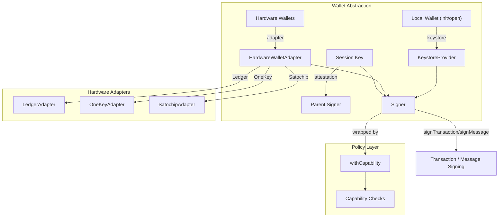

# Wallet Abstraction & Hardware

# Wallet Abstraction & Hardware Module

The **Wallet Abstraction & Hardware** module (`@cfxdevkit/wallet`) provides a unified interface for managing cryptographic identities — from local file-backed keystores to hardware wallets (Ledger, OneKey, Satochip) and ephemeral session keys with fine-grained capability enforcement.

It abstracts away vendor-specific signing protocols while enforcing security policies consistently across all signer types.

---

## Core Purpose

This module enables:

- **Local wallet management**: secure on-disk keystore with Argon2id encryption, mnemonic-backed recovery.
- **Hardware wallet integration**: vendor-agnostic adapters for Ledger, OneKey, and Satochip devices.
- **Session-key delegation**: short-lived, capability-constrained signers with off-chain attestation.
- **Policy enforcement**: runtime checks on chain, contract, selector, value, and expiry before signing.

All signers conform to the `Signer` interface from `@cfxdevkit/core`, ensuring interoperability with higher-level services (e.g., RPC clients, transaction builders).

---

## Architecture Overview



---

## Key Components

### 1. Errors (`src/errors/index.ts`)

Two dedicated error classes for structured failure handling:

| Error Class | Use Case | Error Codes |
|-------------|----------|-------------|
| `SessionKeyError` | Session-key / signer-factory failures | `wallet/session-key/{expired,capability-denied,revoked,bad-attestation}`, `wallet/signers/readonly` |
| `HardwareWalletError` | Hardware-wallet adapter failures | Vendor-prefixed: `wallet/hardware/{ledger,onekey,satochip}/{...}`, `unsupported-tx-type`, `address-mismatch`, `aborted` |

All errors extend `CfxError`, enabling consistent error handling and telemetry.

---

### 2. Local Wallet Management (`src/init/index.ts`)

#### `initLocalWallet(input)`
Creates a new encrypted keystore file (`~/.cfxdevkit/keystore.json` by default), generates a BIP-39 mnemonic, derives an account, and stores the private key under the keystore.

- **Returns**: `provider`, `signer`, `ref`, `address`, `mnemonic`, `path`
- **Security**: Mnemonic is returned **once** for backup; never persisted.
- **Passphrase**: Used to derive the KEK via Argon2id (handled by `@cfxdevkit/services/keystore-file`).

#### `openLocalWallet(input)`
Opens an existing keystore file using the same passphrase.

#### `rotateLocalPassphrase(input)`
Re-encrypts the keystore with a new passphrase.

> ✅ **Best Practice**: Use `initLocalWallet` on first boot; `openLocalWallet` on subsequent boots.

---

### 3. Signer Factories (`src/signers/index.ts`)

| Factory | Purpose |
|---------|---------|
| `signerFromKeystore(provider, ref, capability?)` | Recommended for production — delegates to a `KeystoreProvider`. |
| `readonlySigner(address)` | Placeholder for read-only paths (e.g., simulations). All `sign*` calls throw `SessionKeyError`. |

---

### 4. Hardware Wallet Adapters

All adapters implement `HardwareWalletAdapter` and return a `Signer` via `getSigner(path?)`.

#### Ledger (`src/hardware/ledger/index.ts`)
Thin wrapper over `@cfxdevkit/services/keystore-ledger`. Uses `signerFromLedger` internally.

```ts
const adapter = createLedgerHardwareAdapter({ path: "m/44'/60'/0'/0/0" });
const signer = await adapter.getSigner();
```

#### OneKey (`src/hardware/onekey/index.ts`)
Adapts the OneKey EVM API (`evmGetAddress`, `evmSignMessage`, `evmSignTransaction`, `evmSignTypedData`). The SDK is **injected** (not imported) to avoid bundling conflicts.

```ts
const signer = await signerFromOneKey({
  sdk: HardwareSDK,
  connectId: '...',
  deviceId: '...',
  chainId: 1030,
});
```

#### Satochip (`src/hardware/satochip/index.ts`)
Talks to a local Python bridge (`http://127.0.0.1:8397`) over HTTP. The bridge handles PC/SC communication with the JavaCard.

- `GET /health`, `POST /init`, `GET /address`, `POST /sign-message`, `POST /sign-transaction`
- Returns raw RLP-encoded signed transactions (via `serializeTransaction`).

> ⚠️ **Note**: All hardware adapters currently support **only EIP-1559 transactions**.

---

### 5. Capability Enforcement (`src/policies/index.ts`)

Wraps any `Signer` with a `Capability` and rejects signing attempts that violate policy.

#### Capability Fields
```ts
interface Capability {
  chains?: number[];                // Allowed chain IDs
  contracts?: Address[];            // Allowed destination addresses
  selectors?: Hex[];                // Allowed function selectors (e.g., `0xa9059cbb`)
  maxValuePerTx?: bigint;           // Max value (in wei) per transaction
  notAfter?: number;                // Unix timestamp (ms) — expiry
}
```

#### Usage
```ts
const scoped = withCapability(rootSigner, {
  chains: [1030],
  contracts: [tokenAddr],
  selectors: ['0xa9059cbb'],
  maxValuePerTx: 0n,
  notAfter: Date.now() + 60 * 60_000,
});

await scoped.signTransaction(tx); // throws SessionKeyError if policy violated
```

#### Error Codes
- `wallet/policies/{expired,chain-denied,contract-denied,selector-denied,value-exceeded,missing-target,missing-selector,typed-data-chain-denied}`

#### Standalone Validation
`checkCapability(capability, tx)` returns `null` if allowed, or a `SessionKeyError`.

---

### 6. Session Keys (`src/session-key/index.ts`)

A **session key** is a short-lived, capability-bound signer with an off-chain attestation signed by a parent signer.

#### Workflow
1. Generate a fresh in-memory keypair.
2. Construct a canonical attestation message:  
   ```json
   {
     "v": 1,
     "type": "cfxdevkit.session-key.v1",
     "parent": "0x...",
     "session": "0x...",
     "capability": { ... }
   }
   ```
3. Parent signs the message via `signMessage`.
4. Wrap the session signer with `withCapability`.
5. Add a `guard()` that checks revocation/expiry before every sign call.

#### Usage
```ts
const session = await createSessionKey({
  parent: rootSigner,
  capability: { chains: [1030], maxValuePerTx: 1000n, notAfter: Date.now() + 3600_000 },
});

// Use `session.signer` — it enforces capability and rejects revoked/expired calls.
await session.signer.signTransaction(tx);

// Revoke locally
session.revoke();
```

#### Attestation Fields
- `message`: Canonical JSON (used for signing).
- `signature`: Parent’s `signMessage` output.
- `digest`: `sha256(message)` — for commit-reveal flows.

> 🔐 **Security**: Session keys are **ephemeral** — private key is wiped on `revoke()`.

---

### 7. Hardware Types & Helpers (`src/hardware/types.ts`)

Shared utilities for hardware adapters:

| Function | Purpose |
|----------|---------|
| `EVM_DEFAULT_PATH` | `"m/44'/60'/0'/0/0"` |
| `toCanonicalHex(s)` | Normalize hex strings to `0x`-prefixed lowercase. |
| `rawSignatureToHex({r,s,v})` | Convert `(r,s,v)` to 65-byte personal_sign format (`v ∈ {27,28}`). |
| `finaliseEip1559Tx(tx, sig)` | Combine unsigned EIP-1559 tx + `(r,s,v)` → raw signed RLP hex. |
| `signaturePart(value, name)` | Validate 32-byte `r`/`s` components. |

> ✅ All adapters use `finaliseEip1559Tx` to ensure consistent output format.

---

## Integration Points

| Module | Integration |
|--------|-------------|
| `@cfxdevkit/core` | `Signer`, `Account`, `TypedData`, `deriveAccount`, `generateMnemonic` |
| `@cfxdevkit/services/keystore-file` | File-based keystore (`initFileKeystore`, `createFileKeystore`) |
| `@cfxdevkit/services/keystore-ledger` | Ledger adapter (`signerFromLedger`) |
| `@noble/hashes/sha256` | Attestation digest computation |
| `viem` | `serializeTransaction`, `hashTypedData`, `TransactionSerializableEIP1559` |

---

## Error Handling Strategy

- **Hardware errors** → `HardwareWalletError` with vendor-prefixed codes.
- **Session-key errors** → `SessionKeyError` with policy or lifecycle codes.
- **All errors** include `meta` (e.g., `expected`/`actual` address, `chainId`, `value`) for debugging.

Example:
```ts
try {
  await signer.signTransaction(tx);
} catch (err) {
  if (err instanceof SessionKeyError && err.code === 'wallet/policies/chain-denied') {
    console.warn('Chain', err.meta?.chainId, 'not allowed');
  }
}
```

---

## Security Considerations

| Concern | Mitigation |
|---------|------------|
| **Mnemonic exposure** | `initLocalWallet` returns mnemonic once; never stored. |
| **Hardware device swap** | `expectedAddress` parameter in `signerFromOneKey` / `signerFromSatochip`. |
| **Session key leakage** | In-memory only; wiped on `revoke()`. |
| **Capability bypass** | `withCapability` wraps *all* sign calls — denial happens before secret access. |
| **PIN exposure** | Satochip bridge handles PIN locally; never exposed to JS. |

---

## Usage Examples

### 1. Initialize & Open Local Wallet
```ts
// First boot
const { mnemonic, signer } = await initLocalWallet({ passphrase: '...' });

// Later
const { signer } = await openLocalWallet({ passphrase: '...' });
```

### 2. Hardware Wallet (OneKey)
```ts
import HardwareSDK from '@onekeyfe/hd-common-sdk';
await HardwareSDK.init({ debug: false });

const signer = await signerFromOneKey({
  sdk: HardwareSDK,
  connectId: '...',
  deviceId: '...',
  chainId: 1030,
});
```

### 3. Session Key with Capability
```ts
const session = await createSessionKey({
  parent: rootSigner,
  capability: {
    chains: [1030],
    contracts: ['0x...'],
    maxValuePerTx: 1000000000000000000n, // 1 CFX
    notAfter: Date.now() + 3600_000,
  },
});

// Use `session.signer` — it enforces capability.
await session.signer.signTransaction({ ...tx });
```

### 4. Scoped Signer with Policy
```ts
const scoped = withCapability(signer, {
  chains: [1030],
  contracts: ['0x...'],
  selectors: ['0xa9059cbb'],
});

await scoped.signTransaction(tx); // throws if violates policy
```

---

## Testing & Debugging

- All adapters include test suites (`*.test.ts`) verifying signature normalization, error paths, and capability enforcement.
- Use `checkCapability(capability, tx)` for dry-run validation (e.g., UI confirmation).
- Enable `debug: true` in OneKey SDK for verbose logs.

---

## Future Extensibility

- Add support for legacy (EIP-155) transactions in hardware adapters.
- Support additional hardware vendors (Trezor, KeepKey).
- Integrate on-chain capability validators (EIP-7702, 4337 paymasters).
- Add attestation revocation lists (ARL) for session keys.

---
